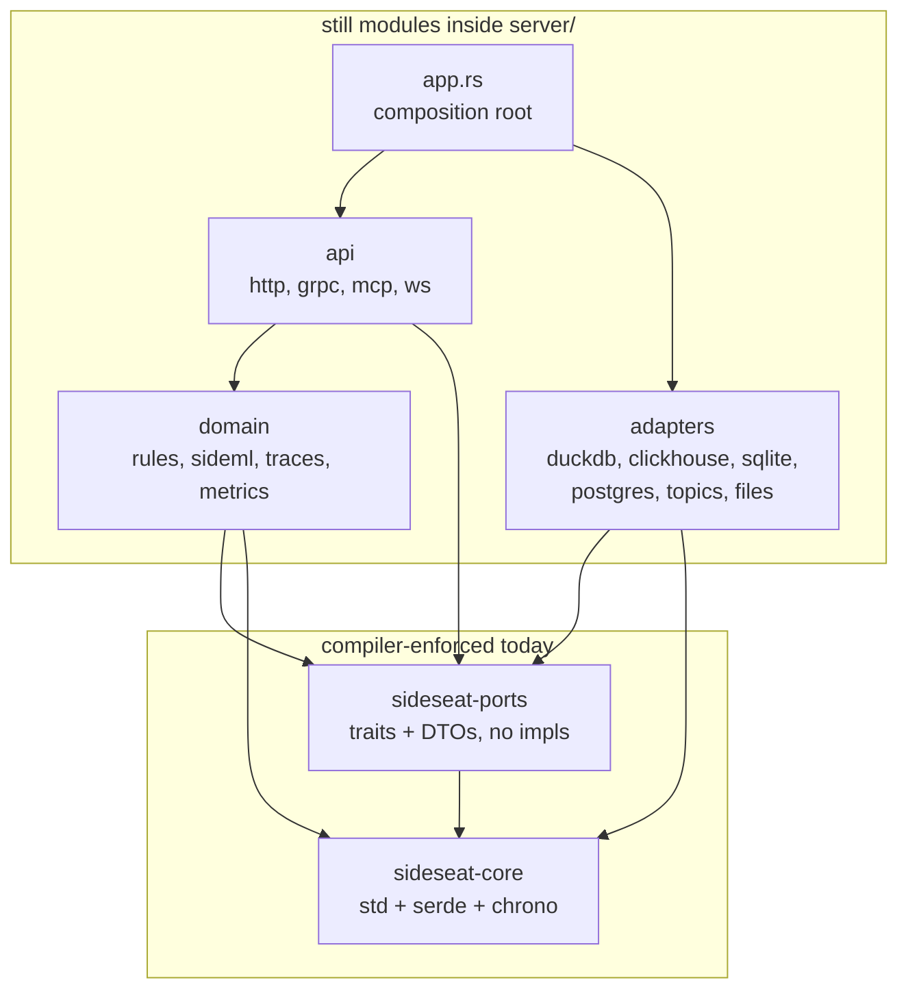
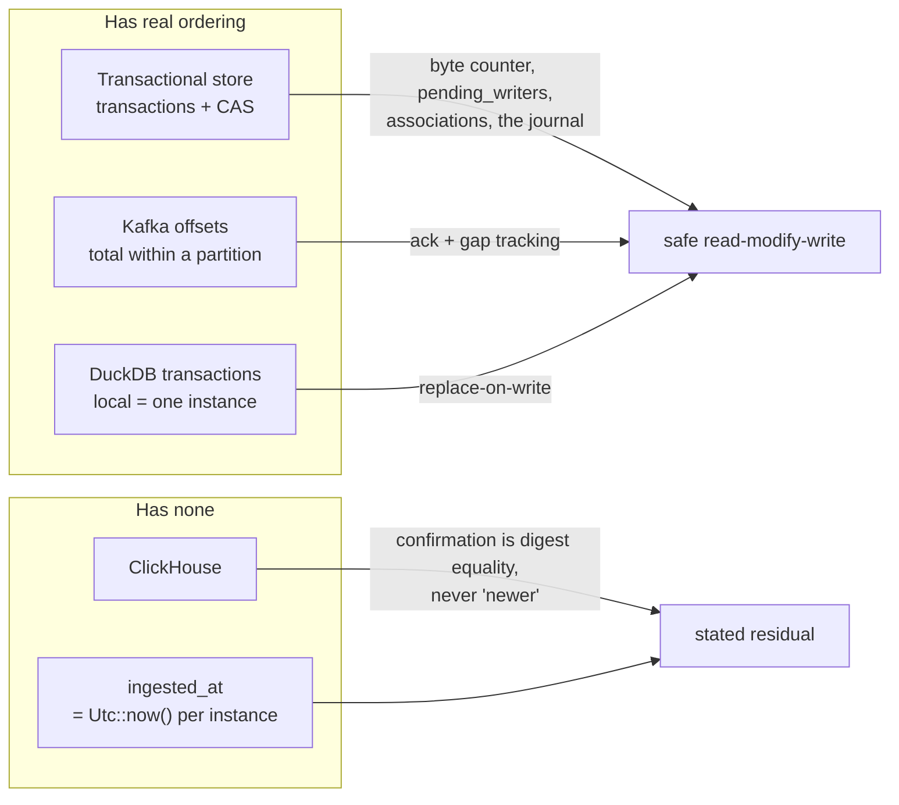
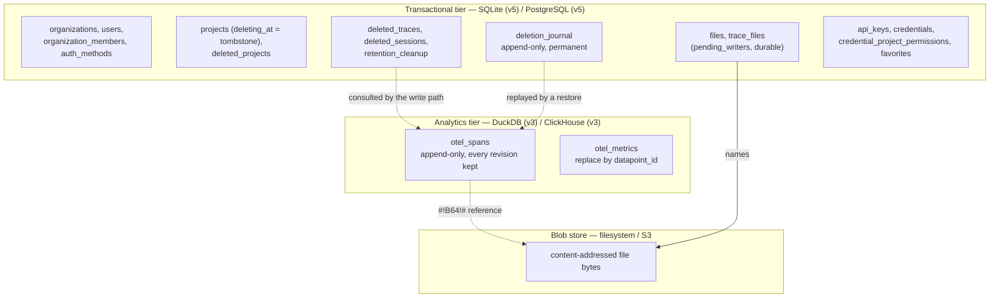
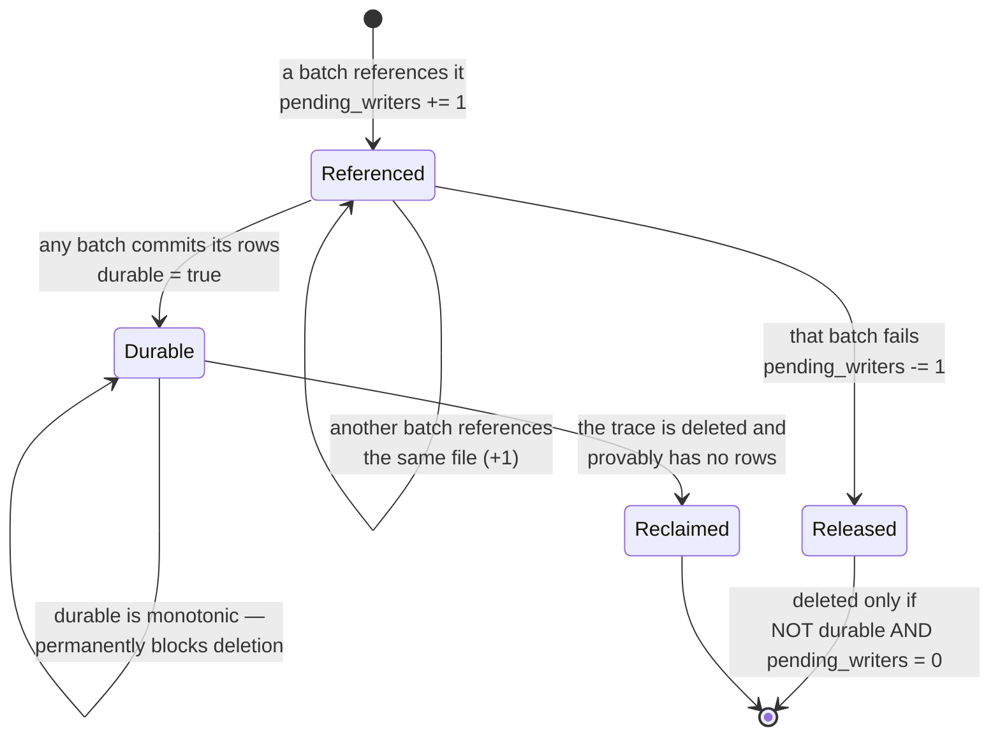
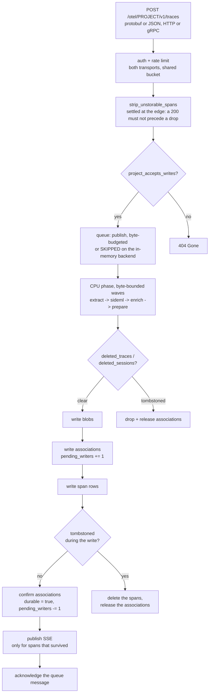
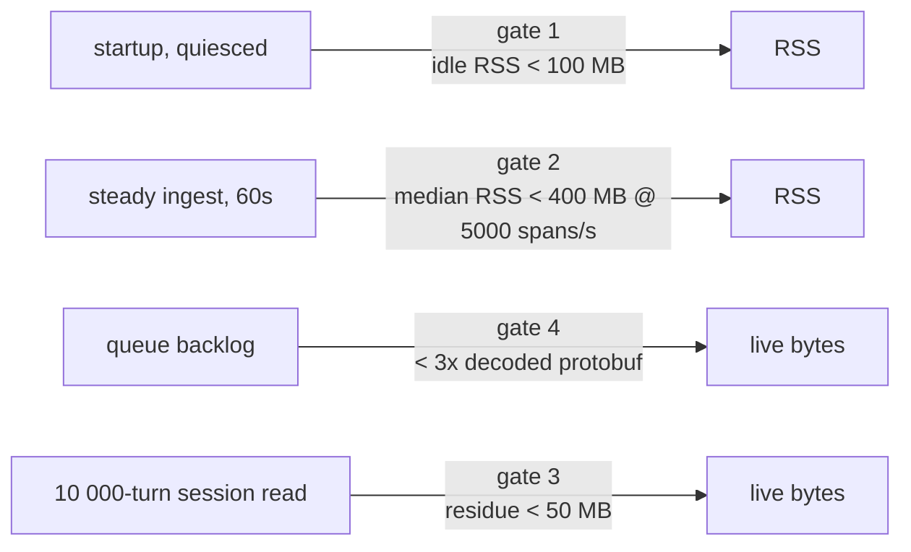
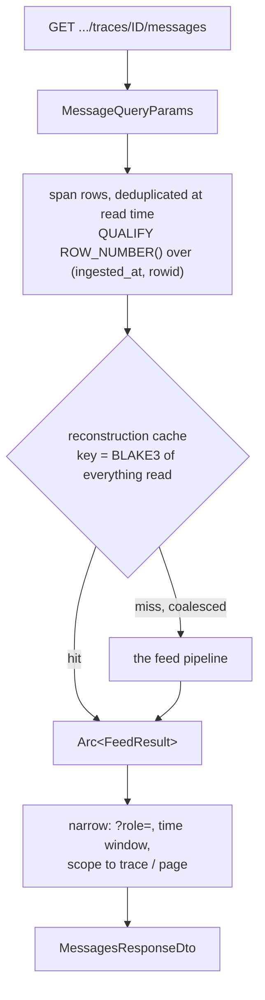
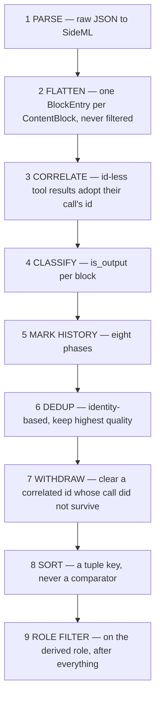
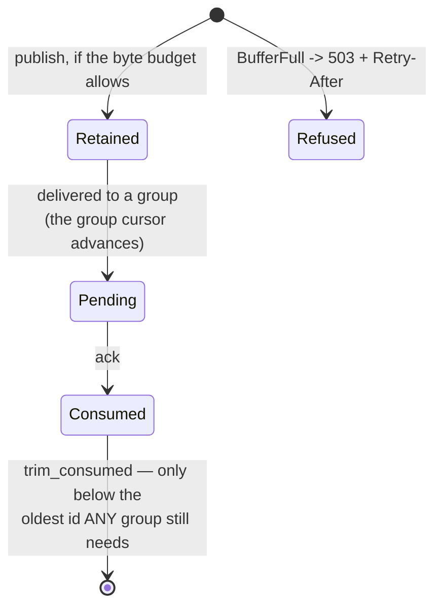
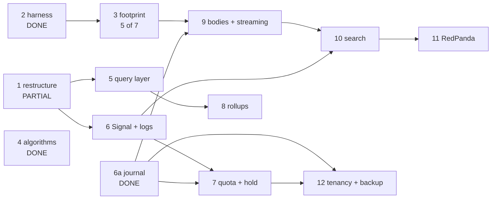

# SideSeat platform foundation — execution plan

**Audience: someone picking this up cold.** It assumes no knowledge of the repository. Read §0–§2, then §9
("Start here").

The *design* lives at `~/.claude/plans/add-claude-agent-sdk-and-anthropic-ai-cl-zany-fern.md` — 13 numbered steps
with the reasoning behind each. That file is the specification; this one is the execution record: what the
architecture is, what has landed and why, what is open, and what has and has not been verified. Where they
disagree the design wins and this file is stale — say so rather than following it.

Written 2026-09-21. "What has landed" is measured from commit `4a9c30c9`.

---

## Contents

| § | | Read it when |
| --- | --- | --- |
| **0** | [What this project is](#0-what-this-project-is) — glossary, layout, commands, how to run it, the four views, the API | first, always |
| **1** | [The architecture](#1-the-architecture) — crate graph, the ports, **the one constraint** | before designing anything |
| **2** | [The data model](#2-the-data-model) — tables, schema versions, the span row, what step 0 fixed | before touching storage |
| **3** | [The ingest path](#3-the-ingest-path) — write order, the fences, where the footprint gates measure | steps 6, 7, 8 |
| **4** | [The read path](#4-the-read-path) — the cache, the nine feed stages | steps 9, 10 |
| **5** | [What landed, and why](#5-what-landed-and-why) — the sixteen code commits, with the reasoning | to avoid re-deciding |
| **6** | [What remains](#6-what-remains) — dependencies, first increments, acceptance criteria, open questions, known bugs | to pick the next thing |
| **7** | [Exact current state](#7-exact-current-state) | to orient |
| **8** | [Verification state](#8-verification-state--read-before-claiming-anything-works) | **before claiming anything works** |
| **9** | [Start here](#9-start-here) | to begin |
| **10** | [Working protocol](#10-working-protocol) — mutation verification, Codex, the conventions that bite | before your first commit |
| **11** | [What this will and will not be](#11-what-this-architecture-will-and-will-not-be) | before trying to "fix" an accepted limit |
| **12** | [Verification matrix](#12-verification-matrix--which-check-covers-which-property) — which check covers which property, and what nothing covers | when you change or add a mechanism |
| **13** | [First day, first week](#13-first-day-first-week) | on arrival |
| **14** | [Risk register](#14-risk-register-for-the-remaining-steps) | when planning a step |
| **15** | [Alternatives already rejected](#15-alternatives-already-evaluated-and-rejected) | **before proposing one** |

**If you have five minutes:** §9 Start here, then §8 to know what is unverified, then §11 so you do not spend the
day on a limit that is deliberate.

---

## 0. What this project is

**SideSeat** is an observability toolkit for AI/LLM applications. Instrumented agent code exports OpenTelemetry
traces to it; it normalises the many frameworks' incompatible message formats into one internal format
(**SideML**) and serves a web UI for debugging conversations.

Three facts about its shape, because they explain nearly every decision below:

1. **Two storage tiers, two backends each.** *Analytics* (spans, metrics) is DuckDB by default, ClickHouse for
   distributed deployments. *Transactional* (projects, users, files, API keys, tombstones) is SQLite by default,
   PostgreSQL otherwise. **Every read method must return identical rows from both backends of a tier** — enforced
   by parity suites, not by review.
2. **Normalisation happens at read time, not at ingest.** Spans are stored close to raw; the message pipeline
   reconstructs conversations on every query. Deliberate: a fix to the pipeline applies to history with no
   re-ingestion. The cost is that reads are expensive, which is why memory is an entire plan step and why a
   reconstruction cache exists.
3. **Framework knowledge is data, not code.** Which telemetry attribute holds a conversation, which member is
   the answer, how a content block is shaped — all declared in embedded JSON under `server/assets/rules/` and
   interpreted by generic Rust. Two structural tests fail the build if a production module names a framework or
   one of their telemetry keys. **Do not put a framework name in Rust.**

`CLAUDE.md` at the repository root is the long-form version of all of this: ~1 500 lines, and the single most
useful thing to read before touching anything.

### 0.1 Glossary

You will not get far in the code or in this document without these.

| Term | Meaning |
| --- | --- |
| **SideML** | SideSeat's universal message format. `ChatMessage` with a `Vec<ContentBlock>`; `domain/sideml/types.rs` |
| **Feed** | the reconstruction pipeline (`domain/sideml/feed/`) that turns span rows into an ordered, deduplicated conversation |
| **Block / `BlockEntry`** | one `ContentBlock` with its metadata — the unit the feed sorts and deduplicates |
| **Carrier** | the telemetry construct a message arrived in (an OTel event, or a framework's attribute like `output.value`). Its *structure* says what it is evidence of — `sideml/carrier.rs` |
| **History** | a message a framework re-sent as context rather than produced now. Eight detection phases; history blocks are filtered from the answer |
| **Replay / cross-trace strip** | a later trace re-sending an earlier one's conversation. Collapsed by injective matching against a partial order |
| **Tombstone** | a row saying "this was deleted", consulted by the write path so a late batch cannot resurrect it. `deleted_traces`, `deleted_sessions`, `projects.deleting_at` |
| **Deletion journal** | `deletion_journal`: append-only, permanent, what a **restore** replays. A tombstone is removed once the target is quiet; the journal never is. §5.6 |
| **`pending_writers` / `durable`** | the two facts a file association carries. Each referencing batch increments the first; a commit sets the second permanently. A release deletes only a non-durable row at zero |
| **Survivor reconciliation** | after retention deletes some of a trace's spans, recompute which files the *surviving* spans reference and release only the difference |
| **Watermark** | `max_ingested_at_us`, taken from the store rather than the reader's clock, bounding a multi-page traversal to one instant |
| **Parity suite** | a test that writes one dataset into both backends of a tier and requires every read to return identical rows. `clickhouse/parity_tests.rs`, `postgres/parity_tests.rs` |
| **Golden** | `server/tests/fixtures/messages/<suite>/<sample>/expected.json` — the recorded correct answer for a captured OTLP payload, across four views. **121 committed**; a working copy shows 123 because two image-gen fixtures are gitignored for size, so a count from `ls` and a count from `git ls-files` legitimately differ |
| **Mutation-verified** | a fix whose test was proven to fail when that fix alone was reverted |

### 0.2 Repository layout

```
crates/core/          sideseat-core: constants, config, CLI, storage paths, utils. Names no driver.
crates/ports/         sideseat-ports: the traits the domain talks through, plus DTOs. No implementations.
server/src/
  app.rs              composition root: startup, wiring, command dispatch
  runtime/            allocation.rs (the counting allocator), shutdown.rs
  data/
    duckdb/ clickhouse/   analytics adapters
    sqlite/ postgres/     transactional adapters
    topics/               pub/sub: memory.rs (default), redis.rs, ack_window.rs
    files/                blob storage + the file-reference protocol
    cleanup.rs            project / organization / trace / session deletion sweeps
    sql/                  SqlDialect + shared SQL helpers (mostly unused — step 5)
  domain/
    sideml/           the message pipeline: feed/, normalize.rs, carrier.rs, types.rs
    traces/           extract/ (OTLP -> spans), enrich.rs (cost), pipeline.rs (ingest)
    rules/            generic interpreters for the JSON assets
    metrics/ pricing/
  api/routes/         Axum handlers; also api/mcp/ and the WebSocket runtime channel
server/assets/rules/  framework assets: producers/, conventions/, vocabulary/
server/tests/         repository.rs (21 structural invariants), footprint.rs, fixtures/
scripts/              bench-http-latency.sh, footprint-gates.sh, message-fixtures/capture.sh
```

### 0.3 Commands

```bash
make check                                                # fmt + clippy + every test. No containers.
cargo test --locked -q -p sideseat-server --lib           # inner loop, ~90s, 2360 tests
cargo test --locked -p sideseat-server message_goldens    # 121 fixtures x 4 views, ~70s — the oracle
cargo test --locked -p sideseat-server --test repository  # 21 structural invariants
make test-postgres                                        # PostgreSQL/SQLite parity, throwaway container
make test-clickhouse                                      # ClickHouse/DuckDB parity, throwaway container
make test-redis                                           # queue durability against a pinned Redis
make bench-http                                           # p95 latency ceilings; non-zero exit on a miss
make footprint                                            # the four memory ceilings; non-zero exit on a miss
```

`cargo clippy` must be warning-free: the workspace sets `all = deny` plus a list of bug classes held at zero.

**`--locked` on every command that resolves dependencies, including in documentation.**
`every_resolving_command_is_locked` reads every tracked file and caught this file's own first draft — a command
that may rewrite `Cargo.lock` makes every `--locked` check downstream a statement about one machine.

**This file is itself under those invariants**, which is worth knowing before editing it. Three of them have
already rejected drafts of it: the `--locked` rule above, `every_module_path_cited_anywhere_resolves` (a
`{a,b}/path` brace shorthand resolves to nothing), and `the_documented_project_structure_matches_the_tree`. Run
`cargo test --locked -p sideseat-server --test repository` after editing.

**`make check` runs no containers**, and the parity suites *skip silently* when `SIDESEAT_TEST_*_URL` is unset. A
green `make check` therefore says nothing about whether the two backends of a tier agree.

### 0.4 Running it, and putting data in

Nothing below needs Docker. The defaults are DuckDB + SQLite + filesystem blobs + an in-process queue, which is a
complete working deployment.

```bash
make dev-server ARGS="--debug --no-auth"    # API on 5388, gRPC OTLP on 4317
make dev-web                                # UI on 5389
make dev                                    # both
```

| Surface | URL |
| --- | --- |
| OTLP ingest (HTTP) | `http://localhost:5388/otel/{project_id}/v1/{traces,metrics,logs}` |
| Query API | `http://localhost:5388/api/v1/project/{project_id}/otel/...` |
| UI | `http://localhost:5389/ui/projects/default/observability/traces` |

The default project id is `default`. **To point any OTel-instrumented app at it**, that is the whole
configuration:

```bash
OTEL_EXPORTER_OTLP_ENDPOINT=http://localhost:5388/otel/default
```

**To generate real data**, the repository ships runnable samples per framework under `examples/`:

```bash
uv run --locked --directory examples/python/strands strands tool_use --sideseat
```

Samples: `tool_use`, `mcp_tools`, `structured_output`, `files`, `image_gen`, `reasoning`, `error`, `swarm`,
`rag_local`, `strands_ws`. Other suites: `examples/python/{openai,bedrock,claude-agent-sdk,langgraph,crewai,adk}`
and `examples/javascript`. They read `examples/.env`, which is **not committed** — copy `examples/.env.example`.
Without it `OTEL_EXPORTER_OTLP_ENDPOINT` is unset and a non-`--sideseat` run fails against the OTel default
`localhost:4318` rather than SideSeat's 5388. Most suites need Bedrock credentials; `examples/.env.example`
documents which.

**Configuration layers**, lowest priority first: defaults → `~/.sideseat/` → `./sideseat.json` → CLI args → env
vars. `config/sideseat.schema.json` is the structure and `config/sideseat.example*.json` are worked examples.
Switching to PostgreSQL + ClickHouse + S3 is configuration, not a rebuild — but note the **`Sharing` rule**
refuses incoherent combinations at startup (PostgreSQL with filesystem blobs, or with per-instance secrets while
auth is on), because each such mismatch produces a silent failure an operator would debug in the wrong place.

**Rust floor is 1.94.1**, stated to the patch in the workspace manifest because the AWS SDK crates require
1.94.1 and `1.94` means 1.94.0. Clippy's `incompatible_msrv` enforces it against the source, not just the
lockfile.

### 0.5 The four views

The goldens check four views per fixture, and the difference between them is a frequent source of confusion.
They share one pipeline (`process_spans`) and differ only in their row set:

| View | Rows | Note |
| --- | --- | --- |
| **span** | `WHERE span_id = ?`, no content filter | can hold **more** messages than its trace view: each generation span re-sends the whole history, which trace-level dedup collapses. No cross-trace stripping — it means "what this span carried" |
| **trace** | if the trace has a session, the query loads **the whole session** so cross-trace stripping can run, then narrows to the trace; otherwise `WHERE trace_id = ?` | |
| **session** | every row of every trace in the session, not just rows naming the session | |
| **feed** | a cursor page of the project, newest-first (`process_feed`, a *different* entry point) | pages are chosen by ingestion time while each page is ordered by message time, so concatenating pages is **not** a transcript. `pages_are_globally_ordered` is always false |

**A trace belongs to exactly one session: the one on its earliest span** (`argMin` over
`(timestamp_start, span_id)` — a total order, because a timestamp tie left to the engine gives three surfaces
three answers). Asking "any span named it" was wrong in eight places and is worth reading about in `CLAUDE.md`
before touching session logic.

### 0.6 The API surface

What step 6's "API v1 breaks in place" and step 10's search endpoint are changing.

```
OTLP ingest      POST /otel/{project_id}/v1/{traces,metrics,logs}        HTTP and gRPC
Query            GET  /api/v1/project/{project_id}/otel/traces
                 GET  .../traces/{id}            .../traces/{id}/messages
                 GET  .../spans                  .../traces/{tid}/spans/{sid}[/messages]
                 GET  .../sessions               .../sessions/{id}[/messages]
                 GET  .../sse                                            real-time
Admin            /api/v1/projects, /api/v1/auth/*, /api/v1/health
MCP              /api/v1/projects/{id}/mcp                               for AI coding assistants
SDK channel      GET  /api/v1/project/{id}/ws                            WebSocket: presence + AG-UI invoke
                 GET  /api/v1/project/{id}/registrations
                 POST /api/v1/project/{id}/agents/{name}/runs             AG-UI run, SSE
```

`?include_raw_span=true` on a span or trace route returns the full OTLP JSON.

**Every surface that reads or writes project data is authenticated when auth is on**, and `auth.enabled` defaults
to **true**. Two layers everywhere, because either alone is insufficient: `require_auth` establishes *who* is
asking and passes through untouched when auth is disabled; `verify_project_access` turns a valid credential into
one valid **for this project**, since a key from another organisation is otherwise perfectly valid. A request
arriving with no auth context is *refused*, so a future mounting that forgets the layer fails closed. Three
surfaces once shipped with no auth at all — MCP, the SDK channel, and gRPC OTLP — so this is enforced rather than
reviewed.

---

## 1. The architecture

Four properties, **in priority order**, each of which must end up *checked* rather than intended. The order
decides every trade below.

1. **Layers separated by construction** — a forbidden dependency does not compile.
2. **No framework knowledge in Rust** — already true, unchanged by this work.
3. **Fastest, smallest footprint** — gated numbers, not adjectives.
4. **Not foreclosing the audit layer** — append-only source of truth, stable identities, hold semantics.

### 1.1 Crate graph — target and actual



`crates/core` and `crates/ports` are real crates, so those two boundaries are enforced by the compiler. The rest
are modules, so the outer boundaries rest on tests and convention. **Extracting them is the largest remaining
piece of step 1.**

**Why crates and not a lint.** A source-scanning test was considered and rejected: `use` parsing misses
fully-qualified paths, macro-generated code, `#[cfg]` branches, re-exports and inferred types. While everything
compiles as one crate the compiler enforces nothing.

**Each boundary has already paid for itself**, which is the argument for finishing: `core` re-exported every layer
above it; `AppConfig::validate` called into the domain; `DataError` embedded four driver error types *and* had a
`From` impl per adapter; the filter vocabulary lived inside one adapter; the adapters implemented their ports for
`Arc<Service>`, which the orphan rule refuses across crates. None were visible before the split.

### 1.2 The ports

`crates/ports/src/traits.rs`, 14 traits:

| Traits | Replaces | Note |
| --- | --- | --- |
| `SpanStore`, `EntityQuery`, `MessageStore`, `AnalyticsMaintenance`, `SurvivorReferences` | `AnalyticsRepository`, 31 methods | the analytics tier, split by cohesion |
| `IdentityStore`, `ProjectStore`, `FileMetaStore`, `ApiKeyStore`, `CredentialStore`, `FavoriteStore` | `TransactionalRepository`, 95 methods | the transactional tier |
| `DeletionJournal` | new | §5.6 |
| `AnalyticsRepository`, `TransactionalRepository` | — | bundles, blanket-implemented, so a caller can still name one bound |

No line numbers here on purpose: an earlier draft cited them and one had already drifted by the end of the same
editing session. Grep the trait name.

`BlobStore`, `Cache`, `Secrets` are ports too (`blobs.rs`, `cache.rs`, `secrets.rs`). **Cache is a decorator over
a port, never a parameter to one** — it used to be `Option<&CacheService>` on 29 transactional methods.

Not yet ports, all from later steps: `MetricStore`, `LogStore`, `SearchIndex`, `RateLimitStore`, `StorageBudget`,
`Clock`.

**Two things deliberately stayed put, and both are the orphan rule rather than taste.** `TopicError` cannot move
to `ports` without `map_err` at 54 `?` sites; `TopicMessage` cannot, because its three impls are for foreign OTLP
types. Documented in code at both ends — read those comments before "fixing" either.

### 1.3 The one constraint that shapes everything

**Neither analytics backend provides a commit-ordered sequence or a fencing token.** `ingested_at` is
`Utc::now()` on the writing instance, so it does not order two writes; nothing lets a coordinator cancel a write
already issued. Six successive designs in the design document died on this before it was stated explicitly.



| Wanted | Available | Consequence |
| --- | --- | --- |
| Order two writes to one identity | nothing usable | confirmation is digest equality, never "newer" |
| Prove no further write can land | nothing | the byte budget is a conservative over-approximation |
| A snapshot across a multi-page read | per-query only | search pagination is not snapshot-isolated, and says so |
| Prove a record is in a backup | nothing derivable | restore is a procedure with stated residuals, not a proof |

**The rule: where the fact is unavailable, refuse or over-report rather than delete or under-report, and say so in
the response.** A guard that silently changes the answer is what a caller cannot reason about.

**§11 lists every limit this constraint leaves behind**, with the reason each stays. Read it before trying to
remove one.

§5.6 is what this looks like applied: both rows were in the transactional store, so no ordering trade was
needed — one transaction removed the question three review rounds had been arguing about.

---

## 2. The data model

### 2.1 What lives where



**`otel_spans` is append-only**, and that is load-bearing: a re-delivered span adds a row rather than replacing
one, and the winner is chosen at read time by `ingested_at` then `rowid`. `as_of_us` reads historical versions.
Derived tables (metrics, and step 8's contributions) are replace-on-write instead, because nothing reads *their*
history.

### 2.2 Schema versions — and the trap

| Store | Version | Notes |
| --- | --- | --- |
| DuckDB | 3 | `otel_metrics.ingested_at` and the exemplar columns arrived at v3 |
| ClickHouse | 3 | v3 removed `toDate()` from the span sorting key and versioned the metrics engine |
| SQLite | **5** | v4 added `deletion_journal`; v5 added its `span_id` CHECK |
| PostgreSQL | **5** | same |

**Every schema change needs its own `SCHEMA_VERSION`.** Editing a released version's script reaches fresh installs
and older upgrades and **never** a database already marked at that version. This trap has been hit three times in
this repository; the most recent was putting the `span_id` CHECK into v4 after v4 had shipped. Step 7's
`hold_until` needs v6.

**A DuckDB migration can only append a column, and its metrics writer is a positional `Appender`** — so the fresh
schema must declare added columns *last*, in the same order the migration adds them.
`a_v1_database_upgrades_to_the_same_column_order_as_a_fresh_one` compares `duckdb_columns()` ordered by position.

### 2.3 The file-reference protocol

Four steps of the deletion protocol and three of the remaining plan steps turn on this, and it is hard to follow
in prose. An association is a row in `trace_files` keyed `(project, trace, file_hash)` carrying **two facts, not a
boolean**:



**Why two facts and not a `provisional` flag.** A flag cannot express *several* batches referencing the same
`(project, trace, hash)` at once, which is the case that matters under concurrency: whichever failed first deleted
the row a still-in-flight or just-committed peer depended on, orphaning its file. With a counter, a failing batch
can never orphan a file another batch committed or is about to.

**Why `durable` is monotonic.** One committed row backs the file, so once any batch commits, deletion must be
blocked permanently. It is never unset — which means a **restore** needs a reconciliation path for it that does
not exist today (step 12).

**Every referencing batch confirms or releases**, not only the one that created the row: sharing an association
makes a batch one of its owners. The four early-return paths between writing the files and writing the rows each
release, checked structurally
(`every_early_return_between_files_and_the_write_releases_its_associations`) because a new one compiles and passes
every behavioural test.

**A crashed writer's increment is reclaimed by the deletion sweep, not by the ingest path.** Deleting the
non-durable row from a *drop* path was tried and reverted: `durable = false` does not prove no analytics row
committed (confirmation runs after the write and can fail), and a concurrent batch that passed the fence before
the tombstone may be committing spans right now — so deleting the shared row leaves readable spans pointing at a
file nothing holds, which is the dangling reference the write-files-before-rows ordering exists to prevent.

### 2.4 The span row

`NormalizedSpan` (`data/duckdb/models.rs`) is the row every step from 7 to 10 has to extend, so its field groups
are worth knowing:

```
Identity        trace_id, span_id, parent_span_id, session_id, user_id
Classification  span_name, span_category, observation_type, framework
Time            timestamp_start, timestamp_end, duration_ms
GenAI core      gen_ai_system, gen_ai_request_model, gen_ai_response_model
GenAI params    gen_ai_temperature, gen_ai_top_p, gen_ai_max_tokens, ...
Tokens          gen_ai_usage_input_tokens, gen_ai_usage_output_tokens      i64, NEVER NULL, default 0
Costs           gen_ai_cost_input, gen_ai_cost_output, gen_ai_cost_total   f64, NEVER NULL, default 0
Error           status_message, exception_type, exception_message, exception_stacktrace
Preview         input_preview, output_preview
Payload         messages (JSON), raw_span (JSON), ingested_at
```

**Tokens and costs are never `Option<T>`.** That is a hard convention, not a default — the read path, the
billing dedup and the web all assume a number.

**Three representations of one span exist today** — extracted columns, the `messages` JSON, and the `raw_span`
JSON. Removing two of them is step 9, and is what makes the "< 3× decoded protobuf" ceiling reachable.

### 2.5 What step 0 fixed, so you do not re-fix it

Marked "Done" in §2's table; these were live data-correctness defects, and seeing the code without this context
invites re-opening them:

| Defect | Fix |
| --- | --- |
| DuckDB retention's batch table was `PRIMARY KEY (trace_id, span_id)` with **no `project_id`** — and a span id is unique only within a trace, a trace id only within a project, both client-supplied. Expiring tenant A's span could delete tenant B's | the project in the key everywhere |
| Retention selected **raw** rows while reads go through the deduplicated relation, so an expired *old* revision selected an identity whose winning correction was recent — and took the correction with it | candidates and counts from the winning relation |
| `max_spans` counted `COUNT(span_id)` over the **whole table**, so the limit was deployment-wide and one noisy tenant spent it for everyone | per project, on the winning relation |
| ClickHouse's span sorting key contained `toDate(timestamp_start)` — a `ReplacingMergeTree` identifies duplicates *by the sorting key*, so a corrected re-delivery crossing midnight UTC returned **both** revisions; across a month boundary it could never collapse, because parts in different partitions never merge | `ORDER BY (project_id, trace_id, span_id)` — identity alone |
| `otel_metrics` was `ReplacingMergeTree()` with **no version column**, so the survivor was insert-block order, while DuckDB's replace was commit-last-wins. Two rules for one question | `ingested_at` as the version on both |

The **cross-month residual is stated and detected, not fixed**: a correction moving a span's `timestamp_start`
across a month boundary puts its revisions in different partitions, and `clickhouse/consistency.rs` reports those
identities rather than the read being silently wrong.

---

## 3. The ingest path



**Why that order.** Blobs and their associations are written **before** the rows that name them, so the surviving
failure is a reclaimable orphan rather than a dangling reference. Everything after is idempotent by span id.

**Why a re-check after the write.** The tombstone is a row in the transactional store and the spans go to the
analytics store, so nothing makes the pair atomic. A deletion landing inside that window is compensated — and
**SSE is published after every drop and compensation**, because built beforehand it announced spans the batch then
discarded, so a reader saw a span appear and never find it.

**The default in-memory backend skips the queue entirely** and writes inside the request, because a 200 must mean
stored and an in-process queue cannot promise that.

### 3.1 Where the footprint gates measure



Gates 1 and 2 are RSS, measured by `scripts/footprint-gates.sh` against a running server. Gates 3 and 4 are **live
allocated bytes**, measured in `server/tests/footprint.rs`. §5.1 says why that split is not arbitrary.

---

## 4. The read path



**The cache key is a digest of everything the pipeline reads**, so a changed row is a *different key* rather than a
stale hit — no invalidation to get wrong, no TTL to tune. It is **process-local and empty at startup**, which is
what keeps "a fix applies to history without re-ingestion" true; a persisted cache would serve answers built by
the previous build.

**Narrowing copies only survivors.** With no `?role=` and no window the caller gets the `Arc` itself. Before this
batch every read deep-cloned the whole answer.

### 4.1 The feed pipeline



Three ordering facts that are not obvious and have each been re-derived the hard way:

- **Correlation runs before classification**, because phase 7 and the orphan-result phase both need the call
  reference. Correlating afterwards let two identical results answering two different calls collapse.
- **Sorting is a tuple key**: `(batch_time, message_index, entry_index, span, after_call, content_hash)`. A
  comparator with role-based cases is *cyclic* — intro text before its call by position, the call before a result
  by role, the result before the text by role — and `sort_by` without a total order may panic.
- **The role filter is last**, on the derived role, because a Gemini or ADK tool result arrives inside a `user`
  message and earlier stages read the blocks it would remove.

---

## 5. What landed, and why

**Sixteen code commits** after `4a9c30c9`; anything else in that range is this document. The *reason* is what does
not survive summarising, so it is kept.

### 5.1 Step 2 — the memory harness (`5a43a546`)

Four ceilings, declared once in `crates/core/src/core/constants.rs`:

| Ceiling | Constant | Measured on |
| --- | --- | --- |
| Idle RSS < 100 MB | `FOOTPRINT_IDLE_RSS_MAX_BYTES` | resident bytes, quiesced |
| Steady ingest RSS < 400 MB @ 5 000 spans/s | `FOOTPRINT_INGEST_RSS_MAX_BYTES` | resident bytes, window **median** |
| A 10 000-turn read leaves < 50 MB | `FOOTPRINT_SESSION_READ_GROWTH_MAX_BYTES` | **live allocated bytes** |
| A queued span < 3× decoded protobuf | `FOOTPRINT_QUEUED_SPAN_MAX_RATIO` | live allocated bytes |

**Live allocations, not RSS, for the leak gates.** glibc and jemalloc both retain freed pages, so an RSS-based
"returns to baseline" gate fails *correct* code and fails it differently depending on timing and allocator
version — worse than no gate, because it teaches people to rerun until it passes. RSS is reported beside it,
ungated; a large gap between the two is itself informative.

**The count is the program's, not the allocator's.** jemalloc publishes `stats.allocated`, which would have
avoided the `unsafe impl` and would have made the gate a statement about jemalloc rather than about SideSeat.
`runtime/allocation.rs` counts in a wrapper around the pinned backend.

That wrapper holds the **only `allow(unsafe_code)` outside a test module in the workspace**. `GlobalAlloc` has no
safe spelling: the trait is unsafe by definition, because a wrong implementation is memory unsafety.

**`LIVE` is one `AtomicI64`, not `allocated - freed`.** Two `Relaxed` atomics cannot be read consistently: a
reader may observe the newer free beside the older allocation and compute a figure that was never true,
understating by whatever was in flight — the direction that lets a gate pass *during* a regression. Reordering the
writes does not fix it; one counter removes the question. `i64` because a `dealloc` can be observed before its
`alloc`, so the value dips negative transiently and is clamped at zero.

**Pinned, and where it cannot be the gates say so.** `tikv-jemalloc-sys` does not build for Windows, so there the
system allocator stands in, `RESIDENT_CEILINGS_APPLY` is false, and the two RSS ceilings do not apply while the
live-allocation gates still do.

**Measured, first run** (debug, this host): a queued span **1.00×** its decoded protobuf against 3× (151 spans,
1.6 MB, 11 408 bytes/span); a 10 000-turn read leaves **0.0 MB** against 50 MB, peak 25.9 MB for 20 000 blocks.
**The two resident ceilings are unmeasured.**

### 5.2 Step 3 item 1 — the queue refuses instead of discarding (`9b00a0fc`)

The `MAXLEN` defect already removed from Redis was **still live in the default in-memory backend**.



The old behaviour: trim the deque front to fit a 100 000-entry count bound, **deleting the pending record too**.
Every such entry had been answered 200 by HTTP or gRPC.

Three changes, and the third is what makes the first two definable:

- **Bytes, not entries** (`STREAM_MAX_RETAINED_BYTES`, 128 MB). A count is the wrong unit for entries spanning
  four orders of magnitude. Each is charged its payload plus `STREAM_ENTRY_OVERHEAD_BYTES`, so one budget bounds
  the memory rather than only the payloads.
- **Refusal, not trimming.** Consumed entries reclaimed first, then `BufferFull`.
- **One cursor per group, not per consumer.** With a cursor per consumer "consumed" is undefinable — and it
  **delivered the same entry twice**: consumer A took entry 51 and acked it, so consumer B at cursor 50 found it
  undelivered and processed it again.

Later rounds added the bounds a byte budget cannot reach, because **group state grows at delivery, which cannot
refuse without stalling a consumer**: pending records charged (`STREAM_PENDING_RECORD_OVERHEAD_BYTES`),
`STREAM_MAX_CONSUMER_GROUPS` = 32 (production uses one, `trace_pipeline`), and `STREAM_MAX_REMEMBERED_CONSUMERS`
= 64 with LRU eviction — a client reconnecting under a fresh name otherwise added an entry per reconnect forever.

### 5.3 Step 3 items 7 and 8 — the read path (`79e025dc`)

**The cache held 512 entries whose size nobody bounded.** Its own comment argued an answer is the blocks a reader
sees rather than the megabytes behind them — true on average, false where it matters. Now weighed in bytes
(`RECONSTRUCTION_CACHE_MAX_BYTES`, 64 MB), measured by serialising into a counting sink, plus a flat per-block
charge, **plus the `#[serde(skip)]` fields measured directly** — those are unbounded, and a 1 MiB span name
weighed **911 bytes against an empty block's 911** until they were.
`every_unserialised_block_field_is_accounted_for` fails if a new skipped field is neither fixed-size nor measured.

**Every read deep-cloned the answer it had just found.** Now `Arc<FeedResult>` with `Cow` and projections
downstream — §4.

### 5.4 Step 3 items 9 and 5 — the engine's share, and the fan-out (`491df90b`, `749dd253`)

DuckDB's default `memory_limit` is 80% of physical RAM. **Measured with the setting removed: 25.5 GiB**, against a
declared 200 MB (`DUCKDB_MEMORY_LIMIT_BYTES`, half the ingest ceiling).

Stated rather than sold: `list()` and `first()` **cannot spill**, and the trace list builds its tag column with
`LIST_DISTINCT(FLATTEN(LIST(...)))`, so a trace with thousands of large tag arrays can raise an out-of-memory
error where the default would have completed. The trade is taken because an error names the limit while the
default makes the ceiling meaningless. **Open: 200 MB is an argument, not a measurement** — `make bench-http` is
what would reject it, and it has not run.

The fan-out spawned one worker per core, so peak CPU-phase memory was *cores × the largest request*.
`byte_bounded_waves` groups requests into consecutive waves under `PIPELINE_CPU_PHASE_MAX_INFLIGHT_BYTES` (64 MB).
A request larger than the whole budget forms a wave of one, because refusing it would discard an export the queue
already accepted.

### 5.5 Step 4 — the three superlinear algorithms (`268c9b33`)

Each was a linear scan inside a per-block loop, so each was quadratic in what a long session has a lot of:

| File | Was | Now |
| --- | --- | --- |
| `feed/correlate.rs` | rescanned the pending call list per result *and* per claim | `by_id` + `by_name` index over the same document-ordered list |
| `feed/dedup.rs` | `iter().position(..)` over a growing `Vec<CallKey>` | `HashMap<CallKey, u32>` — the rank *is* the order of first appearance, which is the map's size at insertion |
| `feed/order_graph.rs` | rescanned all edges per unit; `contains` for adjacency; picked next by filtering every remaining member | bucketed edges, `HashSet`, Kahn's with a min-heap |

**The retired ordering implementation is kept under `#[cfg(test)]` as an equivalence oracle** — 512 generated
graphs per property, because a golden covers the shapes the corpus holds and the interesting edge sets here are
ones no framework produces. Mutation-verified: a max-heap fails both properties. This is the established pattern
for a rewrite claimed answer-preserving; 17 retired SQL tables are kept the same way.

### 5.6 Step 6, first half — the deletion journal (`14d99df4` + four review rounds)

Transactional schema **v5**, one append-only table, permanent, exempt from every sweep.

```mermaid
sequenceDiagram
    participant C as Caller
    participant T as Transactional store
    participant A as Analytics store
    participant R as Restore

    C->>T: record_deleted_traces_journalled
    Note over T: ONE TRANSACTION:<br/>tombstone + journal.<br/>Neither can exist without the other.
    C->>A: delete_traces
    A-->>C: 204
    Note over T: tombstone removed once quiet;<br/>the journal entry is permanent
    R->>T: deletions_since(cursor)
    R->>A: re-apply each deletion
    Note over R: a snapshot predating the deletion<br/>predates its tombstone too —<br/>only the journal survives that
```

**Why the tombstones cannot serve.** A tombstone stops a late *writer* and is removed once the target is provably
quiet. The journal is what a **restore** replays: restoring the analytics store further back than the
transactional one — which is what different backup cadences produce — brings back rows the caller was told 204
for. Its second consumer is step 9's staged-payload re-drive sweep, which without it cannot tell a failed write
from a deliberate deletion.

**The ordering question was the wrong question, and it took three rounds to see.** Both orderings are wrong:

| Order | What breaks |
| --- | --- |
| tombstone, then journal | a failed append leaves a deletion the sweeps perform anyway with no record — a restore undoes a deletion the caller was told succeeded |
| journal, then tombstone | a failed tombstone leaves a permanent record for a deletion the request reported as **failed** — a restore replays it and deletes the data |

Both rows live in the transactional store, so the window never had to exist. Four port methods do the pair in one
transaction:

```
record_deleted_traces_journalled            tombstone + journal
record_deleted_sessions_journalled          both tombstones + both journal scopes
claim_project_for_deletion_journalled       CAS claim + journal, only if the claim wins
claim_organization_for_deletion_journalled  the same
```

**The claims journal only when they win.** Journalling before the claim wrote an entry for every *losing*
caller — and an organization cleanup re-runs while its projects' tombstones remain, so one deletion accumulated
permanent, quota-counted records without bound. Conditional-on-winning is only expressible inside the claim's own
transaction.

Load-bearing details:

- `sequence` is the append order and is what a replay resumes from — **not the timestamp**: two entries can share
  a microsecond and a clock is not an order.
- `deletions_since` returns `(entries, highest_sequence_examined)`. A row whose cause or scope this build does not
  understand is skipped rather than guessed at, so a page of newer-version rows would otherwise return empty —
  indistinguishable from end-of-journal — and the replay would stop before the known deletions behind them.
- `CHECK ((scope = 'span') = (span_id IS NOT NULL))`, because the lookup matches on `span_id`: a span row with a
  null id can be appended and then never found, so the sweep recreates the very span the entry explains.
- **Age retention writes nothing.** It is a predicate, so a restored database recomputes the same verdict.
- The v5 migration **normalises** a stray `span_id` on a non-span row rather than deleting the row: that row is
  read correctly today, and deleting it would discard a real deletion record.

**Scope reduction, stated: nothing writes a `Pressure` entry yet.** Per evicted span is faithful and costs ~8 MB
of permanent, quota-counted rows per full `RETENTION_BATCH_SIZE` batch, forever. Per affected *trace* is cheap and
answers the wrong question — it would tell the re-drive sweep a span was deliberately evicted when only a sibling
was, so the sweep would decline to re-drive a payload whose write actually **failed**, which is loss. Omitting it
is the recoverable error: the sweep re-drives, the eviction repeats, and it stops at the cap with a report. The
enum variant and both `CHECK` constraints already admit the vocabulary, because the stored spelling must be
settled before any row is written under it.

### 5.7 Step 1 pieces that landed earlier

| Commit | What |
| --- | --- |
| `c73b6b27` | god-traits split into eleven ports; SQL taken out of `ports` |
| `d60d2bb1` | a partition key on publish, declared per signal. **Spans key on trace id and nothing else** — a session id lives on the span that knows it, so "session else trace" splits one conversation across two partitions mid-conversation |
| `9bfc26dc` | blob store, cache invalidation, secret writing as ports |
| `fedcafc3` | contiguous-offset acknowledgement (`topics/ack_window.rs`). Kafka commits **offsets, not ids**: committing offset N asserts everything below N is done |

---

## 6. What remains

### 6.1 Step dependencies



Two hard orderings: **step 10 needs step 9** (a ClickHouse text index must be defined over a column that still
exists after bodies move to blobs), and **step 7 needs step 6** (logs must exist before their retention and holds
can).

### 6.2 Step 1, still open

| Item | Size / where |
| --- | --- |
| `ProjectId` newtype | 63 port methods, ~500 call sites. First half of "the query builder cannot construct a statement without a tenant scope" |
| `Clock` injection | 493 `Utc::now()` sites |
| Extract `adapter-*`, `api`, `app` crates | what makes property 1 true for the layers that matter |
| API v1 breaks in place | no v2, no shim — fixed decision |
| Retention versus lag, **continuously** | Kafka retention can delete unacknowledged records during a long outage; a startup check does not cover it |
| Domain's remaining couplings | `FileService` and topics in `traces/persist.rs`, `pipeline.rs` |

### 6.3 Steps 5–12: what each involves, and the smallest first increment

Read the design's own section before starting any of these. "First increment" is the smallest thing that is
reviewable and leaves the tree green.

| Step | What it involves | First increment |
| --- | --- | --- |
| **5** query layer | See §6.4 — this one needs more than a row | §6.4 |
| **6** Signal + logs | See §6.5 | The `Signal` trait with traces as its only implementation, behaviour-identical, both transports through it. Metrics second, logs third |
| **7** quota + hold | See §6.6 | `logical_bytes` on the span row plus the counter, with no enforcement. Then admission refusal. Hold is its own change with `SCHEMA_VERSION` 6 and populated-upgrade tests |
| **8** rollups | DuckDB only. **Not a mutable row**: each span writes its own contribution and the rollup is `SUM`/`MIN`/`MAX`/first-value over contributions, so there is no read-modify-write to lose. ClickHouse has none — an incremental materialised view there is not atomically visible with its source. The aggregate is **not a plain `SUM`**: billing dedup is relational, so the contribution row carries `parent_span_id` and `observation_type` and the rollup applies the same suppression rule the span query applies today | `rebuild_contributions` first (a backfill), then the table written in the span's own transaction, then the two-stage trace query. Gated by a before/after trace-list measurement at both fixture scales; **reverted if the narrow read does not pay for the write amplification** |
| **9** bodies + streaming | Content-address message bodies, per-span references, dual-read (new layout when present, old columns otherwise), a resumable checkpointed backfill reporting drift. Plus streaming chunked JSON on the message endpoints, which currently build a whole `Vec` then serialise it | Content addressing behind a dual-read, old columns still written. Dropping them is a separate change gated on a stated per-project criterion |
| **10** search | Filter-plus-chronological, **no ranking** — ClickHouse cannot rank in any released version (verified against the 26.1–26.8 changelogs; BM25 is an unmerged PR whose open bug is `_bm25_score` + `FINAL` + `ReplacingMergeTree`, this exact configuration). Local: a `span_terms` table in DuckDB written in the span's own transaction. Server: per-field `Array(String)` with native text indexes. **One tokeniser in the domain produces the terms for both sides.** Truncation makes the logic three-valued and that must propagate through nesting | Raise the ClickHouse floor to 26.4 — today CI and `make test-clickhouse` pin **25.8.2** and `deploy/local/docker-compose.yml` pins **26.1.2**, so three places move. Then the tokeniser and its contract with a golden-corpus parity test, before any index exists |
| **11** RedPanda | The adapter plus `make test-redpanda`; server Compose brings up SideSeat itself | The adapter against the three trait changes step 1 already made |
| **12** tenancy + backup | RLS and ClickHouse row policies with a **per-request** tenant context: `SET LOCAL` inside the transaction on PostgreSQL, and on ClickHouse a **per-query setting**, never `SET` — which persists for the session and hands a pooled borrower the previous tenant. On PostgreSQL the runtime role must not own the tables **and** they carry `FORCE ROW LEVEL SECURITY`, because an owner bypasses RLS. Plus per-store backup and a gated restore-and-repair test | The colliding-id leak test (two tenants, same client-supplied trace and session ids) before any policy exists — it should pass today and will catch the policy getting it wrong |

### 6.4 Step 5 in detail, because its starting point is not what it looks like

Two different measurements, and the difference matters. The design says "~2 760 and ~2 990 lines of hand-written
SQL"; that counts the SQL *content*. **Whole-file `wc -l` today is 9 101 across `data/duckdb/repositories/` against
4 691 across `data/clickhouse/repositories/`** — the two `query.rs` files alone are 6 684 and 3 064. Neither figure
is wrong; the first is what a builder replaces, the second is what you will be editing. Use the first when
arguing about the win and the second when estimating the work.

The asymmetry is itself informative: DuckDB carries the `as_of_us` bound and the window-function deduplication
that ClickHouse gets from `FINAL`, so the sides are not two spellings of one implementation.

**`data/sql/` is not a partially-built query builder, and mistaking it for one would send you the wrong way.** It
is 756 lines across seven files, and `SqlDialect` is a *token-level* helper:

```rust
fn name(&self) -> &'static str;
fn placeholder(&self, index: usize) -> String;   // "?" vs "$1"
fn array_contains(&self, ...) -> String;         // array_contains(c,?) vs ? = ANY(c)
// ...
```

That is worth keeping and is **not** the seam the step needs. A builder has to own *statement structure* — which
relation, which predicates, which aggregate, which page — because that is where the 13 792 lines of duplication
live. The dialect becomes the thing the builder lowers *through*, not the thing that replaces it.

**Why it has zero consumers today** matters more than that it does: it was built bottom-up, as the facts two
engines differ on, and nothing was ever expressed in terms of it. A builder built the same way will end the same
way. Start from **one real read** and let its needs decide the vocabulary.

**Capabilities, not conditionals.** The differences that must survive as *declared* facts rather than `if
backend == ` branches:

| Capability | DuckDB | ClickHouse |
| --- | --- | --- |
| Deduplicate by version | `QUALIFY ROW_NUMBER()` over `(ingested_at, rowid)` | `FINAL` |
| `as_of_us` (read at a watermark) | **yes** — the bound goes *inside* the deduplication | **no** — `FINAL` has no "as of" form, and a merge may already have removed the earlier version |
| Delete | `DELETE`, transactional | `ALTER … DELETE` with `AWAIT_MUTATION` and `mutations_sync = 2`, on `_local` with `ON CLUSTER` |
| Write target | the table | the `Distributed` table, with `insert_distributed_sync = 1` |
| Correlated subquery | fine | **silently wrong** — correlated `NOT EXISTS` always returns true; use a materialised CTE plus a tuple `NOT IN` |

**Suggested order**, smallest blast radius first: an `EntityQuery` read with no aggregate → a read with a filter →
the trace list with its two-stage aggregate (the hardest, because a trace-list filter selects *traces*, never span
rows) → deletes → upserts. Each group parity-gated before the next.

**The invariant arrives with the step, scoped by the builder's own registry.** `no_adapter_holds_a_sql_literal`
must read which operation groups have been migrated from the builder itself, so it tightens automatically as
groups land. A grandfathering list of exempt files is the failure mode: it can always be appended to, and then
the gate measures nothing.

### 6.5 Step 6 in detail — the six handlers, and the predicate that is easy to get wrong

`server/src/api/routes/otlp_collector/` is where the duplication is: `traces.rs`, `metrics.rs`, `logs.rs` for HTTP
and `grpc.rs` carrying all three, plus `encoding.rs` and `mod.rs`. Six paths, one decision tree, kept in step by
comments and a source-scanning test — which exists precisely because the compiler cannot enforce the shape.

**What a `Signal` has to declare**, and the last item is the one that decides whether this is a real abstraction:

```
OTLP request type            project-id injection         extraction
storability predicate        partial_success shape        queue topic
durability requirement       lifecycle strategy           THE CONFIRMATION PREDICATE
```

Without the last, the abstraction is transport-only and the three signals become three special cases behind one
name.

**Each signal's stable identity**, because confirmation is defined against it:

| Signal | Identity |
| --- | --- |
| Spans | `(trace, span)` plus position **within the span's own carrier** — so rebatching cannot change it |
| Metrics | the existing `datapoint_id` (`domain/metrics/identity.rs`) |
| Logs | a digest of every distinguishing field OTLP offers **plus the resource, the scope and both schema URLs** — without them, two traced records from *different services* with identical text at the same instant, which is what a fan-out of one request looks like, collide and one collapses into the other as a retry |

**Confirmation is strict digest equality, and three wrong versions are worth knowing about:**

1. **Identity alone is not enough.** Identity is stable across a correction *by design* — a corrected span keeps
   `(trace, span)`, and metric identity deliberately excludes the measurement — so an identity-only read-back is
   answered by the **old** row: the correction's queue record vanishes, the staged payload is released, and a
   correction the caller was told was stored is gone with nothing able to detect it.
2. **"At least mine", compared on `ingested_at`, is not available.** Clock skew can give a later correction an
   earlier value, and both backends treat that column as the version — so older content would falsely confirm a
   newer delivery.
3. **A registry of pending deliveries is unsound.** With A pending and stored, a later C could be staged and lost
   before writing, and A's stored digest would then confirm C — releasing a payload for data never written.

So: strict equality on this delivery's own digest, a **capped** re-drive loop, and a payload that exhausts the cap
is reported *unconfirmed* and stays held — never released, because releasing on exhaustion is exactly the loss the
predicate exists to prevent.

**The digest covers the producer's content and excludes system-managed fields** — `ingested_at`, `hold_until`,
`logical_bytes`. Include them and a byte-identical retry can never confirm. It must still cover fields the
*identity* excludes, such as a metric's `description`, or a correction touching only those is invisible to its own
confirmation. **Test it across a hold patch and a byte-identical retry**: they pull in opposite directions, and
that pair is the acceptance criterion.

**Logs are new end to end** — table, DTO, `domain/logs/`, retention, fences, deletion, read API, correlation to
spans — **except search**, which needs step 10's tokeniser. Log ordering is **not** span-shaped: a record may carry
no trace at all, so it orders by `(time_unix_nano else observed_time_unix_nano, log digest, ordinal)`.

### 6.6 Step 7 in detail — the four TTLs that delete held data today

`grep -n 'TTL ' server/src/data/clickhouse/schema.rs` finds **nine** occurrences across the span and metric
tables, single-node and replicated, all **unconditional**:

```sql
TTL timestamp_start + INTERVAL 90 DAY DELETE
TTL timestamp       + INTERVAL 90 DAY DELETE
```

So a legal hold does nothing until these change. The replacement is a deterministic expression, **not** a predicate
containing `now()`, which ClickHouse rejects in a TTL:

```sql
TTL greatest(<retention expiry>, coalesce(hold_until, toDateTime(0)))
```

**A hold takes the same four steps a deletion does**, and for the same reason — no single write covers it:

1. **Record the hold durably first**, in the transactional store, so every writer admitted afterwards is fenced.
2. **Patch the rows in scope.**
3. **Re-check after**, because step 1 fences new writers and not writers already in flight: scan for rows whose
   `hold_until` is null or expired and patch them.
4. **A leased convergence sweep** repeats step 3 while the hold record exists — which is what makes step 3's
   window bounded rather than merely narrow.

**And those four are not sufficient alone.** A DuckDB retention transaction, or a ClickHouse mutation already
submitted, can remove a row after the hold commits and before the patch reaches it. So **the hold and retention
share one fence**: a per-project mutex in the transactional store that retention takes per batch and that recording
a hold also takes. Retention is periodic and batched, so waiting for it is cheap.

**The mutex's reach has to be stated exactly.** A background TTL merge cannot acquire a transactional-store mutex,
and an `ALTER … DELETE` continues after the process that submitted it has crashed. So the guarantee is properly
written as: **a hold protects rows still present when its patch reaches them.** A row removed inside that window by
a merge or an orphaned mutation is unrecoverable, and no mechanism over these stores changes that.

**The maintenance reserve is not optional.** The journal is quota-counted and must commit *before* the deletion it
records — so at quota the append is refused, nothing can be deleted, and the project is refused forever with
manual intervention the only escape. The reserve is sized from the maximum simultaneous pre-deletion state: the
journal batch **plus** the cleanup candidates, because a pressure eviction must persist both before deleting
anything, and sizing it from the journal alone lets one consume the reserve and block the other.

### 6.7 Review state

Four Codex rounds have run against this batch: **8, 11, 8 and 6 findings — 33 in total, every one real.** Each
round after the first found defects in the previous round's *fixes*. Round four's six are all fixed (`0dcdd767`);
what they were is worth knowing, because the pattern repeats:

| # | Finding | Fix |
| --- | --- | --- |
| 1 | The v5 migration **deleted valid evidence** — only `scope='span' AND span_id IS NULL` is inert | normalise the column, delete only the inert shape |
| 2 | The late-session sweeper journalled and tombstoned in separate transactions | the combined method |
| 3 | `pipeline.rs` tombstoned without journalling. I argued the session's own entry covers them; **wrong** — a restore holding child spans but not the session-bearing root cannot resolve the trace, so it is resurrected | both sites journalled |
| 4 | PostgreSQL held `ACCESS EXCLUSIVE` through `VALIDATE`, because both ran in the migration's transaction | `NOT VALID` with no `VALIDATE`: the migration's own statements make every row conform |
| 5 | `footprint-gates.sh` cleanup did an unbounded `wait` after SIGTERM | bounded wait, then SIGKILL |
| 6 | The allocation test had **no deterministic floor** — a concurrent free of any size can zero `growth_since` | assert `churn_since`, which reads the monotone `ALLOCATED` alone |

**There has been no clean Codex round.** Expect round five to find defects in those six.

### 6.8 How to know a step is done

Baseline for every step: **the 121 committed goldens and both parity suites byte-identical on the far side**,
unless the step is *meant* to change an answer, in which case the changed goldens are reviewed as a diff rather
than regenerated blindly. (`UPDATE_GOLDENS=1` writes the files but still exits non-zero when an invariant was
violated, so known-bad output cannot be committed as reviewed.) On top of that:

| Step | Its own criterion |
| --- | --- |
| 1 | `cargo tree -p sideseat-domain` names no driver |
| 3 | each mechanism measured, not argued; `bench-http` still inside its ceilings |
| 5 | per group: both parity suites identical, and the raw-SQL invariant's scope grows by that group |
| 6 | each signal's confirmation predicate tested across a hold patch **and** a byte-identical retry — they pull in opposite directions |
| 7 | ingest past the quota: refusal explicit, nothing silently dropped, reclaimable space first, held bytes survive, usage converges on `SUM(logical_bytes)`. Plus a {signal} × {removal mechanism} hold-survival matrix, **two cases concurrent** — a writer admitted before the fence, and a retention pass already running — because a sequential matrix passes while held data is still deleted |
| 8 | the before/after trace-list measurement decides it; revert if it does not pay |
| 10 | membership parity **and** ordering/pagination parity (cursors, ties, empty-page advancement, nested negated and truncated clauses), plus write amplification against a recall floor |
| 12 | backup → destroy → restore → repair: every surviving read correct, every unrepairable state *reported*, a restored blob with a missing association rebuilt before the GC could take it, and replaying the journal plus a completed retention pass leaves no resurrected row |

### 6.9 Fixed decisions — do not re-litigate

- **Ports and adapters as Cargo workspace crates.** Not a source-scanning lint (§1.1).
- **No framework knowledge in Rust.** Adding a framework is a new file in `server/assets/rules/producers/`.
- **Footprint ceilings are local numbers**: idle < 100 MB, ingest < 400 MB. Own measurements only.
- **Search is filter-plus-chronological.** No ranking, no new services, no new dependencies. **Score is not in the
  API at all** — not exposed, not filterable, not asserted. Free now, unretrofittable once a score reaches an SDK.
- **API v1 breaks in place.** No v2, no shim.
- **The audit layer is out of scope** (design §6): the Merkle log, COSE receipts, signatures, checkpoints and the
  offline verifier are the *product* on top of this. The foundation must not foreclose it, and does not.
- **The storage quota is best-effort, per project, enforced by refusal.** Eleven review cycles tried to make it
  exact; six mechanisms died on §1.3. It is not exact at any instant and says so.

§11 is the longer form of this list: every accepted limit, with what would have to change to lift it.

### 6.10 Questions the design leaves open

Four, and they are **decisions, not tasks** — cheap to make before the code exists, expensive after:

| # | Question | Why it matters when |
| --- | --- | --- |
| 1 | **Which ClickHouse tokenizer** the domain tokeniser must match (`splitByNonAlpha` is the likely answer), and how diacritics and CJK are handled inside it | decides search membership in *both* modes; cheap now, a full reindex later |
| 2 | **Storage quota policy**: the default limit, the reclamation order when over quota, the reconciliation interval. **Not** whether it is per project — that is fixed, because a deployment-wide quota lets one tenant refuse writes for every other | the interval does *not* bound the over-quota excess; it sets how fast the counter catches up once writes drain |
| 3 | **The per-span term cap and its recall floor** — the cap value, and the minimum recall over the golden corpus below which a footprint miss is reported instead of tightening the cap further | without a floor, "tighten the cap" can be applied until search is useless while every gate still passes |
| 4 | **The re-drive cap** — how many failed re-drives before a staged payload is reported *unconfirmed* and held | the payload is never released on exhaustion; the cap bounds effort, not safety |

Four more belong to the audit layer's own plan rather than here: canonicalisation (JCS + COSE, or deterministic
CBOR), signing granularity, whether to ship witness co-signing, and key custody across replicas.

### 6.11 Known-unresolved bugs

Not findings from review — things that are simply not understood yet:

- **`make test-clickhouse-two-shard` takes ~15 minutes.** A third distributed-DDL replica entry named
  `localhost:9000` sits beside the two correct `ch-shardN:9000` ones, so the node that does not own it waits the
  hardcoded 90 s in `markReplicasActive` before *every* `ON CLUSTER` task. Setting `interserver_http_host` and the
  container hostname fixed the two real names without removing the third, and it survives restarting either node.
  Until this is understood, a regression in the `_local`-versus-`Distributed` reads can merge green.
- **Two of `make bench-http`'s five ceilings are breached** on the development host, by ~35%, across four
  consecutive runs — so not noise. Two things are established: it is *not* the session-membership work (reverting
  that subquery leaves the numbers unchanged) and not the narrowing optimisation (justified on its own interleaved
  measurement). What is unresolved is whether the gap is this host or a cumulative regression. Settling it needs
  an idle host or a bisect — and note that `c00fe46d` does not build in a `git worktree`, which is worth knowing
  before attempting one.
- **Cross-replica ClickHouse convergence is unverified** — it needs a second replica, which no fixture provides.

---

## 7. Exact current state

```bash
git log --oneline 4a9c30c9..HEAD          # everything since the baseline
git log --oneline 4a9c30c9..HEAD -- ':!PLAN.md'   # the code commits only
```

The list is not reproduced here, because it drifts every time this file is edited and a stale list is worse than
no list. The **sixteen code commits**, oldest first, are:

| Commit | What |
| --- | --- |
| `c73b6b27` | god-traits split into eleven ports; SQL out of `ports` |
| `d60d2bb1` | a partition key on publish, per signal |
| `9bfc26dc` | blob store, cache invalidation, secrets as ports |
| `fedcafc3` | contiguous-offset acknowledgement (`AckWindow`) |
| `5a43a546` | **step 2**: the pinned counting allocator and the four ceilings |
| `9b00a0fc` | **step 3.1**: the queue refuses instead of discarding |
| `79e025dc` | **step 3.7+3.8**: the cache weighed in bytes; no deep clone per read |
| `491df90b` | **step 3.9**: DuckDB takes a share of the ceiling |
| `749dd253` | **step 3.5**: the CPU fan-out bounded by bytes |
| `268c9b33` | **step 4**: the three superlinear algorithms indexed |
| `14d99df4` | **step 6a**: the deletion journal |
| `30a29262` | Codex round one — eight findings |
| `eecec70f` | Codex round two — eleven |
| `8299c733` | Codex round three — eight |
| `0dcdd767` | Codex round four — six |
| `2c329ca2` | `make check` green end to end |

**Working tree:** `CLAUDE.md` is modified and stays that way — project convention keeps it out of commits.

## 8. Verification state — read before claiming anything works

**Run, green:**

| Suite | Result |
| --- | --- |
| `make check` (fmt, clippy, all tests) | **passes end to end** — first full run since `4a9c30c9` |
| `cargo test -p sideseat-server --lib` | 2 360 passed, 7 ignored |
| `cargo test --test repository` | 21 structural invariants |
| `cargo test message_goldens` | 32 passed — 121 fixtures × 4 views |
| `cargo test --test footprint -- --ignored` | both live-allocation gates pass (numbers in §5.1) |
| `make test-postgres` | **37 passed** — PostgreSQL/SQLite parity, including the v5 upgrade and the journal |
| web / Python SDK | 93 and 203 passed |

**Not run:**

```
make test-clickhouse         # ClickHouse/DuckDB parity
make test-redis              # queue durability against a real Redis
make bench-http              # so the DuckDB 200 MB limit is unvalidated
make bench-http-distributed
scripts/footprint-gates.sh   # so the two resident ceilings are unmeasured
```

Two pre-existing caveats, so a benchmark result is not misread as a regression: `make bench-http` has **two
already-breached ceilings** documented in `CLAUDE.md` (a 2 KB trace export at p95 10.9 ms against 10, and an
8-concurrent session read at p95 202 ms against 150), and `make test-clickhouse-two-shard` takes ~15 minutes
because of an unresolved fixture problem — a third distributed-DDL replica entry named `localhost:9000` that
nobody owns, which makes the node not owning it wait a hardcoded 90 s in `markReplicasActive` before *every*
`ON CLUSTER` task.

---

## 9. Start here

1. `cargo test --locked -q -p sideseat-server --lib` — confirm green (2 360 passed).
2. `make test-clickhouse`, then `make test-redis` — the two container suites still unrun.
3. `make bench-http` and `make footprint` — the two gates whose numbers are assertions rather than measurements.
   A miss is information: see §8's caveats first.
4. Codex round five against `4a9c30c9..HEAD` — §10.
5. Then **step 5** (largest reduction in duplication) or **step 6's second half** (unblocks logs, and step 7
   depends on it). §6.3 has the first increment for each, and §6.4-§6.6 are deep dives on the three largest.

---

## 10. Working protocol

**Every fix is mutation-verified**: write the test, revert *that fix alone*, watch it fail, restore. This caught
four cases in this batch where a test could not have failed — including one where the mutation silently did not
apply, because `cargo fmt` had joined the two lines it matched, and the passing suite was the mutation's absence
rather than the test's strength. **Check that the mutation applied.**

**The recurring defect class here is a gate that passes while seeing less than it claims.** Five of round one's
eight findings were exactly that. Concrete forms seen in this batch:

- a test whose assertion *string* contained the token it searched the source for, so it could never fail;
- a window anchored such that the regression sat outside it;
- a gate that returned `Ok` when it had no input;
- a bound expressed in the wrong unit (entries, where the resource is bytes);
- a test reconstructing prior state by subtracting from the *current* schema.

**Codex review** — the outer loop:

```bash
codex exec --sandbox read-only "$(cat /tmp/prompt.txt)" < /dev/null > /tmp/out.txt 2>&1
```

`codex mcp-server` does not exist in 0.154.0 and `gpt-5.1-codex-max` 404s; the configured model in
`~/.codex/config.toml` is `openai.gpt-5.6-sol` via Bedrock. **stdin must be closed** or it blocks. Write the
prompt to a file — the useful ones are long. What makes a round productive:

1. Name the commits and the files that matter.
2. List this repository's known defect classes (above) and ask it to hunt those specifically.
3. Demand a **concrete failing scenario** per finding — inputs to wrong output — so speculation is separable.
4. Ask explicitly **which of the previous round's findings are now correctly fixed**. That question has found four
   non-fixes.

### 10.1 The measurements that are not in `make check`

All `#[ignore]`d, because each takes tens of seconds and a debug build's numbers describe the debug build:

```bash
cargo test --locked --release -p sideseat-server bench_ingestion -- --ignored --nocapture
    # the real run_batch: extraction, enrichment, file storage, both writes, the project fence.
    # BENCH=<suite>/<sample> selects a fixture, ITERATIONS=n the run count.

cargo test --locked --release -p sideseat-server bench_session_scaling -- --ignored --nocapture
    # how reconstruction scales, in the two shapes that differ: incremental (each span carries its
    # own turn) and replaying (each generation span re-sends the whole conversation).

cargo test --locked --release -p sideseat-server bench_session_membership -- --ignored --nocapture
    # the session-membership formulations INTERLEAVED in one process, so the ratio is meaningful on a
    # contended host. Asserts they select the same trace ids before timing them — a count would have
    # let a faster wrong answer pass.

cargo test --locked --release -p sideseat-server bench_pipeline -- --ignored --nocapture
    # CPU only, stopping before file extraction and every persistence step. A floor, not a request's cost.

cargo test --locked --release -p sideseat-server --test footprint -- --ignored --nocapture
    # the two live-allocation gates. Serialises itself; see §5.1.
```

The published numbers for the first two are tables in `CLAUDE.md`. `make bench-http` is different in kind — it
**enforces** its ceilings and exits non-zero on a miss.

### 10.2 A Codex prompt that works

The four elements from above, as a template. The specifics matter: a vague prompt returns style notes, and this
shape has returned 33 real findings across four rounds.

```
Review <commits> with `git show`. Read <design file> sections <n> for the intended contract.

The commits, oldest first:
  <sha>  <one line each>

Files that matter most:
  <explicit list>

Hunt specifically for this repository's recurring defect classes, which have accounted for most real findings:
  1. A gate that passes while seeing less than it claims - a test whose assertion cannot fail, or that would
     pass with the fix reverted, or that reconstructs prior state by subtracting from current state.
  2. A mechanism whose stated bound is not a bound - a limit in the wrong unit, a counter that can drift,
     an "eventually" with no bound.
  3. A refactor claimed answer-preserving that changes an answer on an input the corpus does not contain.
  4. Two definitions of one fact that can disagree.

Concrete questions I want answered, with evidence from the code:
  <one per mechanism, naming the function and the property>

Report ONLY real defects, most severe first. For each: file:line, what is wrong, and a concrete failing
scenario (inputs -> wrong output). If you cannot construct one, say the finding is speculative and why. Do
not report style, naming, or missing tests unless the missing test hides a defect you can name.

State explicitly which of the previous round's findings are now correctly fixed and which are not.
```

That last line is the highest-yield sentence in the prompt: it has found four fixes that did not fix anything,
including one that had never been applied to the file at all.

**Conventions that will bite you:**

- **No feature gates** (`#[cfg(feature)]`). All dependencies always compile. Target-scoped `cfg(target_os)` is
  fine, and is how jemalloc is excluded on Windows.
- **No `pub use` re-exports for compatibility.** Every one that existed was an inversion.
- **A multi-statement SQL script must go through `sqlx::raw_sql`.** `sqlx::query` stops at the first `;`,
  *including one inside a `--` comment*, and the fragment after it is a syntax error nobody looks for. This has
  cost a debugging session in each backend, and in this batch one comment containing a semicolon broke twenty-one
  tests in a file it does not appear in. `no_sql_comment_holds_a_semicolon` guards both schemas.
- **Each schema change needs its own `SCHEMA_VERSION`** — §2.2.
- **Never `git checkout` a file with uncommitted work.** Destroyed work four times this way in this batch. Copy
  to `/tmp` at the moment of mutation.
- **Never commit `CLAUDE*.md`**, never delete them. No secrets in the repository, ever.
- **`cargo fmt --all`**, not `-p sideseat-server` — a partial format let an unformatted signature in
  `crates/ports` through until `make check` refused it.
- ClickHouse has a long list of specific traps — correlated subqueries silently wrong, `Decimal64(6)` mapping to
  `i64`, SELECT aliases visible in `WHERE`, aggregate nullability. Enumerated in `CLAUDE.md` under "Common
  Gotchas"; each has cost a debugging session.

**When something in the read path breaks**, `message_goldens` is the oracle: 121 captured OTLP payloads replayed
through the real pipeline, checking message count, content, ordering and duplicate absence across four views. It
is itself mutation-verified — dropping one message, swapping two or duplicating one each fail four of its tests.
If a refactor is meant to be answer-preserving, this is what proves it.

**Adding a parity case** (the other oracle): `server/src/data/clickhouse/parity_tests.rs` and
`server/src/data/postgres/parity_tests.rs`. Write one dataset, call the same read on both backends, `assert_eq!`
the rows. DuckDB and SQLite are the reference. A case
that passes because neither backend was asked the hard question is the failure mode this repository has been
bitten by twice — make sure the fixture actually contains the shape you are testing for.

---

## 11. What this architecture will and will not be

Read this before trying to improve something below. Each row is a limit **accepted deliberately**, with the reason;
treating one as a defect wastes a cycle, and several have already been re-litigated once.

| Limit, after the plan is complete | Why it stays |
| --- | --- |
| **Confirmation is digest equality, never "newer".** Two genuine corrections racing for one identity are resolved by the store's own choice, and both deliveries are reported as stored | No commit-ordered sequence and no fencing token exists in either analytics backend (§1.3). `ingested_at` is `Utc::now()` per instance, so a clock-regressed correction can carry an earlier value — and since both backends treat that column as the version, an "at least mine" test would let older content falsely confirm a newer delivery |
| **The storage quota is not exact at any instant.** Usage may exceed it by the total size of writes issued but not yet landed | A stalled writer cannot be fenced, an external multi-store scan is not atomic, and no observation of absence says anything about the next instant. Eleven review cycles produced six mechanisms that all died here. What is unconditional is the *contract*: at or above measured usage, writes are refused with a reason |
| **Search pagination is not snapshot-isolated.** Records present and unchanged throughout a traversal are returned exactly once; anything arriving or changing during it may be missed or repeated | Needs a snapshot or a durable commit-ordered change token. The arrival predicate raises a flag for what it *can* see, which is strictly better than nothing and strictly weaker than a guarantee — and it is documented as such, because a completeness flag callers read as a proof is worse than an honest caveat |
| **Restore is a procedure with three named residuals**, not a proof that a record is in a backup | Four designs for proving coverage were tried and each failed: no common watermark exists, truncation cannot undo a destructive operation, and three independently backed-up stores have three boundaries with no fence between them |
| **The two modes are not feature-identical.** `as_of_us` works on DuckDB and cannot be expressed on ClickHouse; the rollup contribution table exists only on DuckDB; there is no ranking anywhere | Each is a property of the engine, not of the code. The plan's answer is to state the divergence per mechanism and gate the *public read* with parity suites, so two backends computing the same answer by different means is what is tested |
| **A long session read stays expensive.** Θ(T²) *as sent* for a framework that re-sends its conversation each turn | That cost is a property of the telemetry, not of the normaliser. The pipeline is linear in its input; what grows quadratically is the input. Making the pipeline faster is not the answer — not paying twice for the same rows is, which is what the memo does. Universal O(n) would be a false claim |
| **The deletion journal is permanent and counted against the quota**, so a project that deletes enough can be refused even after every telemetry byte is reclaimed | Excluding it would make "one limit across all of it" false. Including it is the correct direction: discarding the record of a deletion to admit new writes trades a durable guarantee for throughput. Survivable because entries are ids and instants, and a boot-time check turns it into a configuration error rather than a surprise |
| **Presence and AG-UI invoke are single-instance.** The registration store is process-local while the control plane around it spans instances | Warned about at startup on the same signal the `Sharing` rule uses, and the invoke route's 404 names the boundary. A shared store would additionally need leader election to avoid N duplicate expiry events |
| **The query builder will not cover everything.** Schema DDL is exempt by construction, and the raw-SQL invariant's scope is read from the builder's registry rather than from a target of 100% | A narrow typed builder that must satisfy both engines accumulates escape hatches. Stating the scope as "what has been migrated" is what keeps the gate honest; a global ban would simply be disabled |
| **Revision history is not preserved for held records** | It needs an append-only side table on ClickHouse (`ReplacingMergeTree` merges superseded revisions away and no setting makes that selective), inside the commit sequence, with copy-on-hold, an expiry transition, and reads, exports and confirmation all consulting it. That is a state machine whose incompleteness was found repeatedly, and it belongs to the audit layer, which needs revision history for its own reasons |

**What the plan delivers instead of perfection: limits that are stated and checked rather than discovered.** The
difference is practical — "search pagination is not snapshot-isolated" in a response contract is something a
caller can act on; the same fact undetected is a bug someone debugs in six months.

**What would have to change to go further** — none of it a change to the plan:

- a storage substrate with a commit-ordered sequence, which removes four of the rows above at once;
- **one** mode instead of two, which removes the parity tax and the capability gaps;
- normalisation at write time, which would make reads cheap and break the property the product is built on — that
  a pipeline fix applies to history with no re-ingestion.

---

## 12. Verification matrix — which check covers which property

Two uses. If you change a mechanism, this says what should have caught you. If you add one, it says which column
you owe.

| Property | What checks it | Where |
| --- | --- | --- |
| Layers do not invert | the **compiler** (crate manifests), plus `no_layer_crate_depends_on_a_driver`, `the_driver_gate_reads_a_renamed_dependency`, `no_adapter_imports_a_sibling_adapter`, `the_storage_layer_does_not_import_the_http_layer`, `the_ports_crate_emits_no_sql` | `tests/repository.rs` |
| No framework knowledge in Rust | `no_production_module_names_a_framework`, `no_production_module_carries_a_framework_telemetry_key` — two sweeps, because names alone were not enough: the defect that invalidated the first acceptance was a framework fact spelled as a *value* | lib tests |
| The two analytics backends agree | **ClickHouse parity suite** — one span set into both, every read method must return identical rows, DuckDB is the reference | `clickhouse/parity_tests.rs` |
| The two transactional backends agree | **PostgreSQL parity suite**, 37 cases including the v5 upgrade | `postgres/parity_tests.rs` |
| Message reconstruction is correct | **121 goldens × 4 views**: count, content, ordering, duplicate absence — plus invariants that hold *independently* of the goldens, so a blindly regenerated snapshot still fails on a real defect | `message_goldens` |
| A rewrite is answer-preserving | the goldens **plus** an equivalence oracle over generated inputs where the interesting cases are ones no framework produces | `order_within_unit_equivalence`, and 17 retired SQL tables kept under `#[cfg(test)]` |
| Memory ceilings | `make footprint` — two RSS gates against a running server, two live-allocation gates in process | `footprint.rs`, `footprint-gates.sh` |
| Latency ceilings | `make bench-http` — **enforces**, exits non-zero on a miss | `bench-http-latency.sh` |
| The queue loses nothing | six tests, each mutation-verified; `make test-redis` for the durable backend | `topics/memory.rs`, `redis_stream_tests.rs` |
| Schema upgrades reach every database | populated-upgrade tests per backend, comparing a walked-forward v-old database against a fresh one — including **column order** on DuckDB, because its writer is a positional `Appender` | `migrations.rs`, `parity_tests.rs` |
| Tenant isolation | the colliding-id property test (client-supplied trace, session and content ids, so collision is the realistic case) — and step 12 adds the two RLS tests, because one oracle cannot cover both halves: **with** a valid context the policy must return *that tenant's* rows, not empty; **with no** context any read must return empty | lib tests, then step 12 |
| Documentation does not rot | `every_module_path_cited_anywhere_resolves`, `every_tree_diagram_names_things_that_exist`, `the_documented_project_structure_matches_the_tree`, `every_resolving_command_is_locked`, `every_relative_schema_reference_resolves` — **this file is subject to all of them** | `tests/repository.rs` |
| Supply chain | `every_action_is_pinned_to_a_commit_and_every_image_to_a_tag`, `the_image_gate_reads_the_shapes_that_defeated_it`, `every_lockfile_carries_its_manifests_engines`, `dependabot_covers_every_manifest_in_the_tree`, `every_workspace_crate_takes_the_one_version` | `tests/repository.rs` |
| A background worker is actually started | `every_detector_is_actually_started_in_production` — a sweep that exists and is never spawned is the failure it prevents | `tests/repository.rs` |

**What nothing checks yet**, and each is a real gap rather than an oversight:

| Gap | Why it is not covered |
| --- | --- |
| Cross-replica ClickHouse convergence | needs a second replica; no fixture provides one |
| The replicated migration path end to end | `make test-clickhouse` starts a single server and the parity helper sets `distributed: false`, so the UUID Keeper paths, `ON CLUSTER`, `Distributed` front-table recreation and per-host crash convergence are exercised only by `test-clickhouse-replicated` |
| A real network hop | every measurement is loopback or a local container |
| A multi-replica deletion backlog at scale | stated as unmeasured in `CLAUDE.md` |
| `durable` reconciliation after a restore | the flag is monotonic and never unset, so a restore has no path to correct it (step 12) |

---

## 13. First day, first week

**First hour.** `make check` — it needs no containers and no credentials, takes a few minutes, and a green run
means the tree is sound. Then `make dev-server ARGS="--debug --no-auth"` and
`uv run --locked --directory examples/python/strands strands tool_use --sideseat` if you have Bedrock credentials,
or just open the UI against an empty project if not. Seeing a trace render makes everything below concrete.

**First day**, in this order, because each answers a question the next one raises:

1. `CLAUDE.md` — long, and the only place several of these mechanisms are explained at all. Skim the headings,
   read "Common Gotchas" properly.
2. This file's §1.3 (the constraint), §2 (the data model), §3 and §4 (the two paths).
3. `crates/ports/src/traits.rs` — the whole seam in one file. If a method looks odd, its doc comment says why.
4. `domain/sideml/feed/mod.rs` — the pipeline's nine stages. The comments there record decisions that were made
   and reverted, which is the fastest way to learn what does not work.
5. One parity test and one golden test, run individually, to see what an oracle looks like here.

**First week.** Pick something from §6.2 (step 1's remainder) rather than a new step: `ProjectId` or `Clock` are
mechanical, touch hundreds of sites, and will teach you the layout faster than reading it. Then a
Codex round on your own change (§10.2) — the first one is educational in a way nothing else is.

**What to be suspicious of in your own work here**, drawn from what has actually gone wrong:

- a test you have not seen fail;
- a bound in a unit other than the resource it bounds;
- a fix whose commit message is more convincing than its diff;
- "this is behaviour-identical" without the goldens run;
- an argument that a second record is "just a duplicate" — that one has been wrong twice.

## 14. Risk register for the remaining steps

Ordered by the product of likelihood and what it costs to discover late.

| Risk | Why it is plausible | Cheapest mitigation |
| --- | --- | --- |
| **Step 5's builder accumulates escape hatches** until it is a second way to write SQL rather than the only way | The dialect seam already failed this way once — built bottom-up, zero consumers | Start from one real read; let its needs define the vocabulary; scope the invariant from the builder's registry so coverage is *measured*, not intended |
| **Step 7's hold is believed to work and does not** | Its correctness rests on a window bounded by a sweep, plus a mutex whose reach excludes two of the four deletion paths | The survival matrix with **two concurrent cases** — a writer admitted before the fence, and a retention pass already running. A sequential matrix passes while held data is deleted |
| **Step 9's backfill is run once, half-completes, and nobody notices** | It is resumable and rate-limited by design, which also means it can sit at 60% indefinitely | Drift reporting as a *signal*, and the old columns not dropped until a stated per-project criterion is met |
| **Step 10 ships with membership parity and no ordering parity** | Membership is the obvious thing to test; cursors, ties and empty-page advancement are not | Both, named in the acceptance criterion (§6.8) — the local properties exercise `span_terms` and would let a server-only skip pass every other gate |
| **Step 12's RLS is inert on the role that matters** | A table's owner bypasses RLS, and today one pool runs migrations *and* every query, so the runtime role is the owner | Both halves: the runtime role is not the schema owner **and** the tables carry `FORCE ROW LEVEL SECURITY`, because a future migration creating a table under the runtime role would otherwise silently re-open it |
| **A ClickHouse migration works on a fresh install and fails on every real database** | Has already happened once: an `ALTER` DuckDB refuses while indexes depend on the table | A populated-upgrade test per backend, always, and for ClickHouse the replicated variant plus an interrupted-and-resumed run |
| **The parity suites pass because neither backend was asked the hard question** | Bitten twice. A filter case once named a user the fixture did not have, so every trace matched and it could not tell a correct answer from a dropped filter | When adding a case, assert the fixture *contains* the shape first |
| **A review round is treated as done because the findings were addressed** | Four of eight round-one fixes did not fix anything | Ask the next round explicitly which previous findings are now correctly fixed |

---

## 15. Alternatives already evaluated and rejected

A newcomer will propose several of these within a week. Each was considered at length; the reason is the part worth
keeping, because in most cases the option is *reasonable* and fails on a specific fact.

### 15.1 Search

| Option | Why not |
| --- | --- |
| **tantivy embedded** (MIT, real BM25, phrase, fuzzy, snippets) | Ranking is out of scope, so its main capability is unused — while it reintroduces exactly the cross-store consistency machinery a DuckDB table removes: separate index files, a separate commit, a reconciliation sweep. Adds writer memory against the < 100 MB idle gate, and carries pre-1.0 churn: 63 versions, three yanked, breaking changes at minor versions, and an upgrade can change tokenisation and so ranking, forcing a full reindex. **Revisit if local ranking becomes a requirement** — it is still the strongest option for that |
| **OpenSearch 3.8** | The heaviest thing shippable: a JVM plus `vm.max_map_count=262144` as a *host* sysctl the official Helm chart leaves disabled, `memlock`, `nofile`, `swapoff`, a shipped `securityConfig` the docs say to replace before production, ~1.15–1.3× the indexed text in disk, and delete-by-query that reclaims nothing until merge. The official Rust client is 2.4.0 with a documented ceiling of OpenSearch **2.0** and no 3.x release, so it would have to be plain HTTP. **Revisit when query logs show ranking is the blocker**, and require it to degrade to chronological when absent |
| **SQLite FTS5 projection** | Statically linked already, so it cost no dependency — and that was its only real advantage. It puts search state in the **transactional** store, the one store with no relationship to analytics; no transaction spans DuckDB and SQLite, so it needed a generation marker, a reconciliation sweep and a consistency window in the API; and it had to duplicate every filterable scalar to keep filtering and pagination inside SQLite |
| **DuckDB's FTS extension** | Settled by inspection, not argument: `libduckdb-sys` declares its bundleable set exhaustively and **there is no `fts`**. It is out-of-tree, so bundling means forking the sys crate's build and carrying that fork across DuckDB upgrades; loading at runtime is barred by the single-binary rule. And it would be the wrong mechanism anyway — its index "will not update automatically when the input table changes" and the documented refresh is drop-and-recreate |
| **Index-per-tenant on any Lucene engine** | Hard wall at ≤25 shards per GiB heap and 4 000 per node, so a 16 GiB heap is ~200 tenants with the budget spent on nearly-empty indices. The shared-index alternative shares BM25 statistics across tenants: a relevance problem *and* a leak, since scores reveal term rarity in other tenants' data. No configuration gives both |
| **Quickwit** | The mature form of "tantivy on object storage", and a second data plane with its own PostgreSQL metastore. Only if server-side ranking is required and OpenSearch refused |
| **Our own postings with BM25** | The *scorer* was withdrawn: `df` maintenance, `avgdl`, norms, refcount arithmetic, and two holes in its own argument. With no ranking there is nothing to score, and a distinct-term table with a semi-join is not an information-retrieval implementation |

**Ranked cross-engine parity was never achievable**, and this is recorded so it is not retried. tantivy and Lucene
implement BM25 to the letter — same formula, same `k1`, same `b`, f32 throughout — and their scores still cannot be
equal: Lucene's `docCount` is *documents having the field* while tantivy sums all segments' `max_doc`, and spans are
heterogeneous, so a field present on 40% of documents gives the two different N and different `avgdl`. No
configuration fixes it. Separately, tantivy **drops** tokens of 40 bytes or more while Lucene **splits** at 255
characters — a recall difference for tool arguments, JSON, base64, UUIDs and CJK.

### 15.2 Storage and consistency

| Option | Why not |
| --- | --- |
| **A source-scanning test instead of crate boundaries** | `use` parsing misses fully-qualified paths, macro-generated code, `#[cfg]` branches, re-exports and inferred types |
| **A rollup as a mutable row, merged per delta** | On ClickHouse that is an application-side read-modify-write with no transaction and no compare-and-swap, and the queue partitions by *trace*, not by rollup key — so two workers read the same value, both write a replacement, and one delta vanishes with every operation reporting success |
| **A contribution table on ClickHouse too** | "Cannot diverge by construction" is false there: an incremental materialised view is an insert trigger not atomically visible with its source, can leave partial state after a failure, and reacts to no deletion; replicated tables cannot use the experimental multi-table transactions that would be needed |
| **`PARTITION BY project_id`** | Unbounded partition count, and ClickHouse recommends staying well under ~1 000 distinct values because parts in different partitions never merge. Partition by **time**, order by `(project_id, …)` so a tenant's rows are contiguous, and accept that per-tenant deletion is a mutation |
| **A global truncation watermark for restore coverage** | `max_ingested_at_us` is span-only and its own documentation says a true bound needs a commit-ordered sequence neither backend provides. Four designs died here — see §11 |
| **ClickHouse 26.4's experimental `commit_order` projection** | Not usable for any of the four rows in §1.3, and the reasons are specific rather than dismissive: **experimental** (so its on-disk form may change), **per-partition** rather than global, present on **one** of two backends so nothing built on it could be a shared contract, and an insertion order is not a **fencing token**, which is what the byte budget actually needs. Worth re-examining once stable and if a DuckDB counterpart appears |

### 15.3 Things tried in code and reverted

These are in the tree's comments, and each reverted change looked like an improvement:

- **An id-less tool result claiming a *following* call** in a span that starts at the same instant. Both spellings
  made a real fixture worse: ADK's tool and generation spans do tie, so the relaxation let one result claim a call
  a later result needed, and three results that *had* ids lost them.
- **Ranking plain messages by carrier position.** Turned a separator repeated verbatim within one span into
  duplicates.
- **Skipping the session read for a batch carrying the trace's parentless span.** Recovers about half of 2.7 ms and
  privileges the root span — which is exactly what the canonical-session rule refuses to do, since in a distributed
  trace a child produced on another host can carry an earlier start time than its parent.
- **Parameterising the session-membership subquery by relation.** Put the candidate filter *outside* the window and
  silently gave the optimisation back; an interleaved benchmark is what noticed.
- **Deleting a non-durable association from a drop path** — see §2.3.
