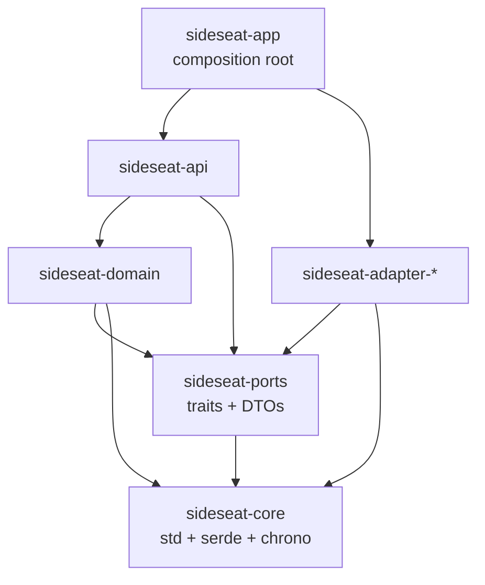

# SideSeat platform foundation — execution plan

**Audience: someone picking this up cold.** It assumes no knowledge of the repository. Read §0 and §1, then go
to §7 ("Start here").

The *design* lives at `~/.claude/plans/add-claude-agent-sdk-and-anthropic-ai-cl-zany-fern.md` — 13 numbered
steps with the reasoning behind each. That file is the specification and this one is the execution record: what
the target architecture is, what has landed and why, what is open, and what has and has not been verified.
Where they disagree, the design wins and this file is stale — say so rather than following it.

Written 2026-09-21. "What has landed" is measured from commit `4a9c30c9`.

---

## 0. What this project is

**SideSeat** is an observability toolkit for AI/LLM applications. It receives OpenTelemetry traces from
instrumented agent code, normalises the many frameworks' message formats into one internal format (**SideML**),
and serves a web UI for debugging conversations.

Three facts about the shape of it, because they explain nearly every design decision below:

1. **Two storage tiers, two backends each.** *Analytics* (spans, metrics) is DuckDB by default and ClickHouse
   for distributed deployments. *Transactional* (projects, users, files, API keys, tombstones) is SQLite by
   default and PostgreSQL. Every read method must return identical rows from both backends of a tier — enforced
   by parity suites.
2. **Normalisation happens at read time, not at ingest.** Spans are stored close to raw. The message pipeline
   (`domain/sideml/`) reconstructs conversations on every query. This is deliberate: a fix to the pipeline
   applies to history with no re-ingestion. The cost is that reads are expensive, which is why §3 of the design
   is about memory and why a reconstruction cache exists.
3. **Framework knowledge is data, not code.** Which telemetry attribute holds a conversation, which member is
   the answer, how a content block is shaped — all declared in embedded JSON assets under
   `server/assets/rules/` and interpreted by generic Rust. Two structural tests fail the build if a production
   module names a framework or one of their telemetry keys. **Do not add a framework name to Rust.**

`CLAUDE.md` at the repository root is the long-form version of all of this and is the single most useful file to
read before touching anything. It is ~1 500 lines and worth it.

### 0.1 Repository layout

```
crates/core/          sideseat-core: constants, config, CLI, storage paths, utils. Names no driver.
crates/ports/         sideseat-ports: the traits the domain talks through, plus DTOs. No implementations.
server/src/
  app.rs              composition root: startup, wiring, command dispatch
  runtime/            allocation.rs (the counting allocator), shutdown.rs
  data/               the adapters
    duckdb/ clickhouse/     analytics
    sqlite/ postgres/       transactional
    topics/                 pub/sub: memory.rs (default), redis.rs
    files/                  blob storage + the file-reference protocol
    cleanup.rs              project/organization/trace/session deletion sweeps
  domain/
    sideml/           the message pipeline: feed/ (dedup, ordering, history), normalize.rs, types.rs
    traces/           extract/ (OTLP -> spans), enrich.rs (cost), pipeline.rs (the ingest path)
    rules/            the generic interpreters for the JSON assets
    metrics/ pricing/
  api/routes/         Axum handlers; also api/mcp/ and the WebSocket channel
server/assets/rules/  the framework assets (producers/, conventions/, vocabulary/)
server/tests/         integration tests: repository.rs (structural invariants), footprint.rs
scripts/              bench-http-latency.sh, footprint-gates.sh, message-fixtures/capture.sh
```

### 0.2 Commands you will need

```bash
make check                                      # fmt + clippy (no warnings allowed) + all tests
cargo test -q -p sideseat-server --lib          # the fast inner loop, ~90s, 2360 tests
cargo test -p sideseat-server message_goldens   # 120 fixtures x 4 views, ~70s — the message oracle
cargo test -p sideseat-server --test repository # 21 structural invariants
make test-postgres                              # PostgreSQL/SQLite parity, throwaway container
make test-clickhouse                            # ClickHouse/DuckDB parity, throwaway container
make test-redis                                 # queue durability against a pinned Redis
make bench-http                                 # p95 latency ceilings; exits non-zero on a miss
make footprint                                  # the four memory ceilings; exits non-zero on a miss
```

`cargo clippy` must be warning-free — the workspace sets `all = deny` plus a list of bug classes held at zero.

---

## 1. The target architecture

Four properties, **in priority order**, each of which must end up *checked* rather than intended. The ordering
decides every trade below.

1. **Layers separated by construction.** A forbidden dependency does not compile, because the layers are
   separate Cargo crates whose manifests do not name the drivers they must not reach.
2. **No framework knowledge in Rust.** Already true; unchanged by this work.
3. **Fastest, with the smallest footprint.** Gated numbers, not adjectives.
4. **Not foreclosing the audit layer.** Append-only source of truth, stable per-signal identities, hold
   semantics — without building that layer here.

### 1.1 Crate graph, target and actual



**Actual today:** `crates/core` and `crates/ports` are real crates, so those two boundaries are
compiler-enforced. `domain`, `adapters`, `api` and `app` are still modules inside `server`, so the outer
boundaries rest on tests and convention. Extracting them is the largest remaining piece of step 1.

**Why crates and not a lint.** A source-scanning test was considered and rejected: `use` parsing misses
fully-qualified paths, macro-generated code, `#[cfg]` branches, re-exports and inferred types. While everything
compiles as one crate the compiler enforces nothing.

**Each boundary has already paid for itself**, which is the argument for finishing: `core` re-exported every
layer above it; `AppConfig::validate` called into the domain; `DataError` embedded four driver error types *and*
had a `From` impl per adapter; the filter vocabulary lived inside one adapter; the adapters implemented their
ports for `Arc<Service>`, which the orphan rule refuses across crates. None were visible before the split.

### 1.2 The ports

`crates/ports/src/traits.rs`, 14 traits:

| Trait | Line | Replaces |
| --- | --- | --- |
| `SpanStore`, `EntityQuery`, `MessageStore`, `AnalyticsMaintenance`, `SurvivorReferences` | 84, 156, 306, 324, 46 | `AnalyticsRepository`, which was 31 methods |
| `IdentityStore`, `ProjectStore`, `FileMetaStore`, `ApiKeyStore`, `CredentialStore`, `FavoriteStore` | 360, 490, 713, 997, 1035, 1111 | `TransactionalRepository`, which was 95 |
| `DeletionJournal` | 1321 | new — §3.6 |
| `AnalyticsRepository`, `TransactionalRepository` | 1181, 1412 | bundles, blanket-implemented, so a caller can still name one bound |

`BlobStore`, `Cache` and `Secrets` are ports too (`blobs.rs`, `cache.rs`, `secrets.rs`). **Cache is a decorator
over a port, never a parameter to one** — it used to be `Option<&CacheService>` on 29 transactional methods.

Not yet ports, all from later steps: `MetricStore`, `LogStore`, `SearchIndex`, `RateLimitStore`,
`StorageBudget`, `Clock`.

**Two things deliberately stayed put, and both are the orphan rule rather than taste.** `TopicError` cannot move
to `ports` without `map_err` at 54 `?` sites; `TopicMessage` cannot, because its three impls are for foreign
OTLP types. Documented in code at both ends — do not "fix" either without reading those comments.

### 1.3 The one constraint that shapes everything

**Neither analytics backend provides a commit-ordered sequence or a fencing token.** `ingested_at` is
`Utc::now()` on the writing instance, so it does not order two writes; nothing lets a coordinator cancel a write
already issued. Six successive designs in the design document died on this before it was stated explicitly.

| Wanted | Available | Consequence |
| --- | --- | --- |
| Order two writes to one identity | nothing usable | confirmation is digest equality, never "newer" |
| Prove no further write can land | nothing | the byte budget is a conservative over-approximation |
| A snapshot across a multi-page read | per-query only | search pagination is not snapshot-isolated, and says so |
| Prove a record is in a backup | nothing derivable | restore is a procedure with stated residuals, not a proof |

**The rule: where the fact is unavailable, refuse or over-report rather than delete or under-report, and say so
in the response.** A guard that silently changes the answer is what a caller cannot reason about.

Three mechanisms *do* have the ordering they need, and each gets it elsewhere — the **transactional store**
(real transactions and compare-and-set), **Kafka offsets** (totally ordered within a partition), and **DuckDB
transactions** (local mode is one instance by construction). §3.6's whole design is the result of noticing which
side a given pair of writes is on: both rows were in the transactional store, so no ordering trade was needed.

---

## 2. Step status

| Step | What it is | State |
| --- | --- | --- |
| 0 | Four live data-correctness defects + the test infrastructure for them | **Done** (pre-batch) |
| 1 | The restructure: crates, god-trait split, `ProjectId`, `Clock`, API v1 break | **Partial** — §4.1 |
| 2 | Memory harness and gates, *before* any optimisation | **Done** — §3.1 |
| 3 | Footprint mechanisms (9 numbered items; 2 belong to step 9) | **5 of 7** — §3.2–3.4 |
| 4 | The three superlinear read algorithms | **Done** — §3.5 |
| 5 | Dialect-driven query layer; one migration runner; retention as a port | **Not started** — §4.2 |
| 6 | Deletion journal, then `Signal` port + generic handlers, logs end to end | **Journal done** — §3.6 |
| 7 | Storage quota and legal hold | **Not started** — §4.2 |
| 8 | Rollup contributions (DuckDB only) | **Not started** — §4.2 |
| 9 | Content-addressed bodies, streaming reads | **Not started** — §4.2 |
| 10 | Search | **Not started** — §4.2 |
| 11 | RedPanda adapter, server Compose | **Not started** |
| 12 | Tenancy hardening, backup/restore | **Not started** — §4.2 |

---

## 3. What landed, and why

Fourteen commits after `4a9c30c9`. In each case the *reason* is the part that does not survive summarising, so
it is kept.

### 3.1 Step 2 — the memory harness (`5a43a546`)

Four ceilings, declared once in `crates/core/src/core/constants.rs`, enforced in two places:

| Ceiling | Constant | Measured on | Where |
| --- | --- | --- | --- |
| Idle RSS < 100 MB | `FOOTPRINT_IDLE_RSS_MAX_BYTES` | resident bytes, quiesced | `scripts/footprint-gates.sh` |
| Steady ingest RSS < 400 MB @ 5 000 spans/s | `FOOTPRINT_INGEST_RSS_MAX_BYTES` | resident bytes, window **median** | same |
| A 10 000-turn session read leaves < 50 MB | `FOOTPRINT_SESSION_READ_GROWTH_MAX_BYTES` | **live allocated bytes** | `server/tests/footprint.rs` |
| A queued span < 3× its decoded protobuf | `FOOTPRINT_QUEUED_SPAN_MAX_RATIO` | live allocated bytes | same |

**Live allocations, not RSS, for the leak gates.** glibc and jemalloc both retain freed pages, so an RSS-based
"returns to baseline" gate fails *correct* code and fails it differently depending on timing and allocator
version — worse than no gate, because it teaches people to rerun until it passes. RSS is reported beside it,
ungated; a large gap between the two is itself informative.

**The count is the program's, not the allocator's.** jemalloc publishes `stats.allocated`, which would have
avoided the `unsafe impl` and would have made the gate a statement about jemalloc rather than about SideSeat.
`runtime/allocation.rs` counts in a wrapper around the pinned backend, so the figure is the same on every
platform whatever the backend is.

That wrapper holds the **only `allow(unsafe_code)` outside a test module in the whole workspace**. `GlobalAlloc`
has no safe spelling: the trait is unsafe by definition, because a wrong implementation is memory unsafety. If
you need to touch it, read the module doc first — it records two ordering mistakes already made there.

**`LIVE` is one `AtomicI64`, not `allocated - freed`.** Two `Relaxed` atomics cannot be read consistently: a
reader may observe the newer free beside the older allocation and compute a figure that was never true,
understating by whatever was in flight — the direction that lets a gate pass *during* a regression. Reordering
the writes does not fix it; one counter removes the question. `i64` because a `dealloc` can be observed before
its `alloc`, so the value dips negative transiently and is clamped at zero.

**The allocator is pinned, and where it cannot be the gates say so.** An absolute megabyte figure is comparable
only within one allocator. `tikv-jemalloc-sys` does not build for Windows, so there the system allocator stands
in, `RESIDENT_CEILINGS_APPLY` is false, and the two RSS ceilings do not apply while the live-allocation gates
still do.

**Measured, first run** (debug build, this host): a queued span **1.00×** its decoded protobuf against a 3×
ceiling (151 spans, 1.6 MB, 11 408 bytes/span); a 10 000-turn read leaves **0.0 MB** against 50 MB, with a
25.9 MB peak for 20 000 blocks. **The two resident ceilings are unmeasured** — they need the script against a
running server, which has not been run.

### 3.2 Step 3 item 1 — the queue refuses instead of discarding (`9b00a0fc`)

The `MAXLEN` defect this repository had already removed from Redis was **still live in the default in-memory
backend**. `trim_stream` popped the deque front until it fit a 100 000-entry count bound and removed each popped
entry's pending record from every consumer group — so the entry a consumer was *holding* went first, along with
the group's record that it owed the work. Every one of those entries had been answered 200 by HTTP or gRPC.

Three changes, and the third is what makes the first two definable:

- **Bytes, not entries** (`STREAM_MAX_RETAINED_BYTES`, 128 MB). A count is the wrong unit for a queue whose
  entries are OTLP exports spanning four orders of magnitude. Each entry is charged its payload plus
  `STREAM_ENTRY_OVERHEAD_BYTES`, so one budget bounds the memory rather than only the payloads.
- **Refusal, not trimming.** Consumed entries are reclaimed first, then `BufferFull` → 503 with `Retry-After`,
  leaving the data with the exporter that still has it.
- **One cursor per group, not per consumer.** With a cursor per consumer, "consumed" is undefinable — and it
  **delivered the same entry twice**: consumer A took entry 51 and acked it, removing the pending record, so
  consumer B at cursor 50 found it undelivered and processed it again.

Two later rounds added the bounds a byte budget cannot reach, because **group state grows at delivery, which
cannot refuse without stalling a consumer**: pending records are charged against the budget
(`STREAM_PENDING_RECORD_OVERHEAD_BYTES`), `STREAM_MAX_CONSUMER_GROUPS` caps groups at 32 (production uses one,
`trace_pipeline`), and `STREAM_MAX_REMEMBERED_CONSUMERS` bounds the per-group consumer-name map with LRU
eviction — a client reconnecting under a fresh name otherwise added an entry per reconnect forever.

### 3.3 Step 3 items 7 and 8 — the read path (`79e025dc`)

**The cache held 512 entries whose size nobody bounded.** Its own comment argued that an answer is the blocks a
reader sees rather than the megabytes of re-sent history behind them — true on average, false where it matters:
an incremental session's output grows with its turns. Now weighed in bytes
(`RECONSTRUCTION_CACHE_MAX_BYTES`, 64 MB), measured by serialising into a counting sink (no allocation, and the
serialised size is the figure a caller sees anyway), plus `RECONSTRUCTION_CACHE_ENTRY_OVERHEAD_BYTES` per block
for the fixed costs, **plus the `#[serde(skip)]` fields measured directly** — those are unbounded, and a 1 MiB
span name weighed **911 bytes against an empty block's 911** until they were.
`every_unserialised_block_field_is_accounted_for` reads `types.rs` and fails if a new skipped field is neither
fixed-size nor measured.

**Every read deep-cloned the answer it had just found**, filtered or not — tens of thousands of blocks copied to
return the same content, on the one path whose purpose is to avoid recomputing it. The cached readers return
`Arc<FeedResult>`; `project_role` hands back the memo untouched with no `?role=`, `apply_time_window` is a `Cow`
borrowed when there is no window, and `scope_feed_to_trace` projects rather than mutating — which it can no
longer do anyway, since a session is cached whole and narrowed per trace.

### 3.4 Step 3 items 9 and 5 — the engine's share, and the fan-out (`491df90b`, `749dd253`)

DuckDB's default `memory_limit` is 80% of physical RAM. **Measured with the setting removed: 25.5 GiB**, against
a declared share of 200 MB (`DUCKDB_MEMORY_LIMIT_BYTES`, half the ingest ceiling). A 400 MB process ceiling was
a statement about everything except the component most likely to breach it.
`the_engine_takes_the_declared_memory_limit` reads both settings back through `current_setting`.

Stated rather than sold: `list()` and `first()` **cannot spill**, and the trace list builds its tag column with
`LIST_DISTINCT(FLATTEN(LIST(...)))`, so a trace with thousands of large tag arrays can raise an out-of-memory
error where the default would have completed. The trade is taken because an error names the limit while the
default makes the ceiling meaningless. **Open: 200 MB is an argument, not a measurement.** `make bench-http`'s
five p95 ceilings are what would reject it, and it has not run.

The ingest fan-out spawned one worker per core, each expanding its own request, so peak CPU-phase memory was
*cores × the largest request* — a 32-core host expanding thirty-two 15.8 MB image-heavy exports at once.
`byte_bounded_waves` groups requests into consecutive waves under `PIPELINE_CPU_PHASE_MAX_INFLIGHT_BYTES`
(64 MB), run one after another, with a count bound per wave so a wave never exceeds available parallelism. A
request larger than the whole budget forms a wave of one, because refusing it would discard an export the queue
already accepted. `encoded_len` is O(fields), not O(bytes), so measuring is free.

### 3.5 Step 4 — the three superlinear algorithms (`268c9b33`)

Each was a linear scan inside a per-block loop, so each was quadratic in what a long session has a lot of:

| File | Was | Now |
| --- | --- | --- |
| `feed/correlate.rs` | rescanned the outstanding tool-call list per result *and* per claim | `by_id` and `by_name` index over the same document-ordered list |
| `feed/dedup.rs` | repeat ordinal via `iter().position(..)` over a growing `Vec<CallKey>` | `HashMap<CallKey, u32>` — the rank *is* the order of first appearance, which is the map's size at insertion |
| `feed/order_graph.rs` | rescanned the whole edge list per unit; `contains` for adjacency dedup; picked the next member by filtering every remaining one | bucketed edges, a `HashSet`, Kahn's with a min-heap |

**The retired ordering implementation is kept under `#[cfg(test)]` as an equivalence oracle** — 512 generated
graphs per property, because a golden covers the shapes the corpus holds and the interesting edge sets here are
ones no framework produces. Mutation-verified: a max-heap instead of a min-heap fails both properties. This is
the established pattern in this repository for a rewrite claimed answer-preserving; 17 retired SQL tables are
kept the same way.

### 3.6 Step 6, first half — the deletion journal (`14d99df4` + three review rounds)

Transactional schema **v5**, one append-only table (`deletion_journal`), permanent, exempt from every sweep.

**Why the existing tombstones cannot serve.** A tombstone (`deleted_traces`, `deleted_sessions`,
`projects.deleting_at`) stops a late *writer* and is removed once the target is provably quiet. The journal is
what a **restore** replays: a snapshot predating a deletion predates its tombstone too, so restoring the
analytics store further back than the transactional one — which is what different backup cadences produce —
brings back rows the caller was told 204 for. Its second consumer is step 9's staged-payload re-drive sweep,
which without it cannot tell a failed write from a deliberate deletion and recreates what the deletion removed.

**The ordering question was the wrong question, and it took three review rounds to see.** Both orderings are
wrong:

| Order | What breaks |
| --- | --- |
| tombstone, then journal | a failed append leaves a deletion the sweeps perform anyway with no record — a restore undoes a deletion the caller was told succeeded |
| journal, then tombstone | a failed tombstone leaves a permanent record for a deletion the request reported as **failed** — a restore replays it and deletes the data |

Both rows live in the transactional store, so the window never had to exist. Four port methods do the pair in
**one transaction**:

```
record_deleted_traces_journalled            tombstone + journal, per trace
record_deleted_sessions_journalled          both tombstones + both journal scopes
claim_project_for_deletion_journalled       CAS claim + journal, only if the claim wins
claim_organization_for_deletion_journalled  the same
```

**The claims journal only when they win.** Journalling before the claim wrote an entry for every *losing*
caller — and an organization cleanup re-runs while its projects' tombstones remain, so one deletion accumulated
permanent, quota-counted records without bound. Conditional-on-winning is only expressible inside the claim's
own transaction.

Details that are load-bearing:

- `sequence` (AUTOINCREMENT / BIGSERIAL) is the append order and is what a replay resumes from — **not the
  timestamp**, because two entries can share a microsecond and a clock is not an order.
- `deletions_since` returns `(entries, highest_sequence_examined)`. A row whose cause or scope this build does
  not understand is skipped rather than guessed at, so a page of rows a newer version wrote would otherwise
  return empty — indistinguishable from end-of-journal — and the replay would stop before the known deletions
  behind them.
- `CHECK ((scope = 'span') = (span_id IS NOT NULL))`, because the lookup matches on `span_id`: a span-scoped
  row with a null id can be appended successfully and then never found, so the sweep recreates the very span
  the entry was written to explain.
- **Age retention writes nothing.** It is a predicate, so a restored database recomputes the same verdict; an
  entry per aged-out record would be an unbounded write for a derivable fact.

**Scope reduction, stated rather than left to be found: nothing writes a `Pressure` entry yet.** The design
wants count-retention eviction journalled. Per evicted span is faithful and costs ~8 MB of permanent,
quota-counted rows per full `RETENTION_BATCH_SIZE` batch, forever. Per affected *trace* is cheap and answers the
wrong question — it would tell the re-drive sweep a span was deliberately evicted when only a sibling was, so
the sweep would decline to re-drive a payload whose write actually **failed**, which is loss. Omitting it is the
recoverable error: the sweep re-drives, the eviction repeats, and it stops at the cap with a report. The
cautious error is taken until the mechanism that reads it exists. The enum variant and both `CHECK` constraints
already admit the vocabulary, because the stored spelling must be settled before any row is written under it.

### 3.7 Step 1 pieces that landed earlier in the batch

| Commit | What |
| --- | --- |
| `c73b6b27` | the god-traits split into eleven ports; the SQL taken out of `ports` (`data/sql/display.rs`, `order.rs`) |
| `d60d2bb1` | a partition key on publish, declared per signal. **Spans key on trace id and nothing else** — a session id lives on the span that knows it, so "session else trace" splits one conversation across two partitions mid-conversation |
| `9bfc26dc` | blob store, cache invalidation and secret writing as ports |
| `fedcafc3` | contiguous-offset acknowledgement (`data/topics/ack_window.rs`). Kafka commits **offsets, not ids**: committing offset N asserts everything below N is done, so a later success must not bury an earlier failure |

---

## 4. What remains

### 4.1 Step 1, still open

| Item | Size / where |
| --- | --- |
| `ProjectId` newtype | 63 port methods, ~500 call sites. First half of §9.1's "the query builder cannot construct a statement without a tenant scope" |
| `Clock` injection | 493 `Utc::now()` sites |
| Extract `adapter-*`, `api`, `app` crates | this is what makes property 1 true for the layers that matter; today only `core` and `ports` are enforced |
| API v1 breaks in place | no v2, no shim — fixed decision |
| §5's third trait change | retention versus lag checked **continuously**, not at startup: Kafka retention can delete unacknowledged records during a long outage |
| Domain's remaining couplings | `FileService` and topics in `traces/persist.rs` and `pipeline.rs` |

### 4.2 Steps 5–12, with what each actually involves

Read the design's own section before starting any of these; the summaries below are orientation, not
specification.

- **Step 5 — the dialect query layer.** `data/sql/` already declares `SqlDialect` with four impls and **zero
  consumers**, which is why ~2 760 lines of DuckDB SQL and ~2 990 of ClickHouse SQL implement the same 31
  operations. Build a narrow typed builder (select / filter / aggregate / paginate / upsert / delete), migrate
  **one operation group at a time**, parity-gated. The raw-SQL structural invariant arrives with it, scoped to
  groups already migrated by reading the builder's own registry — a global ban on day one could not be green.
- **Step 6, second half — the `Signal` port.** Three signals × two transports is six hand-written handlers today
  with the trace decision tree duplicated. A `Signal` declares per signal: OTLP request type, project-id
  injection, extraction, storability predicate, `partial_success` shape, queue topic, durability requirement,
  lifecycle strategy **and a confirmation predicate**. Then logs become a real signal end to end (they are
  currently rejected outright). Confirmation is **strict digest equality**, not identity: identity is stable
  across a correction by design, so an identity-only read-back is satisfied by the *old* row.
- **Step 7 — quota and legal hold.** Per-row `logical_bytes`, a counter plus reconciliation, a maintenance
  reserve (reclamation writes must be exempt or enforcement deadlocks against itself), four enforcement points.
  Hold is the bigger half: `hold_until`, a registry, a writer fence, a post-write patch, a leased convergence
  sweep, a shared hold/retention mutex, and **conditional TTLs on four ClickHouse tables that are unconditional
  today** — so a held row is currently deleted on schedule. Needs its own `SCHEMA_VERSION` bump and
  populated-upgrade tests.
- **Step 8 — rollup contributions**, DuckDB only. Not a mutable row: each span writes its own contribution and
  the rollup is an aggregate. ClickHouse has none, because an incremental materialised view there is not
  atomically visible with its source. Gated by a before/after trace-list measurement that decides whether the
  write amplification pays; reverted if it does not.
- **Step 9 — content-addressed bodies** with dual-read and backfill, plus streaming reads.
- **Step 10 — search.** Filter-plus-chronological, **no ranking** (ClickHouse cannot rank in any released
  version; verified against the 26.1–26.8 changelogs). Local: a `span_terms` table in DuckDB written in the
  span's own transaction. Server: per-field `Array(String)` with native text indexes. **One tokeniser in the
  domain produces the terms for both sides**, so they cannot drift. Raises the ClickHouse floor to 26.4.
- **Step 11 — RedPanda adapter** + `make test-redpanda`; server Compose brings up SideSeat too.
- **Step 12 — tenancy and backup/restore.** RLS and ClickHouse row policies with a **per-request** tenant
  context (`SET LOCAL` on PostgreSQL; a per-query setting on ClickHouse, never `SET`, which persists for a
  pooled session and hands the next borrower the previous tenant). On PostgreSQL the runtime role must not own
  the tables *and* the tables carry `FORCE ROW LEVEL SECURITY`, because an owner bypasses RLS. Plus a gated
  backup→destroy→restore→repair test.

### 4.3 Open Codex findings — fix these first

Four review rounds have run against this batch: **8, 11, 8 and 6 findings — 33 in total, every one real.** Each
round after the first found defects in the previous round's *fixes*.

Round four's six findings are **all addressed in the working tree** (uncommitted — see §5). For the record, what
each was:

| # | Finding | Fix |
| --- | --- | --- |
| 1 | The v5 migration **deleted valid evidence**. Only `scope='span' AND span_id IS NULL` is inert; a non-span row carrying a stray `span_id` is read correctly by both readers, so deleting it lets a restore resurrect its target. | Normalise the column, delete only the inert shape |
| 2 | The late-session sweeper journalled and tombstoned in separate transactions | `record_deleted_traces_journalled` |
| 3 | `pipeline.rs:1114` and `:1571` tombstoned without journalling. I argued the session's own entry covers them; **that argument was wrong** — a restore holding child spans but not the session-bearing root cannot resolve the trace to the session, so nothing explains its absence and it is resurrected. | both sites journalled |
| 4 | PostgreSQL held `ACCESS EXCLUSIVE` through `VALIDATE`, because both ran in the migration's transaction — defeating the point of `NOT VALID` on the one table designed to grow without bound | `NOT VALID` with **no** `VALIDATE`: the migration's own statements make every existing row conform, so validation would only re-confirm that, under the lock |
| 5 | `footprint-gates.sh` cleanup did an unbounded `wait` after SIGTERM | bounded wait, then SIGKILL |
| 6 | The allocation test had **no deterministic floor** — a concurrent free of any size between two snapshots can zero `growth_since`; a bigger block only lowers the probability | assert on `churn_since`, which reads the monotone `ALLOCATED` alone and no concurrent thread can reduce |

**There has been no clean Codex round yet.** Expect round five to find defects in the six fixes above.

---

### 4.4 How to know a step is done

Every step carries the same baseline gate — **the 120 committed goldens and both parity suites byte-identical on
the far side**, unless the step is *meant* to change an answer, in which case the changed goldens are reviewed as
a diff rather than regenerated blindly. (`UPDATE_GOLDENS=1` writes the files but still exits non-zero when an
invariant was violated, so known-bad output cannot be committed as reviewed.) On top of that baseline:

| Step | Its own acceptance criterion |
| --- | --- |
| 1 | `cargo tree -p sideseat-domain` names no driver; the goldens and both parity suites unchanged |
| 2 | the four ceilings are *enforced*, exiting non-zero on a miss — done |
| 3 | each mechanism measured, not argued: the byte-refusal test loses nothing, `bench-http` still inside its ceilings |
| 4 | goldens byte-identical **plus** the equivalence oracle over generated inputs — done |
| 5 | per operation group: both parity suites identical, and the raw-SQL invariant's scope grows by that group |
| 6 | traces behaviour-identical, then metrics, then logs end to end (except search); each signal's confirmation predicate tested across a hold patch **and** a byte-identical retry, which pull in opposite directions |
| 7 | a test ingests past the quota and asserts: refusal is explicit, nothing silently dropped, reclaimable space went first, held bytes survived, usage converges on `SUM(logical_bytes)`. Plus a {signal} × {removal mechanism} survival matrix for holds, **two cases of which must be concurrent** — a writer admitted before the fence, and a retention pass already running — because a sequential matrix passes while held data is still deleted |
| 8 | the before/after trace-list measurement at both fixture scales decides it; reverted if the narrow read does not pay for the write amplification |
| 9 | dual-read correct per span; backfill resumable and reporting drift |
| 10 | golden-corpus membership parity between the two backends, **plus** ordering and pagination parity (cursors, tied records, empty-page advancement, nested negated and truncated clauses), plus the write-amplification figure against a minimum recall floor |
| 11 | `make test-redpanda` green; server Compose brings up SideSeat itself |
| 12 | the gated backup → destroy → restore → repair test: every surviving read correct, every unrepairable state *reported*, a restored blob with a missing association rebuilt before the GC could take it, and replaying the journal plus a completed retention pass leaves no resurrected row |

### 4.5 Fixed decisions — do not re-litigate

These were settled in the design and re-deciding them wastes a review round.

- **Ports and adapters as Cargo workspace crates.** Not a source-scanning lint (§1.1).
- **No framework knowledge in Rust.** Producer facts are JSON assets; adding a framework is a new file in
  `server/assets/rules/producers/`.
- **Footprint ceilings are local numbers**: idle < 100 MB, steady ingest < 400 MB. Own measurements only, no
  published competitor benchmark.
- **Search is filter-plus-chronological.** No relevance ranking, no new services, no new dependencies. Score is
  not in the API at all — not exposed, not filterable, not asserted. That rule is free now and unretrofittable
  once a score reaches an SDK.
- **API v1 breaks in place.** No v2, no shim.
- **Step 1 lands as one commit** — although in practice the parts already landed as reviewable commits, because
  the design's stated reason (the transactional trait taking a concrete `CacheService`) had already been resolved
  by `537113fc`. Codex independently confirmed that reading.
- **The audit layer is out of scope** (the design's §6): the Merkle transparency log, COSE receipts, signatures,
  checkpoints and the offline verifier are the *product* on top of this foundation. What the foundation must not
  do is foreclose it, and it does not — corrections are append-only on DuckDB, every signal has a stable
  identity, and `hold_until` is foundation work because retention that cannot be suspended is a property no
  later layer can add.
- **The storage quota is best-effort, per project, enforced by refusal.** Eleven review cycles were spent trying
  to make it exact; six mechanisms died on the constraint in §1.3. It is not exact at any instant and says so.

## 5. Exact current state

**Committed** (14 commits, `4a9c30c9..8299c733`):

```
8299c733 fix(review): Codex round three — the journal's ordering was the wrong shape, not the wrong order
eecec70f fix(review): Codex round two — eleven findings, four of them my round-one "fixes" that did not fix
30a29262 fix(review): eight Codex findings against the footprint batch, five of which made a gate not gate
14d99df4 feat(deletion): the deletion journal, so a restore cannot undo a deletion it predates
268c9b33 perf(feed): the three superlinear reconstruction algorithms, indexed
749dd253 perf(ingest): the CPU phase's fan-out is bounded by bytes in flight, not by the host's core count
491df90b perf(duckdb): the embedded engine takes a share of the footprint ceiling instead of the host's RAM
79e025dc perf(read): the reconstruction cache weighed in bytes, and the answer no longer deep-cloned per read
9b00a0fc fix(queue): the in-process queue refuses instead of discarding accepted work
5a43a546 feat(footprint): a pinned counting allocator and the four memory ceilings, before any optimisation
fedcafc3 feat(queue): contiguous-offset acknowledgement, so a later success cannot bury an earlier failure
9bfc26dc refactor(ports): the blob store, cache invalidation and secret writing as ports
d60d2bb1 feat(queue): a partition key on publish, declared per signal
c73b6b27 refactor(ports): the god-traits split into eleven, and the SQL taken out of the ports
```

**Uncommitted**, all of it round-four fixes plus documentation:

| File | Change |
| --- | --- |
| `server/src/data/cleanup.rs` | the late-session sweeper uses `record_deleted_traces_journalled`; the structural test's window widened to the top of the block, because anchored at the record call it could not see a delete placed *before* it — mutation-verified, an early unconditional delete passed the old form |
| `server/src/domain/traces/pipeline.rs` | both tombstone sites journalled |
| `server/src/data/sqlite/migrations.rs`, `postgres/migrations.rs` | v5 normalises instead of deleting; PostgreSQL drops the `VALIDATE` |
| `server/src/runtime/allocation.rs` | the allocation test asserts churn, not growth |
| `scripts/footprint-gates.sh` | bounded shutdown wait |
| `CLAUDE.md` | the batch's findings documented (convention keeps this out of commits) |

---

## 6. Verification state — read this before claiming anything works

**Run, green:**

| Suite | Result |
| --- | --- |
| `cargo test -p sideseat-server --lib` | 2 360 passed, 7 ignored |
| `cargo test --test repository` | 21 structural invariants passed |
| `cargo test message_goldens` | 32 passed — 120 committed fixtures × 4 views |
| `cargo test --test footprint -- --ignored` | both live-allocation gates pass, numbers in §3.1 |
| `cargo clippy --all-targets` | clean |

**Not run since `4a9c30c9`**, and every commit used `--no-verify`:

```
make check                  (end to end)
make test-postgres          <- the biggest gap; see below
make test-clickhouse
make test-redis
make bench-http             (so the DuckDB 200 MB limit is unvalidated)
make bench-http-distributed
scripts/footprint-gates.sh  (so the two resident ceilings are unmeasured)
```

**`make test-postgres` is where to start.** The deletion journal added four methods to both transactional
backends, and **the PostgreSQL half was derived from the SQLite half by mechanical translation** — placeholder
rewriting, `UNNEST` instead of loops, `i32` instead of `i64` for `SELECT 1`. Compiler-checked and hand-reviewed,
never executed. If anything in this batch is broken, it is there.

---

## 7. Start here

In order:

1. `cargo test -q -p sideseat-server --lib` — confirm the working tree is green (expect 2 360 passed).
2. `make test-postgres` — the untested path. Then `make test-clickhouse`, `make test-redis`.
3. `make bench-http` and `make footprint` — the two gates whose numbers are still assertions rather than
   measurements. A miss is information, not necessarily a regression: `bench-http` has two *pre-existing*
   breached ceilings documented in `CLAUDE.md`, and `footprint`'s resident ceilings have never been taken.
4. Commit the working tree (round four's fixes) once the suites above agree.
5. Run Codex round five against it — §8.
6. Then step 5 or step 6's second half, whichever the design's sequencing prefers. Step 5 is the largest
   remaining reduction in duplication; step 6 is what unblocks logs and the quota work.

---

## 8. Working protocol

**Every fix is mutation-verified**: write the test, revert *that fix alone*, watch the test fail, restore. This
caught four cases in this batch where a test could not have failed — including one where my own mutation
silently did not apply, because `cargo fmt` had joined the two lines it matched, and the passing suite was the
mutation's absence rather than the test's strength. **Check that the mutation applied.**

**The recurring defect class here is a gate that passes while seeing less than it claims.** Five of round one's
eight findings were exactly that. Concrete forms seen in this batch: a test whose assertion string contained the
token it searched the source for, so it could never fail; a window anchored such that the regression sat outside
it; a gate that returned `Ok` when it had no input; a bound expressed in the wrong unit.

**Codex review**, which is the outer loop:

```bash
codex exec --sandbox read-only "$(cat /tmp/prompt.txt)" < /dev/null > /tmp/out.txt 2>&1
```

`codex mcp-server` does not exist in 0.154.0 and `gpt-5.1-codex-max` 404s; the configured model in
`~/.codex/config.toml` is `openai.gpt-5.6-sol` via Bedrock. **stdin must be closed** or it blocks. Write the
prompt to a file — the useful prompts are long: name the commits, name the files, list the repository's known
defect classes, and ask for a concrete failing scenario per finding so speculation is separable from fact. Ask
explicitly which of the *previous* round's findings are now correctly fixed; that question has found four
non-fixes.

**Conventions that will bite you:**

- **No feature gates** (`#[cfg(feature)]`). All dependencies always compile. Target-scoped `cfg(target_os)` is
  fine and is how jemalloc is excluded on Windows.
- **No `pub use` re-exports for compatibility.** Every one that existed was an inversion.
- **A multi-statement SQL script must go through `sqlx::raw_sql`.** `sqlx::query` stops at the first `;`,
  *including one inside a `--` comment*, and the fragment after it is a syntax error nobody looks for. This has
  cost a debugging session in each backend, and in this batch one comment containing a semicolon broke
  twenty-one tests in a file it does not appear in. `no_sql_comment_holds_a_semicolon` guards both schemas.
- **A DuckDB migration can only append a column, and its metrics writer is a positional `Appender`** — so the
  fresh schema must declare added columns *last*, in the same order the migration adds them.
- **Each schema change needs its own `SCHEMA_VERSION`.** Editing a released version's script reaches fresh
  installs and older upgrades and **never** a database already marked at that version. This trap has now been
  hit three times in this repository; round four's finding 1 was the third.
- **Never `git checkout` a file with uncommitted work.** I destroyed work this way four times in this batch.
  Copy to `/tmp` at the moment of mutation.
- **Never commit `CLAUDE*.md`** and never delete them. Keep secrets out of the repository entirely.
- ClickHouse has a long list of specific gotchas — correlated subqueries, `Decimal64(6)` mapping to `i64`,
  SELECT aliases visible in `WHERE`, aggregate nullability. They are enumerated in `CLAUDE.md` under "Common
  Gotchas" and each one has cost a debugging session.

**Where to look when something in the read path breaks**: `message_goldens` is the oracle — 120 captured OTLP
fixtures replayed through the real pipeline, checking message count, content, ordering and duplicate absence
across four views (span / trace / session / feed). It is mutation-verified: dropping one message, swapping two
or duplicating one each fail four of its tests. If a refactor is meant to be answer-preserving, this is what
proves it.
