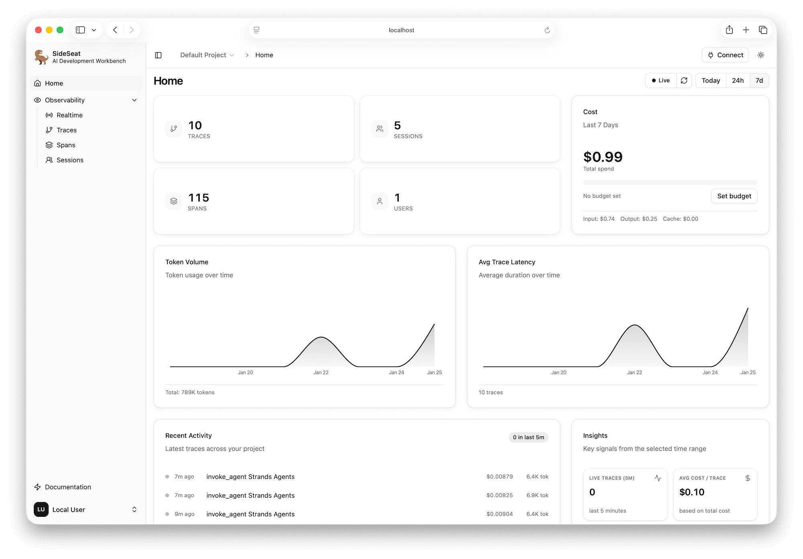

<h1 align="center">SideSeat</h1>

<p align="center">
  <strong>Observability for AI agents, built on OpenTelemetry.</strong><br>
  See every model call, tool call, and agent decision - as conversations, live.
</p>

<p align="center">
  <a href="https://github.com/sideseat/sideseat/blob/main/LICENSE"></a>
  <a href="https://www.npmjs.com/package/sideseat"></a>
  <a href="https://pypi.org/project/sideseat/"></a>
</p>

<p align="center">
  <a href="https://www.youtube.com/watch?v=JqTcJ2OCLQI">
    
  </a>
</p>

SideSeat collects the OpenTelemetry your agent framework already emits and turns it back into the
conversation it describes: every system prompt, question, tool call, tool result, reasoning block, and
answer, in order, grouped into traces and sessions. Run it on your machine - prompts and data never
leave it - or deploy it for a team.

## Quick start

```bash
npx sideseat                      # or: docker run -p 5388:5388 sideseat/core
```

Open [http://localhost:5388](http://localhost:5388), then instrument your agent:

```bash
pip install sideseat strands-agents
```

```python
import sideseat
from strands import Agent

sideseat.init(integrations=["strands"])

agent = Agent(model="global.anthropic.claude-sonnet-5-5")

with sideseat.session("trip-planning", user_id="user-7"):
    agent("Plan a weekend in Lisbon.")
    agent("What should I eat there?")
```

The same in TypeScript:

```ts
import * as sideseat from "@sideseat/sdk";

await sideseat.init({ integrations: ["vercel-ai"] });
await sideseat.session({ sessionId: "trip-planning" }, () => runAgent());
```

No SDK? Point any OpenTelemetry exporter at `http://localhost:5388/otel/default`.

## Supported frameworks and providers

**Python:** Strands Agents, LangGraph, LangChain, CrewAI, AutoGen, AG2, OpenAI Agents SDK, Google ADK,
Pydantic AI, Microsoft Agent Framework, Semantic Kernel, Claude Agent SDK, Agno, smolagents, LlamaIndex,
AgentScope, Haystack, Browser Use, Logfire, TraceLoop, OpenInference, Langfuse.

**TypeScript:** Strands Agents, Vercel AI SDK, Claude Agent SDK.

**Coding agents:** Claude Code, OpenAI Codex CLI.

**Providers:** Amazon Bedrock, Anthropic, OpenAI, Azure OpenAI, Google Gemini, Vertex AI.

Each of these is verified end to end. Its example suite runs a fixed set of scenarios - chat, multi-turn,
sessions, tool use, a failing tool, and where the framework supports them streaming, structured output,
reasoning, files, multi-agent and MCP tools - once with the framework's own OpenTelemetry setup and once
with the SideSeat SDK, against current models (Claude Sonnet 5.5 on Bedrock, or a deterministic fake
server where Bedrock does not serve the provider). SideSeat's reading of every captured trace, span and
session is checked message by message, and both runs must read the same. Where an instrumentation itself
drops content - images, documents, reasoning - the
[compatibility matrix](https://sideseat.ai/docs/reference/production-readiness/) says so.

**Also integrated, not yet covered by a captured suite:** Langflow in Python; Microsoft.Extensions.AI,
Microsoft Agent Framework and Semantic Kernel in .NET, where the SDK itself is verified by its
conformance program.

## SDKs

| Language | Package | Docs |
| --- | --- | --- |
| Python | [`sideseat`](https://pypi.org/project/sideseat/) | [Python SDK](https://sideseat.ai/docs/sdks/python/) |
| TypeScript | [`@sideseat/sdk`](https://www.npmjs.com/package/@sideseat/sdk) | [TypeScript SDK](https://sideseat.ai/docs/sdks/typescript/) |
| .NET | [`SideSeat`](https://www.nuget.org/packages/SideSeat) | [.NET SDK](https://sideseat.ai/docs/sdks/dotnet/) |
| Rust | [`sideseat`](https://crates.io/crates/sideseat) | [Rust SDK](https://sideseat.ai/docs/sdks/rust/) |

All four implement one [contract](docs/engineering/sdk-contract.md): one call to configure, session
scopes that reach framework spans, and exactly-once export.

## MCP server for coding agents

SideSeat serves your agent's execution history over [MCP](https://modelcontextprotocol.io/), so a coding
agent can read real prompts, tool calls, errors, and costs:

```bash
claude mcp add --transport http sideseat http://localhost:5388/api/v1/projects/default/mcp \
  --header "Authorization: Bearer $SIDESEAT_API_KEY"
```

Setup for Codex, Cursor, Kiro, and other clients is in the [MCP docs](https://sideseat.ai/docs/mcp/).

## Deploy

- **Local:** `npx sideseat` stores everything in a local embedded database.
- **Container:** `docker run -p 5388:5388 -v $(pwd)/data:/data sideseat/core`.
- **Team:** PostgreSQL, ClickHouse, Redis or Redpanda, and S3-compatible storage scale it out - see the
  [configuration reference](https://sideseat.ai/docs/reference/config/).

## Repository

```
server/     Rust backend: crates/ (ports and adapters), src/ (composition root), tests/, assets/rules/, specs/ (TLA+)
web/        React UI
sdk/        python/  js/  dotnet/  rust/
examples/   one suite per framework, sharing a scenario harness; the source of the golden fixtures
docs/       the documentation site, and docs/engineering/ for internals
cli/        the npm distribution
config/     configuration schema and examples
make/       Makefile fragments, one per area
scripts/    automation by purpose: check/ test/ perf/ fixtures/ dev/ release/ ops/ deploy/ tools/
```

[CONTRIBUTING.md](CONTRIBUTING.md) explains the development loop.

## License

[Apache-2.0](LICENSE). The SDKs are MIT.
