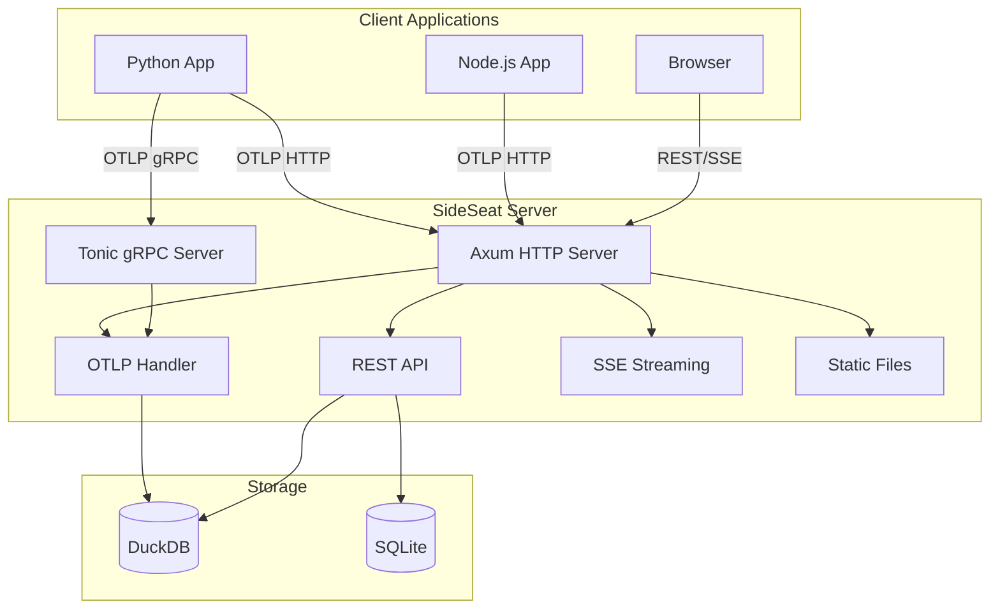
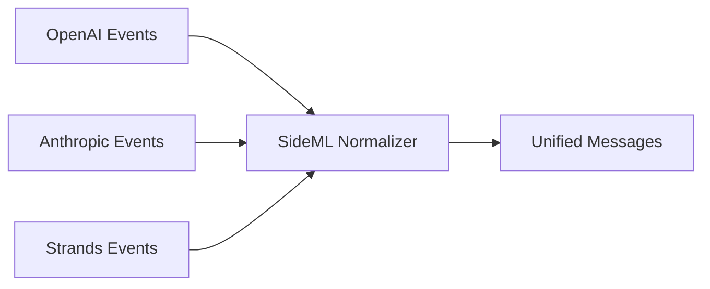
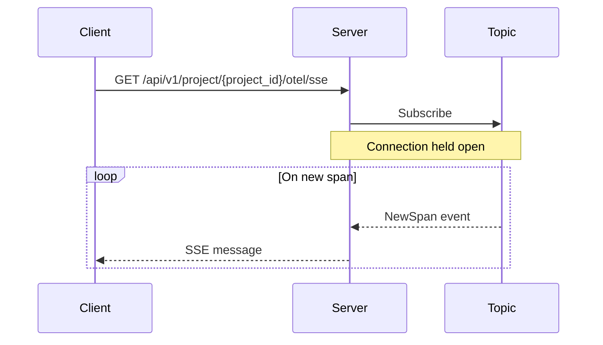

import { Aside } from '@astrojs/starlight/components';

This page provides a technical overview of SideSeat’s architecture for developers who want to understand how the local workbench is built or contribute to the project.

## System Overview

SideSeat runs as a single local binary that includes:
- **HTTP Server** (Axum) - REST API, OTLP ingestion, static file serving
- **gRPC Server** (Tonic) - Optional high-throughput OTLP ingestion
- **Workbench UI** (React) - Embedded static files
- **Storage** - DuckDB (analytics) + SQLite (transactional)



## Ingestion Pipeline

The ingestion pipeline processes incoming OTLP data through these stages:

### 1. Receive

OTLP data arrives via:
- **HTTP**: `POST /otel/{project_id}/v1/traces` (protobuf or JSON)
- **gRPC**: `localhost:4317` (protobuf)

### 2. Decode

Protobuf messages are decoded into internal `SpanData` structures. The decoding preserves all original attributes.

### 3. Extract

Framework detection and attribute extraction happens at ingestion time:

```rust
// Detect framework from span attributes
let framework = detect_framework(&span.attributes);

// Extract GenAI-specific fields
let model = get_first(attrs, &[
    "gen_ai.request.model",
    "gen_ai.response.model",
    "llm.model_name",
]);
```

<Aside type="note">
Message normalization (SideML) happens at **query time**, not ingestion. This ensures bug fixes apply to historical data without re-ingestion.
</Aside>

### 4. Enrich

Enrichment adds derived fields:
- **Cost calculation**: Look up model pricing, compute costs
- **Preview generation**: Truncate input/output for list views
- **Timestamps**: Normalize to microseconds

### 5. Persist

Spans are batched and written to DuckDB. The schema preserves raw attributes in a JSON column for flexibility.

## Database Architecture

SideSeat uses two databases:

### Analytics Database (DuckDB/ClickHouse)

Stores telemetry data optimized for analytical queries:
- **spans**: Normalized span data with extracted fields
- **Raw attributes**: Preserved in JSON for ad-hoc queries

Default: DuckDB (embedded, zero config)

Optional: ClickHouse (external, high volume)

### Transactional Database (SQLite/PostgreSQL)

Stores application state:
- **projects**: Project configuration
- **api_tokens**: Authentication tokens
- **settings**: User preferences

Default: SQLite (embedded, zero config)

Optional: PostgreSQL (external, HA)

## Query Architecture

### Message Normalization (SideML)

SideSeat normalizes messages from different frameworks into a universal format called SideML:



This happens at query time via `sideml/pipeline.rs`:

1. **Extract events** from span
2. **Categorize** by role (system/user/assistant/tool)
3. **Parse content** into blocks (text, tool_use, tool_result, etc.)
4. **Deduplicate** using content hashing
5. **Sort** by birth time

### Query Endpoints

All query endpoints are prefixed with `/api/v1/project/{project_id}/otel`:

| Endpoint | Purpose |
|----------|---------|
| `GET /traces` | List runs with filtering |
| `GET /traces/{id}` | Get a single run |
| `GET /traces/{id}/messages` | Get normalized messages |
| `GET /spans` | List steps with filtering |
| `GET /sessions` | List sessions |
| `GET /sse` | Real-time event stream |

## Real-time Streaming

SideSeat uses Server-Sent Events (SSE) for real-time updates:



The `Topic` is an in-memory pub/sub system that broadcasts events to all connected clients.

## Configuration System

Configuration is loaded from multiple sources with this priority (highest first):

1. **CLI arguments**: `--port 8080`
2. **Environment variables**: `SIDESEAT_PORT=8080`
3. **Working directory config**: `./sideseat.json`
4. **User config**: `~/.sideseat/sideseat.json`
5. **Defaults**: Built-in values

```rust
// Priority chain example
let port = cli.port
    .or(env_port)
    .or(workdir_config.port)
    .or(user_config.port)
    .unwrap_or(DEFAULT_PORT);
```

## Directory Structure

```
server/src/
├── app.rs              # Main orchestrator
├── core/
│   ├── config.rs       # Configuration loading
│   ├── cli.rs          # CLI argument parsing
│   ├── constants.rs    # All constants
│   └── topic.rs        # Pub/sub messaging
├── data/
│   ├── duckdb/         # DuckDB implementation
│   ├── clickhouse/     # ClickHouse implementation
│   ├── sqlite/         # SQLite implementation
│   ├── postgres/       # PostgreSQL implementation
│   └── traits.rs       # Repository interfaces
├── domain/
│   ├── pricing/        # Cost calculation
│   ├── sideml/         # Message normalization
│   └── traces/         # Trace extraction/enrichment
└── api/
    └── routes/         # HTTP handlers
```

## Key Design Decisions

### Why DuckDB?

- **Embedded**: No external dependencies
- **Analytical**: Columnar storage for fast aggregations
- **Compatible**: SQL interface, easy migration to ClickHouse

### Why SQLite?

- **Embedded**: Single file, zero config
- **ACID**: Full transaction support
- **Compatible**: Easy migration to PostgreSQL

### Why Rust?

- **Performance**: Low latency, high throughput
- **Memory safety**: No GC pauses, predictable performance
- **Single binary**: Easy distribution via npm

### Why React (not Next.js)?

- **Embedded**: Static files bundled in binary
- **Simple**: No SSR complexity for a local workbench UI
- **Portable**: Works with any HTTP server

## Next Steps

- [API Reference](/docs/reference/api/) — REST API documentation
- [OpenTelemetry Reference](/docs/reference/otel/) — attribute extraction details
- [Configuration Schema](/docs/reference/config/) — all config options
