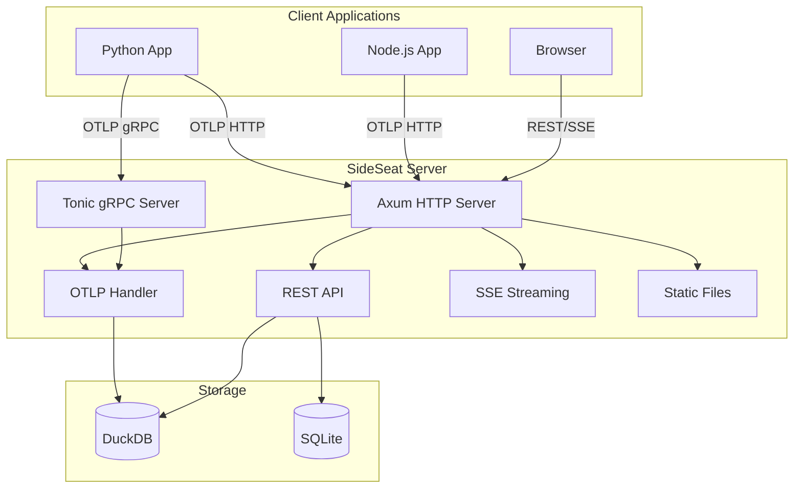
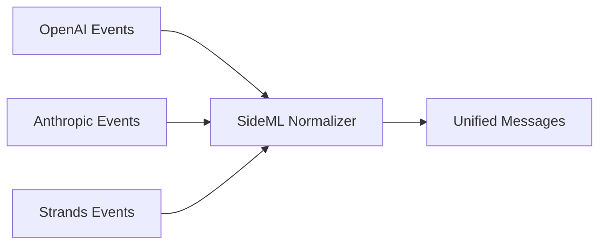
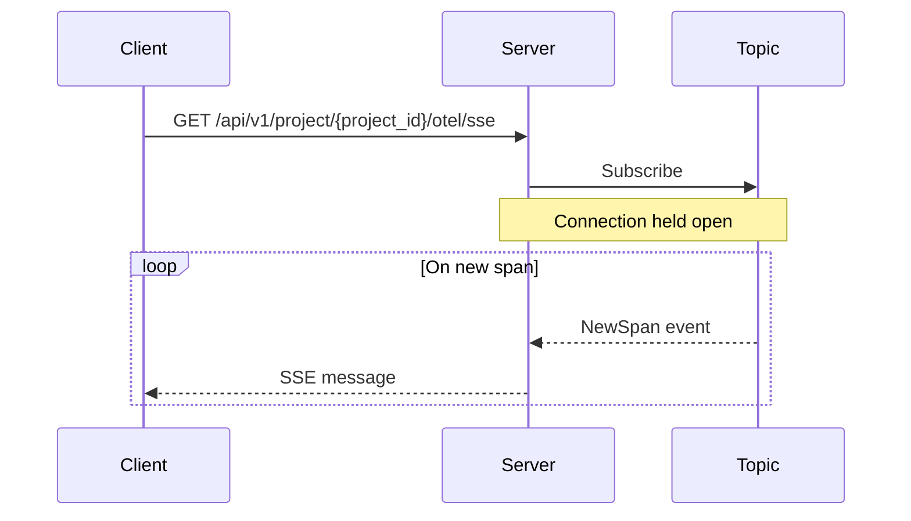

import { Aside } from "@astrojs/starlight/components";

This page provides a technical overview of SideSeat’s architecture for developers who want to understand how the local workbench is built or contribute to the project.

## System Overview

SideSeat runs as a single local binary that includes:

- **HTTP Server** (Axum) - REST API, OTLP ingestion, static file serving
- **gRPC Server** (Tonic) - Optional high-throughput OTLP ingestion
- **Workbench UI** (React) - Embedded static files
- **Storage ports** - DuckDB + SQLite by default, or ClickHouse + PostgreSQL for distributed deployments


```mermaid
graph TB
    subgraph "Client Applications"
        A[Python App]
        B[Node.js App]
        C[Browser]
    end

    subgraph "SideSeat Server"
        D[Axum HTTP Server]
        E[Tonic gRPC Server]
        F[OTLP Handler]
        G[REST API]
        H[SSE Streaming]
        I[Static Files]
    end

    subgraph "Storage"
        J[(DuckDB)]
        K[(SQLite)]
    end

    A -->|OTLP HTTP| D
    B -->|OTLP HTTP| D
    A -->|OTLP gRPC| E
    C -->|REST/SSE| D

    D --> F
    D --> G
    D --> H
    D --> I

    E --> F

    F --> J
    G --> J
    G --> K
```

## Ingestion Pipeline

The ingestion pipeline processes incoming OTLP data through these stages:

### 1. Receive

OTLP data arrives via:

- **HTTP**: `POST /otel/{project_id}/v1/traces` (protobuf or JSON)
- **gRPC**: `localhost:4317` (protobuf)

### 2. Decode

Protobuf messages are decoded into internal `SpanData` structures. The decoding preserves all original attributes.

### 3. Extract

Framework detection and attribute extraction happen at ingestion time. Producer-specific knowledge is
declared in JSON under `server/assets/rules/`; `sideseat-rule-assets` embeds it and `sideseat-domain`
compiles it into typed plans consumed by ingestion. Adding a producer normally changes rules and fixtures,
not framework-name branches in Rust.

<Aside type="note">
  Message normalization (SideML) happens at **query time**, not ingestion. This
  ensures bug fixes apply to historical data without re-ingestion.
</Aside>

### 4. Enrich

Enrichment adds derived fields:

- **Cost calculation**: Look up model pricing, compute costs
- **Preview generation**: Truncate input/output for list views
- **Timestamps**: Normalize to microseconds

### 5. Persist

Spans are batched and written to DuckDB. The schema preserves raw attributes in a JSON column for flexibility.

## Database Architecture

SideSeat uses two databases:

### Analytics Database (DuckDB/ClickHouse)

Stores telemetry data optimized for analytical queries:

- **spans**: Normalized span data with extracted fields
- **Raw attributes**: Preserved in JSON for ad-hoc queries

Default: DuckDB (embedded, zero config)

Optional: ClickHouse (external, high volume)

### Transactional Database (SQLite/PostgreSQL)

Stores application state:

- **projects**: Project configuration
- **api_tokens**: Authentication tokens
- **settings**: User preferences

Default: SQLite (embedded, zero config)

Optional: PostgreSQL (external, HA)

## Query Architecture

### Message Normalization (SideML)

SideSeat normalizes messages from different frameworks into a universal format called SideML:


```mermaid
graph LR
    A[OpenAI Events] --> D[SideML Normalizer]
    B[Anthropic Events] --> D
    C[Strands Events] --> D
    D --> E[Unified Messages]
```

This happens at query time via `sideml/normalize.rs`:

1. **Extract events** from span
2. **Categorize** by role (system/user/assistant/tool)
3. **Parse content** into blocks (text, tool_use, tool_result, etc.)
4. **Deduplicate** using content hashing
5. **Sort** by birth time

### Query Endpoints

All query endpoints are prefixed with `/api/v1/project/{project_id}/otel`:

| Endpoint                    | Purpose                   |
| --------------------------- | ------------------------- |
| `GET /traces`               | List runs with filtering  |
| `GET /traces/{id}`          | Get a single run          |
| `GET /traces/{id}/messages` | Get normalized messages   |
| `GET /spans`                | List steps with filtering |
| `GET /sessions`             | List sessions             |
| `GET /sse`                  | Real-time event stream    |

## Real-time Streaming

SideSeat uses Server-Sent Events (SSE) for real-time updates:


```mermaid
sequenceDiagram
    participant Client
    participant Server
    participant Topic

    Client->>Server: GET /api/v1/project/{project_id}/otel/sse
    Server->>Topic: Subscribe
    Note over Server,Topic: Connection held open

    loop On new span
        Topic-->>Server: NewSpan event
        Server-->>Client: SSE message
    end
```

`sideseat-messaging` is a typed facade over the queue port. The composition root selects an in-process,
Redis, or Redpanda adapter; stream topics carry durable ingestion work when configured, while broadcast
topics feed live SSE subscribers.

## Configuration System

Configuration is loaded from multiple sources with this priority (highest first):

1. **CLI arguments**: `--port 8080`
2. **Environment variables**: `SIDESEAT_PORT=8080`
3. **Working directory config**: `./sideseat.json`
4. **User config**: `~/.sideseat/sideseat.json`
5. **Defaults**: Built-in values

```rust
// Priority chain example
let port = cli.port
    .or(env_port)
    .or(workdir_config.port)
    .or(user_config.port)
    .unwrap_or(DEFAULT_PORT);
```

## Directory Structure

The layers are **separate crates**, so a forbidden dependency does not compile: `server/crates/core` names no driver
and nothing of SideSeat's own, which is what makes the direction a fact rather than a convention.

```
server/crates/core/src/
├── config.rs           # Configuration loading
├── cli.rs              # CLI argument parsing
├── constants.rs        # Shared limits and defaults
├── storage.rs          # Storage layout
└── utils/              # Pure utilities
```

```
server/crates/ports/src/
├── traits.rs           # Repository interfaces - no implementation may be named here
├── error.rs            # DataError, carrying each driver's message rather than its error type
├── filters/            # The filter vocabulary, shared by both analytics adapters
└── types/              # Shared DTOs
```

```
server/crates/
├── core/                         # Configuration, constants, storage layout, pure utilities
├── ports/                        # Traits, DTOs, filters, and shared errors
├── domain/                       # Reconstruction, governance, files, and search
├── ingestion/                    # OTLP lifecycle, staging, normalization, and persistence
├── messaging/                    # Typed streams and broadcasts over the queue port
├── api/                          # HTTP/gRPC transport and route handlers
├── query-sql/                    # Typed cross-engine query construction
├── rule-assets/                  # Deterministic embedding of framework rule JSON
├── adapter-duckdb/               # Embedded analytics
├── adapter-clickhouse/           # Server analytics
├── adapter-sqlite/               # Embedded transactional store
├── adapter-postgres/             # Server transactional store
├── adapter-blob-storage/         # Filesystem and S3 blobs
├── adapter-cache/                # In-memory and Redis cache
├── adapter-topics/               # In-process, Redis, and Redpanda messaging
├── adapter-secrets/              # Credential secret providers
├── adapter-pricing/              # External pricing catalogue
└── adapter-registrations-memory/ # Process-local agent registration
```

```
server/src/
├── main.rs                       # Process entry point
├── lib.rs                        # Testable server library boundary
├── app.rs                        # Composition root
├── app/                          # Adapter selection, lifecycle, and system workflows
│   ├── background_tasks.rs
│   ├── files.rs
│   ├── providers.rs
│   ├── providers/
│   │   └── azure.rs
│   ├── storage/
│   │   ├── mod.rs
│   │   ├── analytics.rs
│   │   └── transactional.rs
│   ├── system_commands.rs
│   └── update.rs
└── runtime/                      # Process lifecycle and allocator instrumentation
    ├── allocation.rs
    ├── clock.rs
    ├── mod.rs
    └── shutdown.rs
```

## Key Design Decisions

### Why DuckDB?

- **Embedded**: No external dependencies
- **Analytical**: Columnar storage for fast aggregations
- **Compatible**: SQL interface, easy migration to ClickHouse

### Why SQLite?

- **Embedded**: Single file, zero config
- **ACID**: Full transaction support
- **Compatible**: Easy migration to PostgreSQL

### Why Rust?

- **Performance**: Low latency, high throughput
- **Memory safety**: No GC pauses, predictable performance
- **Single binary**: Easy distribution via npm

### Why React (not Next.js)?

- **Embedded**: Static files bundled in binary
- **Simple**: No SSR complexity for a local workbench UI
- **Portable**: Works with any HTTP server

## Next Steps

- [API Reference](/docs/reference/api/) — REST API documentation
- [OpenTelemetry Reference](/docs/reference/otel/) — attribute extraction details
- [Configuration Schema](/docs/reference/config/) — all config options
