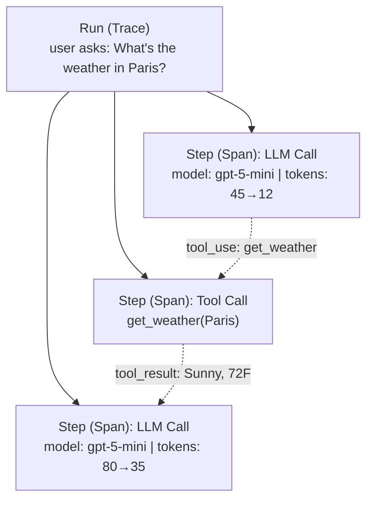

import { Aside } from '@astrojs/starlight/components';

SideSeat is built on OpenTelemetry. This page maps SideSeat concepts to the underlying telemetry model so you can reason about what you see in the UI and API.

## Runs (Traces)

A **run** represents one end-to-end execution in your AI application. Under the hood, a run maps to an OpenTelemetry **trace**.

Examples of a run:
- A user asks a question and receives an answer
- An agent completes a multi-step task
- A batch job processes a single item

Each run has:
- **Run ID (Trace ID)**: Unique identifier (128-bit hex string)
- **Steps (Spans)**: Individual operations within the run
- **Duration**: Total time from start to finish
- **Status**: Success, error, or in-progress



## Steps (Spans)

A **step** represents a single operation within a run. Under the hood, each step is an OpenTelemetry **span**.

### Step Properties

| Property | Description |
|----------|-------------|
| `span_id` | Unique identifier within the run |
| `parent_span_id` | ID of the parent step (null for root) |
| `span_name` | Operation name (e.g., "chat", "tool_call") |
| `timestamp_start` | When the operation started |
| `timestamp_end` | When the operation completed |
| `duration_ms` | How long it took |
| `status` | OK, ERROR, or UNSET |

### Step Categories

SideSeat categorizes steps based on attributes:

| Category | Description | Example |
|----------|-------------|---------|
| `LLM` | Language model calls | Chat completion, embedding |
| `Tool` | Tool/function executions | API calls, file operations |
| `Agent` | Agent orchestration | Planning, routing |
| `Chain` | Chain/workflow steps | Sequential operations |
| `DB` | Database operations | Vector store queries |
| `HTTP` | HTTP requests | External API calls |
| `Other` | Uncategorized | Custom spans |

### GenAI Attributes

For LLM steps, SideSeat extracts and normalizes these attributes:

```
gen_ai.system               Provider (openai, anthropic, bedrock)
gen_ai.request.model        Requested model name
gen_ai.response.model       Actual model used
gen_ai.usage.input_tokens   Prompt tokens
gen_ai.usage.output_tokens  Completion tokens
gen_ai.cost.input           Input cost in USD
gen_ai.cost.output          Output cost in USD
gen_ai.cost.total           Total cost in USD
```

<Aside type="note">
Cost calculation is automatic when the model is recognized. You can override pricing via config if needed.
</Aside>

## Messages

**Messages** represent the conversation within a step. They're extracted from OpenTelemetry events and attributes.

### Message Roles

| Role | Description | Source |
|------|-------------|--------|
| `system` | System prompts | Initial instructions |
| `user` | User input | Questions, commands |
| `assistant` | Model output | Responses, tool calls |
| `tool` | Tool results | Function return values |

### Content Blocks

Messages can contain multiple content types:

```typescript
type ContentBlock =
  | { type: 'text', text: string }
  | { type: 'image', source: ImageSource }
  | { type: 'tool_use', id: string, name: string, input: object }
  | { type: 'tool_result', tool_use_id: string, content: string }
  | { type: 'thinking', thinking: string }
```

## Sessions

A **session** groups related runs together (for example, multi-turn conversations).

Sessions are created implicitly when traces share a `session.id` attribute:

```python
# All traces with this session.id are grouped
agent = Agent(
    trace_attributes={"session.id": "conversation-abc123"}
)
```

### Session Properties

| Property | Description |
|----------|-------------|
| `session_id` | Unique identifier |
| `first_trace_at` | When the session started |
| `last_trace_at` | Most recent activity |
| `trace_count` | Number of runs |
| `total_tokens` | Combined token usage |
| `total_cost` | Combined cost |

## Projects

**Projects** organize runs into isolated namespaces. Each project has:
- Separate trace storage
- Independent retention settings
- Unique API endpoints

The default project is called `default`. Traces are sent to:

```
POST /otel/{project_id}/v1/traces
```

## Next Steps

- [OpenTelemetry Reference](/docs/reference/otel/) — attribute extraction and framework detection
- [API Reference](/docs/reference/api/) — query runs programmatically
- [Architecture](/docs/architecture/) — deep dive into system design
