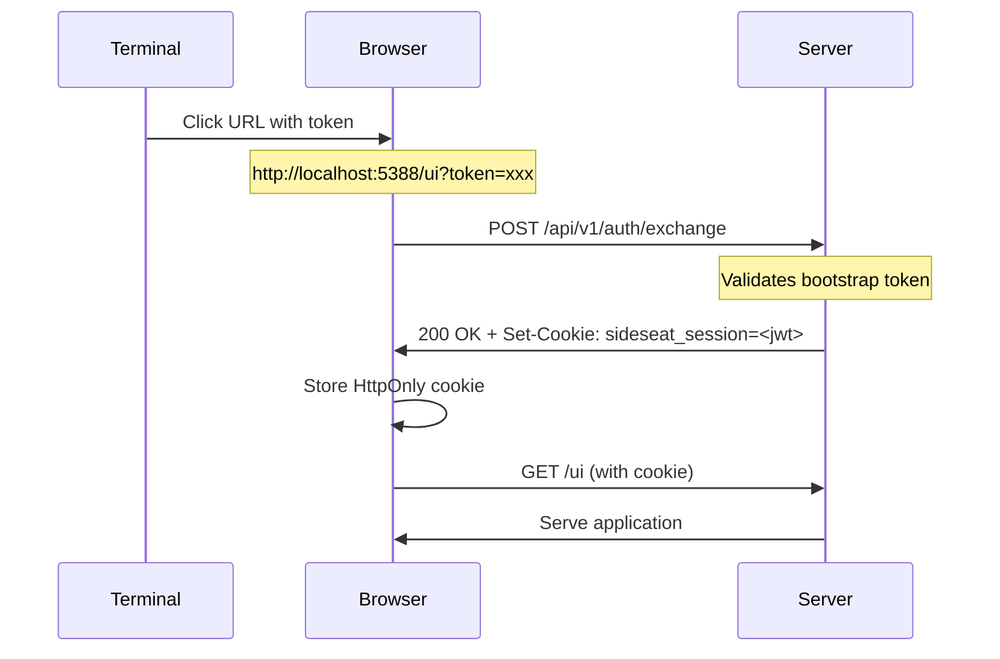
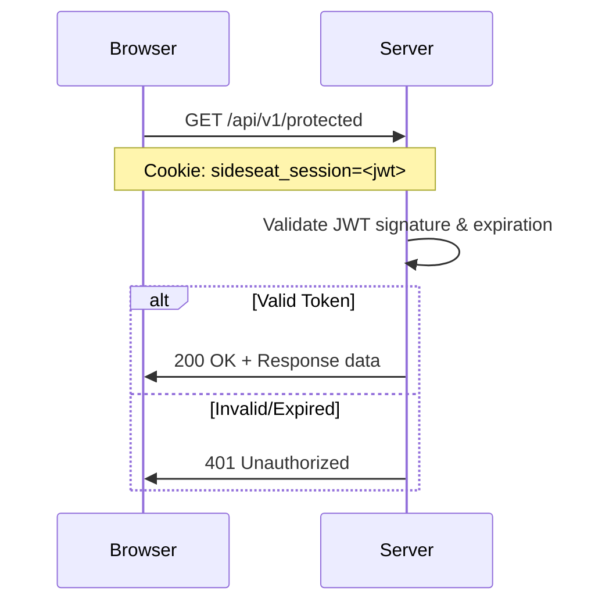

SideSeat uses a token-based authentication system that secures the web UI while remaining easy to use for local development.

## How It Works

1. **Server starts** → Generates a bootstrap token and prints URL to terminal
2. **User clicks URL** → Browser exchanges bootstrap token for JWT session
3. **JWT stored in cookie** → HttpOnly, SameSite=Strict cookie for security
4. **Protected routes** → API endpoints validate JWT on each request

## Quick Start

```bash
# Start with authentication (default)
sideseat start

# Output:
#   SideSeat v1.x
#   ➜  Local: http://127.0.0.1:5388/ui?token=abc123...
```

Click the URL with the token to authenticate automatically.

## Disabling Authentication

For development or trusted environments, authentication can be disabled:

```bash
# CLI flag
sideseat start --no-auth

# Environment variable
SIDESEAT_AUTH_ENABLED=false sideseat start
```

Or in configuration file:

```json
{
  "auth": {
    "enabled": false
  }
}
```

## Authentication Flow

### Bootstrap Token Exchange



### Session Validation



## API Endpoints

### POST /api/v1/auth/exchange

Exchange a bootstrap token for a JWT session.

**Request:**
```json
{ "token": "bootstrap_token_here" }
```

**Success Response (200):**
```json
{ "success": true, "message": "Authentication successful" }
```
Plus `Set-Cookie: sideseat_session=<jwt>; HttpOnly; SameSite=Strict; Path=/api`

**Error Response (401):**
```json
{
  "error": "unauthorized",
  "code": "BOOTSTRAP_INVALID",
  "message": "Invalid bootstrap token"
}
```

### GET /api/v1/auth/status

Check current authentication status.

**Response:**
```json
{
  "authenticated": true,
  "auth_method": "bootstrap",
  "expires_at": "2025-02-24T12:00:00Z"
}
```

### POST /api/v1/auth/logout

Clear the session cookie.

**Response:**
```json
{ "success": true, "message": "Logged out successfully" }
```

## Security Features

| Feature | Implementation |
|---------|----------------|
| **Token Storage** | JWT signing key in OS keychain via SecretManager |
| **Cookie Security** | HttpOnly, SameSite=Strict, Path=/api |
| **Token Validation** | Constant-time comparison (timing attack resistant) |
| **Session Expiry** | 30-day JWT lifetime |
| **CSRF Protection** | SameSite cookie + Origin header validation |

## JWT Claims

```json
{
  "sub": "local",
  "iat": 1703001234,
  "exp": 1705593234,
  "jti": "unique-uuid-v4",
  "auth_method": "bootstrap"
}
```

| Claim | Description |
|-------|-------------|
| `sub` | Subject identifier ("local" for bootstrap auth) |
| `iat` | Issued at timestamp |
| `exp` | Expiration timestamp (30 days from issue) |
| `jti` | Unique JWT ID for tracking |
| `auth_method` | Authentication method used |

## Error Responses

All authentication errors return 401 with a structured response:

```json
{
  "error": "unauthorized",
  "code": "ERROR_CODE",
  "message": "Human-readable message"
}
```

| Code | Description |
|------|-------------|
| `AUTH_REQUIRED` | No session cookie present |
| `TOKEN_EXPIRED` | JWT has expired |
| `TOKEN_INVALID` | Invalid JWT signature |
| `BOOTSTRAP_INVALID` | Invalid bootstrap token |
| `ORIGIN_NOT_ALLOWED` | Request from disallowed origin |

## Protecting API Routes

```rust
use sideseat_server::auth::{require_auth, AuthManager};
use axum::{Router, middleware, routing::get};

let auth_manager = Arc::new(AuthManager::init(&secrets, true).await?);

let protected_routes = Router::new()
    .route("/protected", get(handler))
    .layer(middleware::from_fn_with_state(
        auth_manager.clone(),
        require_auth
    ));
```

## Frontend Integration

### React Auth Context

```tsx
import { useAuth } from "@/auth/context";

function MyComponent() {
  const { authenticated, loading, login, logout } = useAuth();

  if (loading) return <div>Loading...</div>;
  if (!authenticated) return <div>Please authenticate</div>;

  return <div>Welcome!</div>;
}
```

### Protected Routes

```tsx
import { AuthGuard } from "@/auth/guard";

<AuthGuard>
  <ProtectedPage />
</AuthGuard>
```

### API Client

```ts
import { fetchAPI, AuthError } from "@/api/client";

try {
  const data = await fetchAPI("/protected");
} catch (e) {
  if (e instanceof AuthError) {
    // Redirect to login
  }
}
```

## Best Practices

1. **Always use HTTPS in production** - Cookies are sent in clear text over HTTP
2. **Click "Always Allow"** - On macOS, grant keychain access permanently
3. **Don't share terminal URLs** - Bootstrap tokens grant access
4. **Monitor session expiry** - 30-day tokens should be refreshed periodically
5. **Use --no-auth carefully** - Only in trusted, isolated environments
