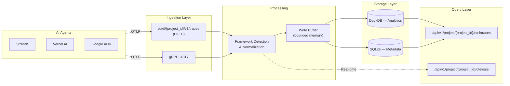

SideSeat includes a built-in OpenTelemetry collector optimized for local AI development workflows. It receives OTLP traces via HTTP and gRPC, stores them locally (DuckDB + SQLite), and provides real-time streaming via SSE.

## Architecture



## Features

- **OTLP-compatible**: Receives traces via standard OpenTelemetry protocol (HTTP JSON/Protobuf, gRPC)
- **Framework detection**: Automatically detects Strands, LangGraph, Vercel AI, Google ADK, and other AI frameworks
- **GenAI field extraction**: Extracts token usage, model info, and other GenAI-specific fields
- **Bounded memory**: Configurable buffer limits prevent memory exhaustion
- **FIFO storage**: Automatic cleanup when storage limits are reached
- **Real-time streaming**: SSE endpoint for live trace updates
- **Efficient storage**: DuckDB + SQLite with indexed columns for fast queries

## Endpoints

### Trace Ingestion

| Endpoint | Method | Content-Type | Description |
|----------|--------|--------------|-------------|
| `/otel/{project_id}/v1/traces` | POST | `application/json` | OTLP JSON traces |
| `/otel/{project_id}/v1/traces` | POST | `application/x-protobuf` | OTLP Protobuf traces |
| `localhost:4317` | gRPC | Protobuf | OTLP gRPC endpoint |

### Query API

| Endpoint | Method | Description |
|----------|--------|-------------|
| `/api/v1/project/{project_id}/otel/traces` | GET | List traces with filtering |
| `/api/v1/project/{project_id}/otel/traces/filter-options` | GET | Get available filter options |
| `/api/v1/project/{project_id}/otel/traces/{trace_id}` | GET | Get single trace details |
| `/api/v1/project/{project_id}/otel/traces/{trace_id}` | DELETE | Delete a trace and all associated data |
| `/api/v1/project/{project_id}/otel/traces/{trace_id}/spans` | GET | Get spans for a trace |
| `/api/v1/project/{project_id}/otel/spans` | GET | Query spans with GenAI fields |
| `/api/v1/project/{project_id}/otel/traces/{trace_id}/spans/{span_id}` | GET | Get span detail with events |
| `/api/v1/project/{project_id}/otel/traces/{trace_id}/spans/{span_id}/messages` | GET | Get normalized span messages |
| `/api/v1/project/{project_id}/otel/sessions` | GET | List sessions with filtering |
| `/api/v1/project/{project_id}/otel/sessions/{session_id}` | GET | Get single session details |
| `/api/v1/project/{project_id}/otel/sessions` | DELETE | Delete sessions (batch) |
| `/api/v1/project/{project_id}/otel/sessions/filter-options` | GET | Get available filter options |

### Real-time Streaming

| Endpoint | Method | Description |
|----------|--------|-------------|
| `/api/v1/project/{project_id}/otel/sse` | GET | SSE stream of trace events |

## Configuration

All OTel settings are under the `otel` key in your config file:

```json
{
  "otel": {
    "grpc": {
      "enabled": true,
      "port": 4317
    },
    "retention": {
      "max_age_minutes": 10080,
      "max_spans": 5000000
    }
  }
}
```

See [Config Manager](/docs/reference/config/) for the full configuration reference.

## Sending Traces

### Python with OpenTelemetry SDK

```python
from opentelemetry import trace
from opentelemetry.sdk.trace import TracerProvider
from opentelemetry.sdk.trace.export import BatchSpanProcessor
from opentelemetry.exporter.otlp.proto.http.trace_exporter import OTLPSpanExporter

# Configure exporter to send to SideSeat
exporter = OTLPSpanExporter(endpoint="http://localhost:5388/otel/default/v1/traces")
provider = TracerProvider()
provider.add_span_processor(BatchSpanProcessor(exporter))
trace.set_tracer_provider(provider)

# Create traces
tracer = trace.get_tracer(__name__)
with tracer.start_as_current_span("my-agent-operation"):
    # Your agent code here
    pass
```

### Python with Strands SDK

```python
from strands import Agent
from strands.models import BedrockModel
from strands.telemetry import StrandsTelemetry

# Configure telemetry to export to SideSeat
telemetry = StrandsTelemetry()
telemetry.setup_otlp_exporter(endpoint="http://localhost:5388/otel/default/v1/traces")

# Create agent with optional trace attributes
model = BedrockModel(model_id="us.anthropic.claude-sonnet-4-5-20250929-v1:0")
agent = Agent(
    name="my-agent",
    model=model,
    trace_attributes={
        "session.id": "my-session-123",
        "user.id": "user-456",
    },
)

# Don't forget to flush telemetry before exit
# telemetry.tracer_provider.force_flush()
```

### Node.js with OpenTelemetry SDK

```javascript
const { NodeTracerProvider } = require('@opentelemetry/sdk-trace-node');
const { OTLPTraceExporter } = require('@opentelemetry/exporter-trace-otlp-http');
const { BatchSpanProcessor } = require('@opentelemetry/sdk-trace-base');

const exporter = new OTLPTraceExporter({
  url: 'http://localhost:5388/otel/default/v1/traces',
});

const provider = new NodeTracerProvider();
provider.addSpanProcessor(new BatchSpanProcessor(exporter));
provider.register();
```

### Using gRPC

For higher throughput, use the gRPC endpoint:

```python
from opentelemetry.exporter.otlp.proto.grpc.trace_exporter import OTLPSpanExporter

exporter = OTLPSpanExporter(endpoint="localhost:4317", insecure=True)
```

## Framework Detection

SideSeat automatically detects and normalizes spans from popular AI frameworks:

| Framework | Detection Method | Extracted Fields |
|-----------|------------------|------------------|
| Strands | Scope name, resource attrs | Cycle ID, agent info |
| Vercel AI | Scope name, attributes | Model, tokens, telemetry |
| LangGraph | Scope name, attributes | Node, edge, state |
| LangChain | Scope name, attributes | Chain type, run ID |
| CrewAI | Scope name, attributes | Crew, agent, task |
| AutoGen | Scope name, attributes | Agent name, chat round |
| Google ADK | Scope name, attributes | Agent name, model |
| OpenAI Agents | Logfire span type | Agent name, model |
| OpenInference | Attribute prefix | Session ID, user ID |
| Generic GenAI | `gen_ai.*` attributes | Model, tokens, system |

## GenAI Fields

The collector extracts and normalizes GenAI-specific fields:

| Field | Description |
|-------|-------------|
| `gen_ai_system` | AI provider (openai, anthropic, etc.) |
| `gen_ai_request_model` | Requested model name |
| `gen_ai_response_model` | Actual model used |
| `gen_ai_operation_name` | Operation type (chat, completion) |
| `gen_ai_agent_name` | Agent name (for agent frameworks) |
| `gen_ai_tool_name` | Tool name (for tool calls) |
| `usage_input_tokens` | Input/prompt tokens |
| `usage_output_tokens` | Output/completion tokens |
| `usage_total_tokens` | Total tokens (computed if not provided) |
| `usage_cache_read_tokens` | Cache read tokens (Anthropic) |
| `usage_cache_write_tokens` | Cache write tokens (Anthropic) |
| `time_to_first_token_ms` | Time to first token (TTFT) |
| `request_duration_ms` | Total request duration |
| `session_id` | Session/conversation ID |

## Span Events

Span events (messages, tool calls, choices) are automatically categorized:

| Event Type | Role | Description |
|------------|------|-------------|
| `user_message` | user | User input messages |
| `assistant_message` | assistant | Model responses |
| `system_message` | system | System prompts |
| `tool_call` | assistant | Tool/function calls |
| `tool_result` | tool | Tool execution results |
| `choice` | assistant | Completion choices with finish_reason |

Events include `content_preview` (first 500 chars) and tool correlation fields (`tool_name`, `tool_call_id`).

## Storage

Trace data is stored locally with DuckDB for analytics and SQLite for app metadata. Full span data is preserved as JSON for complete access to all fields.

### Retention

Storage is managed with optional retention limits:

- **Time-based**: If `retention.max_age_minutes` is set, data older than that is deleted. No default (disabled unless configured).
- **Volume-based**: `retention.max_spans` limits the number of stored spans. Default: 5,000,000. Oldest spans are deleted first.

## Real-time Streaming

Subscribe to span events via Server-Sent Events:

```javascript
const eventSource = new EventSource(
  'http://localhost:5388/api/v1/project/default/otel/sse'
);

eventSource.addEventListener('span', (event) => {
  const payload = JSON.parse(event.data);
  console.log('Span event:', payload);
});
```

### SSE Limits

- Maximum connections: 100 (configurable)
- Connection timeout: 1 hour (configurable)
- Keepalive interval: 30 seconds (configurable)

## Advanced Filtering

Use the `filters` query parameter on list endpoints to filter by attributes and fields. Pass a JSON array of filter objects (URL-encoded).

### Filter Operators

The attribute filter API supports these operators:

| Operator | Description | Example |
|----------|-------------|---------|
| `eq` | Equals | `{"key":"env","op":"eq","value":"prod"}` |
| `ne` | Not equals | `{"key":"env","op":"ne","value":"dev"}` |
| `contains` | Contains substring | `{"key":"user_id","op":"contains","value":"admin"}` |
| `starts_with` | Starts with | `{"key":"session_id","op":"starts_with","value":"sess_"}` |
| `in` | In list | `{"key":"env","op":"in","value":["prod","staging"]}` |
| `gt`, `lt`, `gte`, `lte` | Numeric comparison | `{"key":"latency","op":"gt","value":1000}` |
| `is_null` | Attribute not present | `{"key":"error","op":"is_null","value":null}` |
| `is_not_null` | Attribute present | `{"key":"user_id","op":"is_not_null","value":null}` |

## Query Examples

### List Recent Traces

```bash
curl http://localhost:5388/api/v1/project/default/otel/traces
```

### Filter by Attributes

```bash
# Filter traces where environment=production
curl "http://localhost:5388/api/v1/project/default/otel/traces?filters=%5B%7B%22key%22%3A%22environment%22%2C%22op%22%3A%22eq%22%2C%22value%22%3A%22production%22%7D%5D"

# Decoded: filters=[{\"key\":\"environment\",\"op\":\"eq\",\"value\":\"production\"}]
```

### Multiple Attribute Filters

```bash
# Filter by environment AND user_id
curl "http://localhost:5388/api/v1/project/default/otel/traces?filters=%5B%7B%22key%22%3A%22environment%22%2C%22op%22%3A%22eq%22%2C%22value%22%3A%22production%22%7D%2C%7B%22key%22%3A%22user_id%22%2C%22op%22%3A%22eq%22%2C%22value%22%3A%22user-123%22%7D%5D"
```

### Get Trace Details

```bash
curl http://localhost:5388/api/v1/project/default/otel/traces/abc123def456
```

### Get Filter Options

Discover available filter values for building UI dropdowns:

```bash
curl http://localhost:5388/api/v1/project/default/otel/traces/filter-options
```

Response:
```json
{
  "services": ["my-agent", "my-service"],
  "frameworks": ["langchain", "openai"],
  "attributes": [
    {
      "key": "environment",
      "key_type": "string",
      "entity_type": "trace",
      "sample_values": ["production", "staging", "development"]
    }
  ]
}
```

## Troubleshooting

### Traces Not Appearing

1. Check OTel is enabled: `"otel": { "enabled": true }`
2. Verify endpoint URL matches your exporter configuration
3. Check server logs for ingestion errors

### High Memory Usage

Reduce buffer sizes in config:

```json
{
  "otel": {
    "ingestion": {
      "channel_capacity": 500,
      "buffer_max_spans": 500,
      "buffer_max_bytes": 5242880
    }
  }
}
```

### Disk Full

1. Reduce `retention.max_age_minutes` for a shorter retention period
2. The local database will be cleaned up automatically based on retention settings
