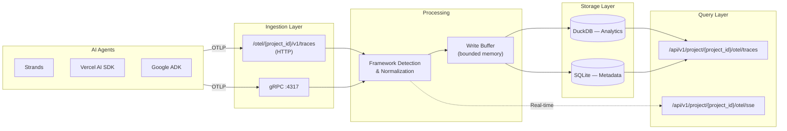

SideSeat includes a built-in OpenTelemetry collector optimized for local AI development workflows. It receives OTLP traces via HTTP and gRPC, stores them locally (DuckDB + SQLite), and provides real-time streaming via SSE.

## Architecture


```mermaid
flowchart LR
    subgraph Agents["AI Agents"]
        A1[Strands]
        A2[Vercel AI SDK]
        A3[Google ADK]
    end

    subgraph Ingest["Ingestion Layer"]
        HTTP["/otel/{project_id}/v1/traces<br/>(HTTP)"]
        GRPC["gRPC :4317"]
    end

    subgraph Processing["Processing"]
        Normalize["Framework Detection<br/>& Normalization"]
        Buffer["Write Buffer<br/>(bounded memory)"]
    end

    subgraph Storage["Storage Layer"]
        DuckDB[(DuckDB — Analytics)]
        SQLite[(SQLite — Metadata)]
    end

    subgraph Query["Query Layer"]
        API["/api/v1/project/{project_id}/otel/traces"]
        SSE["/api/v1/project/{project_id}/otel/sse"]
    end

    Agents -->|OTLP| HTTP
    Agents -->|OTLP| GRPC
    HTTP --> Normalize
    GRPC --> Normalize
    Normalize -.->|Real-time| SSE
    Normalize --> Buffer
    Buffer --> DuckDB
    Buffer --> SQLite
    DuckDB --> API
    SQLite --> API
```

## Features

- **OTLP-compatible**: Receives traces via standard OpenTelemetry protocol (HTTP JSON/Protobuf, gRPC)
- **Framework detection**: Automatically detects Strands, LangGraph, Vercel AI SDK, Google ADK, Claude Agent SDK, and other AI frameworks
- **GenAI field extraction**: Extracts token usage, model info, and other GenAI-specific fields
- **Bounded memory**: Configurable buffer limits prevent memory exhaustion
- **FIFO storage**: Automatic cleanup when storage limits are reached
- **Real-time streaming**: SSE endpoint for live trace updates
- **Efficient storage**: DuckDB + SQLite with indexed columns for fast queries

## Endpoints

### Trace Ingestion

| Endpoint | Method | Content-Type | Description |
|----------|--------|--------------|-------------|
| `/otel/{project_id}/v1/traces` | POST | `application/json` | OTLP JSON traces |
| `/otel/{project_id}/v1/traces` | POST | `application/x-protobuf` | OTLP Protobuf traces |
| `localhost:4317` | gRPC | Protobuf | OTLP gRPC endpoint |

### Query API

| Endpoint | Method | Description |
|----------|--------|-------------|
| `/api/v1/project/{project_id}/otel/traces` | GET | List traces with filtering |
| `/api/v1/project/{project_id}/otel/traces/filter-options` | GET | Get available filter options |
| `/api/v1/project/{project_id}/otel/traces/{trace_id}` | GET | Get single trace details |
| `/api/v1/project/{project_id}/otel/traces` | DELETE | Delete traces (batch) — JSON body `{"trace_ids": ["..."]}` |
| `/api/v1/project/{project_id}/otel/traces/{trace_id}/spans` | GET | Get spans for a trace |
| `/api/v1/project/{project_id}/otel/spans` | GET | Query spans with GenAI fields |
| `/api/v1/project/{project_id}/otel/traces/{trace_id}/spans/{span_id}` | GET | Get span detail with events |
| `/api/v1/project/{project_id}/otel/traces/{trace_id}/spans/{span_id}/messages` | GET | Get normalized span messages |
| `/api/v1/project/{project_id}/otel/sessions` | GET | List sessions with filtering |
| `/api/v1/project/{project_id}/otel/sessions/{session_id}` | GET | Get single session details |
| `/api/v1/project/{project_id}/otel/sessions` | DELETE | Delete sessions (batch) |
| `/api/v1/project/{project_id}/otel/sessions/filter-options` | GET | Get available filter options |

### Real-time Streaming

| Endpoint | Method | Description |
|----------|--------|-------------|
| `/api/v1/project/{project_id}/otel/sse` | GET | SSE stream of trace events |

## Configuration

All OTel settings are under the `otel` key in your config file:

```json
{
  "otel": {
    "grpc": {
      "enabled": true,
      "port": 4317
    },
    "retention": {
      "max_age_minutes": 10080,
      "max_spans": 5000000
    }
  }
}
```

See [Config Manager](/docs/reference/config/) for the full configuration reference.

## Sending Traces

### Python with OpenTelemetry SDK

```python
from opentelemetry import trace
from opentelemetry.sdk.trace import TracerProvider
from opentelemetry.sdk.trace.export import BatchSpanProcessor
from opentelemetry.exporter.otlp.proto.http.trace_exporter import OTLPSpanExporter

# Configure exporter to send to SideSeat
exporter = OTLPSpanExporter(endpoint="http://localhost:5388/otel/default/v1/traces")
provider = TracerProvider()
provider.add_span_processor(BatchSpanProcessor(exporter))
trace.set_tracer_provider(provider)

# Create traces
tracer = trace.get_tracer(__name__)
with tracer.start_as_current_span("my-agent-operation"):
    # Your agent code here
    pass
```

### Python with Strands SDK

```python
from strands import Agent
from strands.models import BedrockModel
from strands.telemetry import StrandsTelemetry

# Configure telemetry to export to SideSeat
telemetry = StrandsTelemetry()
telemetry.setup_otlp_exporter(endpoint="http://localhost:5388/otel/default/v1/traces")

# Create agent with optional trace attributes
model = BedrockModel(model_id="us.anthropic.claude-sonnet-4-5-20250929-v1:0")
agent = Agent(
    name="my-agent",
    model=model,
    trace_attributes={
        "session.id": "my-session-123",
        "user.id": "user-456",
    },
)

# Don't forget to flush telemetry before exit
# telemetry.tracer_provider.force_flush()
```

### Node.js with OpenTelemetry SDK

```javascript
const { NodeTracerProvider } = require('@opentelemetry/sdk-trace-node');
const { OTLPTraceExporter } = require('@opentelemetry/exporter-trace-otlp-http');
const { BatchSpanProcessor } = require('@opentelemetry/sdk-trace-base');

const exporter = new OTLPTraceExporter({
  url: 'http://localhost:5388/otel/default/v1/traces',
});

const provider = new NodeTracerProvider();
provider.addSpanProcessor(new BatchSpanProcessor(exporter));
provider.register();
```

### Using gRPC

For higher throughput, use the gRPC endpoint:

```python
from opentelemetry.exporter.otlp.proto.grpc.trace_exporter import OTLPSpanExporter

exporter = OTLPSpanExporter(endpoint="localhost:4317", insecure=True)
```

## Framework Detection

SideSeat automatically detects and normalizes spans from popular AI frameworks:

Detection uses the span name, span attributes, and resource attributes (notably
`service.name`). The instrumentation scope name is not consulted.

| Framework | Detection Method | Extracted Fields |
|-----------|------------------|------------------|
| Strands | `service.name`, `gen_ai.system`, span name | Cycle ID, agent info |
| Vercel AI SDK | `ai.*` attributes | Model, tokens, telemetry |
| LangGraph | `langgraph.*` attributes, span name | Node, edge, state |
| LangChain | `langchain.*` / `langsmith.*` attributes | Chain type, run ID |
| CrewAI | `crew_*` attributes, `service.name` | Crew, agent, task |
| AutoGen | `autogen.*` attributes, span name | Agent name, chat round |
| Google ADK | `google.adk.*` / `gcp.vertex.agent.*` attributes | Agent name, model |
| OpenAI Agents | `openai.agents.*`, `service.name` | Agent name, model |
| Claude Agent SDK | `claude_code.*` span names, `service.name` | Model, tokens, messages |
| Microsoft Agent Framework | GenAI semantic conventions | Model, tokens, tool calls |
| Google Vertex AI | `vertexai.*` span names | Model, tokens, tool calls |
| OpenInference | Attribute prefix | Session ID, user ID |
| Generic GenAI | `gen_ai.*` attributes | Model, tokens, system |

## GenAI Fields

The collector extracts and normalizes GenAI-specific fields:

| Field | Description |
|-------|-------------|
| `gen_ai_system` | AI provider (openai, anthropic, etc.) |
| `gen_ai_request_model` | Requested model name |
| `gen_ai_response_model` | Actual model used |
| `gen_ai_operation_name` | Operation type (chat, completion) |
| `gen_ai_agent_name` | Agent name (for agent frameworks) |
| `gen_ai_tool_name` | Tool name (for tool calls) |
| `gen_ai_usage_input_tokens` | Input/prompt tokens |
| `gen_ai_usage_output_tokens` | Output/completion tokens |
| `gen_ai_usage_total_tokens` | Total tokens (computed if not provided) |
| `gen_ai_usage_cache_read_tokens` | Cache read tokens (Anthropic) |
| `gen_ai_usage_cache_write_tokens` | Cache write tokens (Anthropic) |
| `gen_ai_usage_reasoning_tokens` | Reasoning tokens |
| `gen_ai_cost_input` / `gen_ai_cost_output` / `gen_ai_cost_total` | Computed cost, USD |
| `gen_ai_server_ttft_ms` | Time to first token (TTFT) |
| `gen_ai_server_request_duration_ms` | Total request duration |
| `session_id` | Session/conversation ID |

These are the normalized storage field names. The trace and span **query** responses
return shorter aliases for the same values — `input_tokens`, `output_tokens`,
`total_tokens`, `cache_read_tokens`, `cache_write_tokens`, `reasoning_tokens`,
`input_cost`, `output_cost`, `total_cost`, `model`, `agent_name`, `duration_ms`.

## Span Events

Span events (messages, tool calls, choices) are automatically categorized:

| Event Type | Role | Description |
|------------|------|-------------|
| `user_message` | user | User input messages |
| `assistant_message` | assistant | Model responses |
| `system_message` | system | System prompts |
| `tool_call` | assistant | Tool/function calls |
| `tool_result` | tool | Tool execution results |
| `choice` | assistant | Completion choices with finish_reason |

Message content is not returned on the span record itself. Use the dedicated messages
endpoints (`/traces/{id}/messages`, `/spans/{trace_id}/{span_id}/messages`) for
normalized message content, or `?include_raw_span=true` for the untouched OTLP span
with its events and attributes. Span records carry only the truncated `input_preview`
and `output_preview` strings for list display.

## Storage

Trace data is stored locally with DuckDB for analytics and SQLite for app metadata. Full span data is preserved as JSON for complete access to all fields.

### Retention

Storage is managed with optional retention limits:

- **Time-based**: If `retention.max_age_minutes` is set, data older than that is deleted. No default (disabled unless configured).
- **Volume-based**: `retention.max_spans` limits the number of stored spans. Default: 5,000,000. Oldest spans are deleted first.

## Real-time Streaming

Subscribe to span events via Server-Sent Events:

```javascript
const eventSource = new EventSource(
  'http://localhost:5388/api/v1/project/default/otel/sse'
);

eventSource.addEventListener('span', (event) => {
  const payload = JSON.parse(event.data);
  console.log('Span event:', payload);
});
```

### SSE Limits

- Maximum connections: 100 (configurable)
- Connection timeout: 1 hour (configurable)
- Keepalive interval: 30 seconds (configurable)

## Advanced Filtering

Use the `filters` query parameter on list endpoints to filter by attributes and fields. Pass a JSON array of filter objects (URL-encoded).

### Filter Operators

Filters are a JSON array passed in the `filters` query parameter. Each entry is tagged by
`type` and carries a `column`, an `operator`, and (except for `null`) a `value`. Operators
are SQL-shaped literals, not names — `"="`, not `"eq"`.

| `type` | Operators | Value |
|--------|-----------|-------|
| `string` | `=`, `contains`, `starts_with`, `ends_with` | string |
| `number` | `=`, `>`, `<`, `>=`, `<=` | number |
| `datetime` | `>`, `<`, `>=`, `<=` | RFC 3339 string |
| `string_options` | `any of`, `none of` | array of strings |
| `boolean` | `=`, `<>` | boolean |
| `null` | `is null`, `is not null` | omitted |

Each endpoint allows its own set of columns and rejects the rest with
`INVALID_FILTER_COLUMN`. Notably the timestamp column differs: `/traces` and `/sessions`
use `start_time` / `end_time`, while `/spans` also accepts `timestamp_start` /
`timestamp_end`.

```bash
# Traces slower than 1s
curl -G "http://localhost:5388/api/v1/project/default/otel/traces" \
  --data-urlencode 'filters=[{"type":"number","column":"duration_ms","operator":">","value":1000}]'

# Traces from either framework, since a given date
curl -G "http://localhost:5388/api/v1/project/default/otel/traces" \
  --data-urlencode 'filters=[
    {"type":"string_options","column":"framework","operator":"any of","value":["StrandsAgents","ClaudeAgentSDK"]},
    {"type":"datetime","column":"start_time","operator":">=","value":"2026-01-01T00:00:00Z"}
  ]'

# Spans that belong to a session
curl -G "http://localhost:5388/api/v1/project/default/otel/spans" \
  --data-urlencode 'filters=[{"type":"null","column":"session_id","operator":"is not null"}]'
```

## Query Examples

### List Recent Traces

```bash
curl http://localhost:5388/api/v1/project/default/otel/traces
```

### Filter by Attributes

```bash
# Traces where environment = production
curl -G "http://localhost:5388/api/v1/project/default/otel/traces" \
  --data-urlencode 'filters=[{"type":"string","column":"environment","operator":"=","value":"production"}]'
```

### Multiple Attribute Filters

Entries in the array are combined with AND.

```bash
curl -G "http://localhost:5388/api/v1/project/default/otel/traces" \
  --data-urlencode 'filters=[
    {"type":"string","column":"environment","operator":"=","value":"production"},
    {"type":"string","column":"user_id","operator":"=","value":"user-123"}
  ]'
```

### Get Trace Details

```bash
curl http://localhost:5388/api/v1/project/default/otel/traces/abc123def456
```

### Get Filter Options

Discover available filter values for building UI dropdowns:

```bash
curl http://localhost:5388/api/v1/project/default/otel/traces/filter-options
```

The response is a single `options` map from filterable column name to the values present,
each with an occurrence count:

```json
{
  "options": {
    "trace_name": [
      { "value": "invoke_agent Strands Agents", "count": 87 },
      { "value": "chat global.anthropic.claude-haiku-4-5", "count": 104 }
    ],
    "environment": [{ "value": "production", "count": 42 }],
    "session_id": [],
    "user_id": [],
    "tags": []
  }
}
```

## Troubleshooting

### Traces Not Appearing

1. Check OTel is enabled: `"otel": { "enabled": true }`
2. Verify endpoint URL matches your exporter configuration
3. Check server logs for ingestion errors

### High Memory Usage

Ingestion buffers are sized with environment variables. There is no `otel.ingestion`
section in the config file — unknown keys there are silently ignored, so setting them
has no effect.

```bash
# In-memory ingest buffer per topic, in bytes (default: 104857600 = 100 MB)
SIDESEAT_TOPIC_BUFFER_SIZE=5242880

# Max queued messages per topic channel (default: 100000)
SIDESEAT_TOPIC_CHANNEL_CAPACITY=500
```

### Disk Full

1. Reduce `retention.max_age_minutes` for a shorter retention period
2. The local database will be cleaned up automatically based on retention settings
