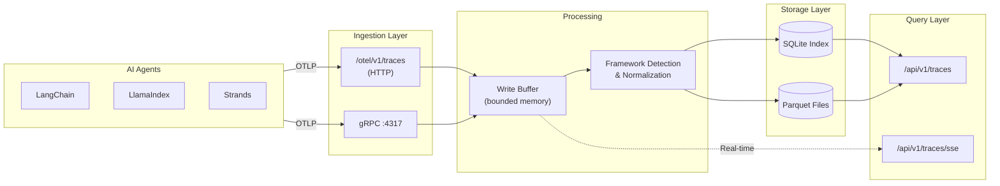

SideSeat includes a built-in OpenTelemetry collector optimized for AI agent development workflows. It receives OTLP traces via HTTP and gRPC, stores them in Parquet files for efficient querying, and provides real-time streaming via SSE.

## Architecture



## Features

- **OTLP-compatible**: Receives traces via standard OpenTelemetry protocol (HTTP JSON/Protobuf, gRPC)
- **Framework detection**: Automatically detects LangChain, LlamaIndex, Strands, and other AI frameworks
- **GenAI field extraction**: Extracts token usage, model info, and other GenAI-specific fields
- **Bounded memory**: Configurable buffer limits prevent memory exhaustion
- **FIFO storage**: Automatic cleanup when storage limits are reached
- **Real-time streaming**: SSE endpoint for live trace updates
- **Efficient storage**: Parquet columnar format for fast queries

## Endpoints

### Trace Ingestion

| Endpoint | Method | Content-Type | Description |
|----------|--------|--------------|-------------|
| `/otel/v1/traces` | POST | `application/json` | OTLP JSON traces |
| `/otel/v1/traces` | POST | `application/x-protobuf` | OTLP Protobuf traces |
| `localhost:4317` | gRPC | Protobuf | OTLP gRPC endpoint |

### Query API

| Endpoint | Method | Description |
|----------|--------|-------------|
| `/api/v1/traces` | GET | List traces with filtering |
| `/api/v1/traces/filters` | GET | Get available filter options |
| `/api/v1/traces/{trace_id}` | GET | Get single trace details |
| `/api/v1/traces/{trace_id}` | DELETE | Soft-delete a trace |
| `/api/v1/traces/{trace_id}/spans` | GET | Get spans for a trace |
| `/api/v1/spans` | GET | Query spans directly |

### Real-time Streaming

| Endpoint | Method | Description |
|----------|--------|-------------|
| `/api/v1/traces/sse` | GET | SSE stream of trace events |

## Configuration

All OTel settings are under the `otel` key in your config file:

```json
{
  "otel": {
    "enabled": true,
    "grpc": {
      "enabled": true,
      "port": 4317
    },
    "retention": {
      "max_mb": 20480
    }
  }
}
```

See [Config Manager](/reference/config/#otel-config) for the full configuration reference.

## Sending Traces

### Python with OpenTelemetry SDK

```python
from opentelemetry import trace
from opentelemetry.sdk.trace import TracerProvider
from opentelemetry.sdk.trace.export import BatchSpanProcessor
from opentelemetry.exporter.otlp.proto.http.trace_exporter import OTLPSpanExporter

# Configure exporter to send to SideSeat
exporter = OTLPSpanExporter(endpoint="http://localhost:5001/otel/v1/traces")
provider = TracerProvider()
provider.add_span_processor(BatchSpanProcessor(exporter))
trace.set_tracer_provider(provider)

# Create traces
tracer = trace.get_tracer(__name__)
with tracer.start_as_current_span("my-agent-operation"):
    # Your agent code here
    pass
```

### Python with Strands SDK

```python
from strands import Agent
from strands.telemetry import OTLPExporter

# Configure Strands to export to SideSeat
exporter = OTLPExporter(endpoint="http://localhost:5001/otel/v1/traces")

agent = Agent(
    model="anthropic/claude-sonnet-4-20250514",
    telemetry_exporter=exporter
)
```

### Node.js with OpenTelemetry SDK

```javascript
const { NodeTracerProvider } = require('@opentelemetry/sdk-trace-node');
const { OTLPTraceExporter } = require('@opentelemetry/exporter-trace-otlp-http');
const { BatchSpanProcessor } = require('@opentelemetry/sdk-trace-base');

const exporter = new OTLPTraceExporter({
  url: 'http://localhost:5001/otel/v1/traces',
});

const provider = new NodeTracerProvider();
provider.addSpanProcessor(new BatchSpanProcessor(exporter));
provider.register();
```

### Using gRPC

For higher throughput, use the gRPC endpoint:

```python
from opentelemetry.exporter.otlp.proto.grpc.trace_exporter import OTLPSpanExporter

exporter = OTLPSpanExporter(endpoint="localhost:4317", insecure=True)
```

## Framework Detection

SideSeat automatically detects and normalizes spans from popular AI frameworks:

| Framework | Detection Method | Extracted Fields |
|-----------|------------------|------------------|
| LangChain | Scope name, attributes | Chain type, run ID |
| LangGraph | Scope name, attributes | Node, edge, state |
| LlamaIndex | Scope name, attributes | Query, response |
| Strands | Scope name, resource attrs | Cycle ID, agent info |
| OpenInference | Attribute prefix | Session ID, user ID |
| Generic GenAI | `gen_ai.*` attributes | Model, tokens, system |

## GenAI Fields

The collector extracts and normalizes GenAI-specific fields:

| Field | Description |
|-------|-------------|
| `gen_ai_system` | AI provider (openai, anthropic, etc.) |
| `gen_ai_request_model` | Requested model name |
| `gen_ai_response_model` | Actual model used |
| `usage_input_tokens` | Input/prompt tokens |
| `usage_output_tokens` | Output/completion tokens |
| `gen_ai_operation_name` | Operation type (chat, completion) |

## Storage

Traces are stored in Parquet files under `data/traces/`:

```
data/traces/
├── spans_20241127_143022_abc123.parquet
├── spans_20241127_144533_def456.parquet
└── ...
```

### Retention

Storage is managed with FIFO (First-In-First-Out) deletion:

- **Size-based**: When `retention.max_mb` is exceeded, oldest files are deleted
- **Time-based**: Optional `retention_days` deletes files older than N days
- **Automatic**: Retention runs every `retention_check_interval_secs` (default: 5 min)

### Disk Safety

The collector monitors disk usage and protects against filling the disk:

- **Warning** (80%): Logs warning, continues operation
- **Critical** (95%): Stops accepting new traces until space is freed

## Real-time Streaming

Subscribe to trace events via Server-Sent Events:

```javascript
const eventSource = new EventSource('http://localhost:5001/api/v1/traces/sse');

eventSource.onmessage = (event) => {
  const payload = JSON.parse(event.data);
  // Event types: NewSpan, SpanUpdated, TraceCompleted, HealthUpdate
  console.log('Event:', payload.event.type, payload.event.data);
};
```

### SSE Limits

- Maximum connections: 100 (configurable)
- Connection timeout: 1 hour (configurable)
- Keepalive interval: 30 seconds (configurable)

## Attribute Filtering

SideSeat uses an Entity-Attribute-Value (EAV) storage pattern for flexible attribute filtering. This enables querying traces by any indexed attribute without schema changes.

### Configuring Indexed Attributes

Configure which attributes to extract and index:

```json
{
  "otel": {
    "attributes": {
      "trace_attributes": [
        "environment",
        "deployment.environment",
        "service.version",
        "user.id",
        "session.id"
      ],
      "span_attributes": [
        "gen_ai.system",
        "gen_ai.operation.name",
        "gen_ai.request.model",
        "level"
      ],
      "auto_index_genai": true
    }
  }
}
```

- **trace_attributes**: Attributes extracted from resource/span attributes and indexed at trace level
- **span_attributes**: Attributes indexed per span
- **auto_index_genai**: Automatically index all `gen_ai.*` attributes (default: true)

### Filter Operators

The attribute filter API supports these operators:

| Operator | Description | Example |
|----------|-------------|---------|
| `eq` | Equals | `{"key":"env","op":"eq","value":"prod"}` |
| `ne` | Not equals | `{"key":"env","op":"ne","value":"dev"}` |
| `contains` | Contains substring | `{"key":"user_id","op":"contains","value":"admin"}` |
| `starts_with` | Starts with | `{"key":"session_id","op":"starts_with","value":"sess_"}` |
| `in` | In list | `{"key":"env","op":"in","value":["prod","staging"]}` |
| `gt`, `lt`, `gte`, `lte` | Numeric comparison | `{"key":"latency","op":"gt","value":1000}` |
| `is_null` | Attribute not present | `{"key":"error","op":"is_null","value":null}` |
| `is_not_null` | Attribute present | `{"key":"user_id","op":"is_not_null","value":null}` |

## Query Examples

### List Recent Traces

```bash
curl http://localhost:5001/api/v1/traces
```

### Filter by Service

```bash
curl "http://localhost:5001/api/v1/traces?service=my-agent"
```

### Filter by Framework

```bash
curl "http://localhost:5001/api/v1/traces?framework=langchain"
```

### Filter by Attributes

```bash
# Filter traces where environment=production
curl "http://localhost:5001/api/v1/traces?attributes=%5B%7B%22key%22%3A%22environment%22%2C%22op%22%3A%22eq%22%2C%22value%22%3A%22production%22%7D%5D"

# Decoded: attributes=[{"key":"environment","op":"eq","value":"production"}]
```

### Multiple Attribute Filters

```bash
# Filter by environment AND user_id
curl "http://localhost:5001/api/v1/traces?attributes=%5B%7B%22key%22%3A%22environment%22%2C%22op%22%3A%22eq%22%2C%22value%22%3A%22production%22%7D%2C%7B%22key%22%3A%22user_id%22%2C%22op%22%3A%22eq%22%2C%22value%22%3A%22user-123%22%7D%5D"
```

### Get Trace Details

```bash
curl http://localhost:5001/api/v1/traces/abc123def456
```

### Get Filter Options

Discover available filter values for building UI dropdowns:

```bash
curl http://localhost:5001/api/v1/traces/filters
```

Response:
```json
{
  "services": ["my-agent", "my-service"],
  "frameworks": ["langchain", "openai"],
  "attributes": [
    {
      "key": "environment",
      "key_type": "string",
      "entity_type": "trace",
      "sample_values": ["production", "staging", "development"]
    }
  ]
}
```

## Troubleshooting

### Traces Not Appearing

1. Check OTel is enabled: `"otel": { "enabled": true }`
2. Verify endpoint URL matches your exporter configuration
3. Check server logs for ingestion errors

### High Memory Usage

Reduce buffer sizes in config:

```json
{
  "otel": {
    "ingestion": {
      "channel_capacity": 500,
      "buffer_max_spans": 500,
      "buffer_max_bytes": 5242880
    }
  }
}
```

### Disk Full

1. Reduce `retention.max_mb`
2. Enable `retention.days` for time-based cleanup
3. Manually delete old files in `data/traces/`
