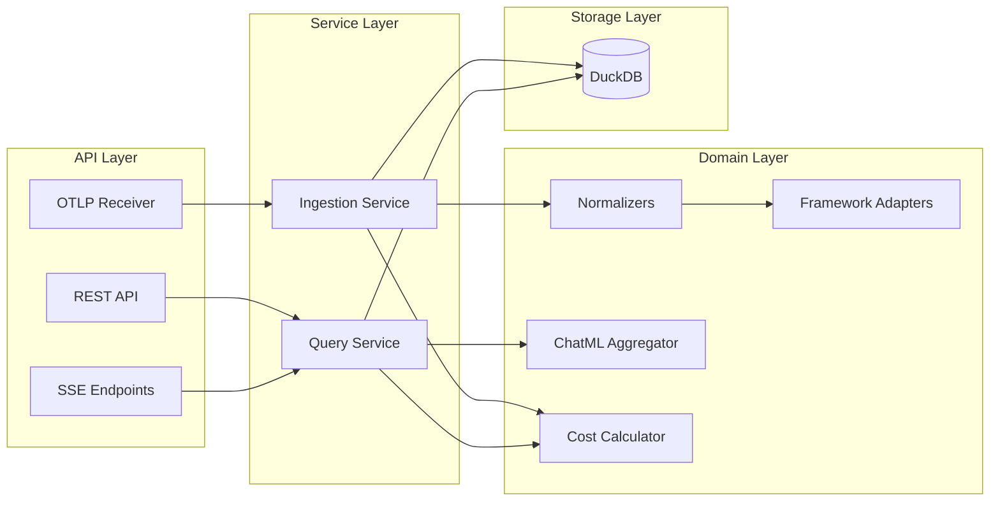
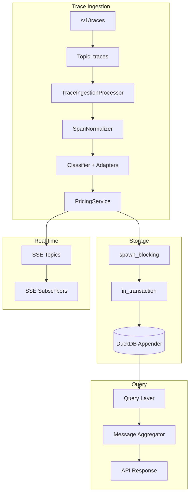
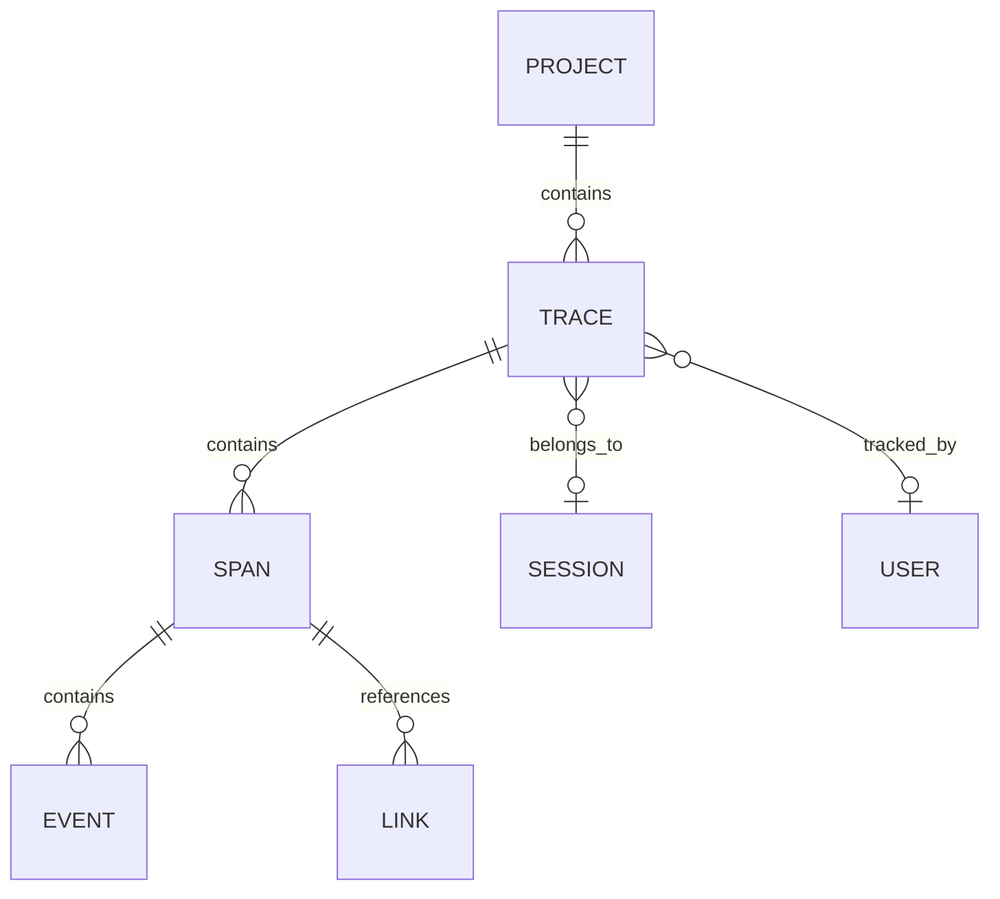
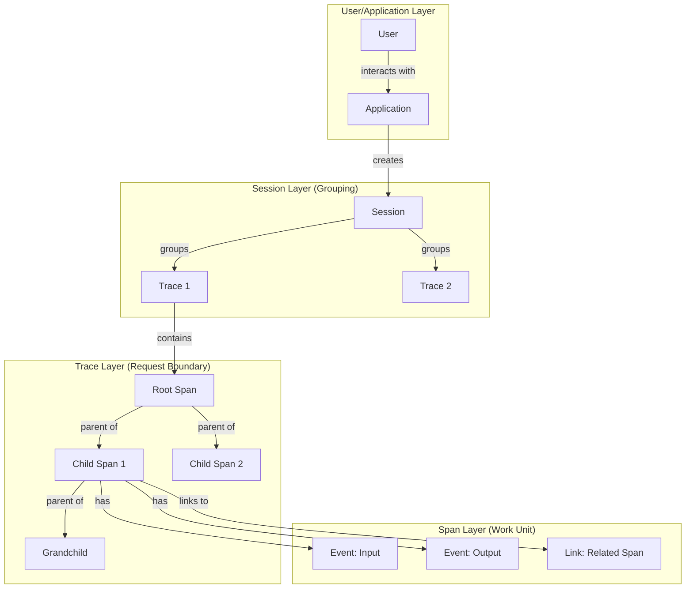
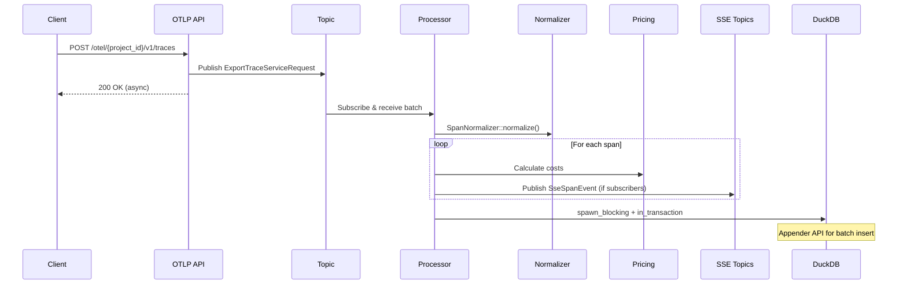
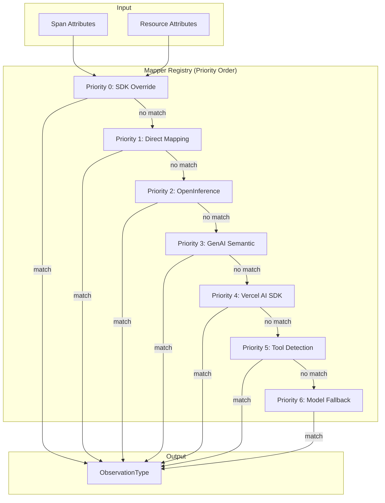
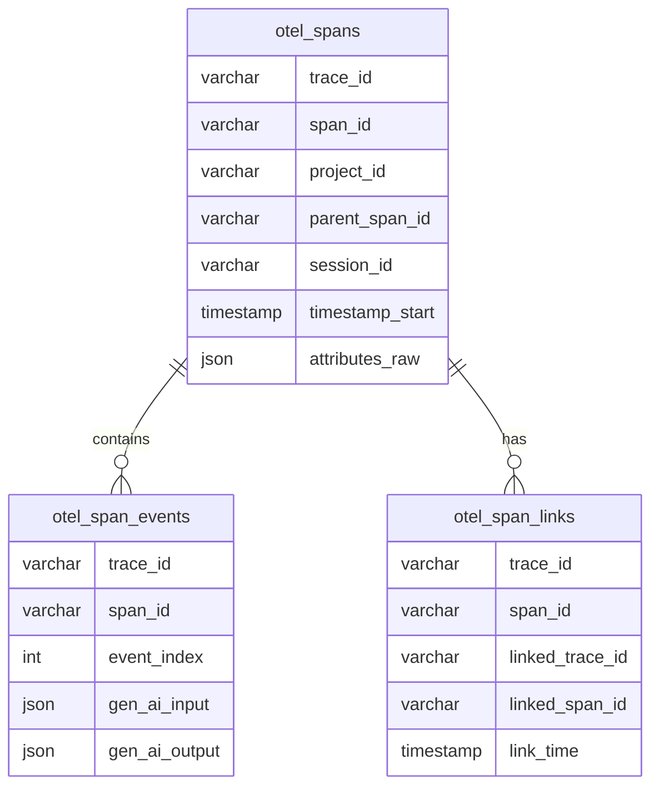

# GenAI Observability Ingestion Pipeline Design

A design for an OTEL-based ingestion pipeline that captures, normalizes, and stores telemetry data from GenAI applications with immediate data availability and ingestion-time ChatML normalization (query-time is for aggregation/dedup only).

---

## Table of Contents

- [Design Principles](#design-principles)
  - [Key Implementation Decisions](#9-key-implementation-decisions)
- [Architecture](#architecture)
- [Folder Structure](#folder-structure)
- [Data Model](#data-model)
  - [Core Entities](#core-entities)
  - [Entity Hierarchy & Terminology](#entity-hierarchy--terminology)
  - [Entity Definitions & Separation of Concerns](#entity-definitions--separation-of-concerns)
  - [Real-World Telemetry Examples](#real-world-telemetry-examples-from-miscfixtures)
  - [Observation Types](#observation-types-existing)
  - [Framework Detection Patterns](#framework-detection-patterns)
- [Ingestion Pipeline](#ingestion-pipeline)
  - [Transformation Stages](#transformation-stages)
  - [Error Handling Strategy](#error-handling-strategy)
  - [Backpressure Handling](#backpressure-handling)
- [Normalization Layer](#normalization-layer)
- [Query Layer](#query-layer)
- [ChatML Handling](#chatml-handling)
- [Framework Adapters](#framework-adapters)
- [Storage Schema](#storage-schema)
  - [Query Patterns](#query-patterns)
  - [Rust-Side Deduplication](#rust-side-deduplication)
  - [Data Retention](#data-retention)
- [Real-time Streaming](#real-time-streaming)
- [API Design](#api-design)
  - [Query Parameters](#query-parameters)
  - [Filter Options Endpoint](#filter-options-endpoint)
  - [Sortable Fields](#sortable-fields)
  - [Filterable Fields](#filterable-fields)
  - [Error Response Format](#error-response-format)
- [Conversation Messages API](#conversation-messages-api)
  - [Core Types](#core-types-reusable)
  - [Messages Endpoints](#messages-endpoints)
  - [Type Reuse](#type-reuse-across-system)
- [Extension Points](#extension-points)
- [Summary](#summary)
- [Implementation Checklist](#implementation-checklist)

---

## Design Principles

### 1. Topic-Based Async Processing

- OTLP endpoint publishes to topic, returns immediately (existing pattern)
- Processor subscribes and handles batches asynchronously
- Real-time SSE updates via per-project topics
- Graceful shutdown with message draining

### 2. Raw + Normalized Storage

- Store raw OTEL data verbatim for debugging/reprocessing
- Extract and normalize gen_ai fields at ingestion
- Build ChatML-compatible messages during ingestion; query time only aggregates/deduplicates

### 3. Framework Agnostic

- Some frameworks emit OTEL events, some use attributes
- Adapters handle extraction uniformly
- Core pipeline is framework-unaware

### 4. Support All Span Types

- GenAI spans (LLM, embedding, tool, agent)
- Infrastructure spans (HTTP, DB, storage, messaging)
- Custom spans (any OTEL-compliant data)

### 5. Extensible Architecture

- Clear module boundaries
- Plugin-based framework adapters
- Easy to add new normalizers and classifiers

### 6. Tokens and Costs Never NULL

- All numeric fields default to 0
- Simplifies aggregations and frontend logic

### 7. Reliability Patterns (Inspired by Langfuse)

**Append-Only Ingestion:**

- All incoming spans are appended (no updates or deletes at ingestion); tables have no primary keys
- Duplicates handled at query time via deduplication
- Simplifies writes, enables time-travel queries, preserves all data

**Query-Time Deduplication:**

- List queries: Two-phase (root spans → aggregate by ID subset) with page-based pagination
- Detail queries: Rust FxHashMap on `(trace_id, span_id)` - O(n), no sorting
- Messages: HashSet per span with content hash (role + content + tool_call_id)
- Never use SQL window functions (`ROW_NUMBER`) - O(n log n) sorting unacceptable at scale

**Fail-Safe Processing:**

- Malformed spans logged and skipped, never block the batch
- Missing required fields use sensible defaults (empty string, 0, null)
- Unknown attributes preserved in `attributes_raw` for future reprocessing

**Clear Transformation Stages:**
Each stage has a single responsibility and clear inputs/outputs:

1. **Parse** - Decode protobuf → structured OTEL data
2. **Classify** - Detect framework, observation type, category
3. **Normalize** - Extract fields with fallbacks, build messages
4. **Enrich** - Calculate costs, generate previews
5. **Persist** - Atomic batch write to storage

### 8. Separation of Concerns

**Layer Boundaries:**

```
┌─────────────────────────────────────────────────────────────┐
│ API Layer (routes/)                                        │
│   - HTTP/gRPC transport, request validation                │
│   - No business logic, just dispatch                       │
├─────────────────────────────────────────────────────────────┤
│ Service Layer (otel/, query/)                              │
│   - Orchestration, transactions, SSE publishing            │
│   - Calls domain layer components                          │
├─────────────────────────────────────────────────────────────┤
│ Domain Layer (normalizers/, classifiers/, adapters/)       │
│   - Pure transformations, no I/O                           │
│   - Framework detection, field extraction, message build   │
├─────────────────────────────────────────────────────────────┤
│ Storage Layer (duckdb/, sqlite/)                           │
│   - Data access, schema, repositories                      │
│   - No business logic                                      │
└─────────────────────────────────────────────────────────────┘
```

**Single Responsibility:**

- `SpanNormalizer` - Field extraction only, no classification
- `SpanClassifier` - Detection only, no extraction
- `EventNormalizer` - Message building only
- `PricingService` - Cost calculation only
- `TopicService` - Pub/sub only

### 9. Key Implementation Decisions

**Terminology:**

- **Span** - OTEL technical term, used in code and storage
- **Observation** - API/UI term for GenAI-classified spans (Langfuse compatibility)

**Storage Strategy:**

- `otel_traces` and `otel_sessions` are **VIEWs** over `otel_spans` with nested `GROUP BY` dedup, always filtered by `project_id` + time bounds
- Trace-level metadata stored on **root span** (`parent_span_id IS NULL`)
- Session metadata comes from first span in session
- No separate trace/session tables

**Append-Only Storage:**

- All spans appended without primary keys (fast writes)
- Deduplication at query time: two-phase for lists (root spans → aggregate subset), FxHashMap for details
- Never use window functions - O(n log n) sorting unacceptable at terabyte scale
- Preserves all data for debugging and audit trails
- Optional background compaction can merge duplicates later if needed

**Backpressure:**

- Byte-based topic buffer: `TOPIC_BUFFER_SIZE=100 MB`, `TOPIC_CHANNEL_CAPACITY=100k` messages (configurable)
- When buffer full: `TopicError::BufferFull` → OTLP returns `503 Service Unavailable` with `Retry-After`

**Error Handling:**
| Error Type | Handling | Visibility |
|------------|----------|------------|
| Malformed protobuf | Skip, log WARN | Server logs |
| Missing required field | Use defaults, log DEBUG | Silent |
| Unknown framework | Classify as Unknown | Graceful |
| DuckDB write failure | Retry 3x, then log ERROR | Server logs |
| Pricing lookup failure | Cost = 0, log WARN | Server logs |

**Data Retention:**

- Per-project, time-based retention: default 30 days (configurable)
- Events table has no foreign key to spans (events may arrive before spans)

---

## Architecture

### High-Level Components



### Data Flow



| Component  | OTLP Endpoint | Data Type     | Contains                       |
| ---------- | ------------- | ------------- | ------------------------------ |
| **Traces** | `/v1/traces`  | ResourceSpans | Spans with optional SpanEvents |

### Component Responsibilities

| Component                   | Responsibility                                                                          |
| --------------------------- | --------------------------------------------------------------------------------------- |
| **OTLP Collector**          | Accept OTLP HTTP/gRPC, publish to Topic (existing)                                      |
| **TopicService**            | Pub/sub for decoupling ingestion from processing (existing)                             |
| **TraceIngestionProcessor** | Subscribe to traces topic, normalize spans + SpanEvents, enrich, write batch (existing) |
| **SpanNormalizer**          | Extract fields from OTEL spans (existing)                                               |
| **EventNormalizer**         | Normalize SpanEvents to ChatML format (ingestion)                                       |
| **Framework Adapters**      | Handle framework-specific attribute patterns [NEW]                                      |
| **SpanClassifier**          | Detect framework, observation type, category [NEW]                                      |
| **PricingService**          | Compute costs from usage and model pricing (existing)                                   |
| **AnalyticsService**        | DuckDB connection pool and batch writes (existing)                                      |
| **MessageAggregator**       | Deduplicate and aggregate ChatML events per span at query time (existing)               |

---

## Folder Structure

This extends the existing codebase structure. Files marked with `[NEW]` are additions, `[EXTEND]` indicates modifications to existing files.

```
server/src/
├── main.rs
├── lib.rs
├── app.rs
│
├── core/                           # (existing)
│   ├── mod.rs
│   ├── cli.rs
│   ├── config.rs
│   ├── constants.rs
│   ├── pricing.rs                  # [EXTEND] Add model pricing data
│   ├── secret.rs
│   ├── shutdown.rs
│   ├── storage.rs
│   ├── topic.rs
│   └── banner.rs
│
├── api/                            # (existing)
│   ├── mod.rs
│   ├── server.rs
│   ├── middleware.rs
│   ├── extractors.rs
│   ├── types.rs
│   ├── embedded.rs
│   ├── otlp_grpc.rs
│   ├── auth/                       # (existing)
│   │   ├── mod.rs
│   │   ├── jwt.rs
│   │   ├── manager.rs
│   │   └── middleware.rs
│   └── routes/
│       ├── mod.rs
│       ├── auth.rs
│       ├── health.rs
│       ├── otlp_collector/         # (existing) OTLP ingestion
│       │   ├── mod.rs
│       │   ├── traces.rs           # [EXTEND] Use new ingestion pipeline
│       │   ├── logs.rs
│       │   └── metrics.rs
│       ├── otel/                   # (existing) Query endpoints
│       │   ├── mod.rs
│       │   ├── traces.rs           # [EXTEND] Add ChatML aggregation/dedup
│       │   ├── spans.rs            # [EXTEND] Add ChatML aggregation/dedup
│       │   ├── sessions.rs
│       │   ├── sse.rs
│       │   ├── filters.rs
│       │   └── types.rs
│       └── projects/
│           ├── mod.rs
│           └── types.rs
│
├── otel/                           # (existing) → Refactor into submodules
│   ├── mod.rs
│   ├── models.rs                   # [EXTEND] Add new fields to NormalizedSpan
│   ├── sse_models.rs
│   ├── ingestion.rs                # [EXTEND] Add adapter registry, classifiers
│   ├── detectors.rs                # [EXTEND] → Move to classifiers/
│   │
│   ├── normalizers/                # (existing)
│   │   ├── mod.rs
│   │   ├── span_normalizer.rs      # [EXTEND] Add semantic conventions
│   │   ├── event_normalizer.rs     # [EXTEND] Store raw, add categories
│   │   ├── event_normalizer_adk.rs # → Move to adapters/google_adk.rs
│   │   ├── event_normalizer_langgraph.rs  # → Move to adapters/langgraph.rs
│   │   └── message_aggregator.rs   # → Move to query/aggregators/
│   │
│   ├── adapters/                   # [NEW] Framework-specific adapters
│   │   ├── mod.rs
│   │   ├── traits.rs               # FrameworkAdapter trait
│   │   ├── registry.rs             # Adapter registry
│   │   ├── strands.rs              # AWS Bedrock / Strands
│   │   ├── langgraph.rs            # LangGraph (from event_normalizer_langgraph.rs)
│   │   ├── langchain.rs            # LangChain
│   │   ├── openinference.rs        # OpenInference (Phoenix, etc.)
│   │   ├── google_adk.rs           # Google ADK (from event_normalizer_adk.rs)
│   │   ├── vercel_ai.rs            # Vercel AI SDK
│   │   ├── semantic_kernel.rs      # Microsoft Semantic Kernel
│   │   ├── logfire.rs              # Pydantic Logfire
│   │   ├── mlflow.rs               # MLflow
│   │   ├── traceloop.rs            # Traceloop OpenLLMetry
│   │   └── livekit.rs              # LiveKit
│   │
│   ├── classifiers/                # [NEW] Span classification
│   │   ├── mod.rs
│   │   ├── framework.rs            # Framework detection (from detectors.rs)
│   │   ├── observation_type.rs     # Observation type detection
│   │   └── category.rs             # Span category detection (HTTP, DB, etc.)
│   │
│   └── enrichers/                  # [NEW] Post-processing enrichment
│       ├── mod.rs
│       ├── preview.rs              # Generate input/output previews
│       └── cost.rs                 # Cost calculation
│
├── query (under otel)/                          # [NEW] Query layer
│   ├── mod.rs
│   ├── service.rs                  # Query orchestration
│   │
│   ├── filters/                    # (partially exists in api/routes/otel/filters.rs)
│   │   ├── mod.rs
│   │   ├── types.rs                # Filter type definitions
│   │   ├── parser.rs               # Filter parsing
│   │   └── builder.rs              # SQL builder
│   │
│   ├── converters/                 # [NEW] Response converters
│   │   ├── mod.rs
│   │   ├── chatml.rs               # ChatML aggregation/dedup (messages already ChatML)
│   │   ├── trace.rs                # Trace response building
│   │   └── observation.rs          # Observation response building
│   │
│   └── aggregators/                # [NEW] Aggregation logic
│       ├── mod.rs
│       └── messages.rs             # Message deduplication (from message_aggregator.rs)
│
├── duckdb/                         # (existing)
│   ├── mod.rs
│   ├── error.rs
│   ├── schema.rs                   # [EXTEND] Add new columns
│   ├── migrations.rs               # [EXTEND] Add migration for new schema
│   ├── retention.rs
│   └── repositories/
│       ├── mod.rs
│       ├── span.rs                 # [EXTEND] Add new fields
│       ├── query.rs
│       ├── event.rs                # [NEW] Event repository
│       └── link.rs                 # [NEW] Link repository
│
├── sqlite/                         # (existing) - Metadata storage
│   ├── mod.rs
│   ├── error.rs
│   ├── schema.rs
│   ├── migrations.rs
│   └── repositories/
│       ├── mod.rs
│       └── project.rs
│
└── utils/                          # (existing)
    ├── mod.rs
    ├── crypto.rs
    ├── file.rs
    ├── json.rs
    ├── otlp.rs
    ├── sql.rs
    ├── string.rs
    ├── terminal.rs
    └── time.rs
```

### Key Refactoring

| Current Location                                 | New Location                    | Rationale               |
| ------------------------------------------------ | ------------------------------- | ----------------------- |
| `otel/detectors.rs`                              | `otel/classifiers/framework.rs` | Better organization     |
| `otel/normalizers/event_normalizer_adk.rs`       | `otel/adapters/google_adk.rs`   | Unified adapter pattern |
| `otel/normalizers/event_normalizer_langgraph.rs` | `otel/adapters/langgraph.rs`    | Unified adapter pattern |
| `otel/normalizers/message_aggregator.rs`         | `query/aggregators/messages.rs` | Query-time operation    |
| `api/routes/otel/filters.rs`                     | `query/filters/`                | Reusable filter system  |

---

## Data Model

### Existing Models (Reuse)

All models already exist in `otel/models.rs`:

### Core Entities



### Entity Hierarchy & Terminology

Understanding the relationship between OTEL concepts and observability concepts is critical for this design. Here's the complete hierarchy:

```
┌─────────────────────────────────────────────────────────────────────────────┐
│ SESSION (optional grouping)                                                 │
│   Logical grouping of related traces (e.g., user conversation, workflow)    │
│   ┌─────────────────────────────────────────────────────────────────────┐   │
│   │ TRACE                                                               │   │
│   │   A single end-to-end request or operation                          │   │
│   │   ┌─────────────────────────────────────────────────────────────┐   │   │
│   │   │ SPAN (root)                                                 │   │   │
│   │   │   A unit of work within a trace                             │   │   │
│   │   │   ┌─────────────────────────────────────────────────────┐   │   │   │
│   │   │   │ SPAN (child) ─────────────────────────────────────┐ │   │   │   │
│   │   │   │   └── EVENT (0..n per span)                       │ │   │   │   │
│   │   │   │       Timestamped occurrences within a span       │ │   │   │   │
│   │   │   │       (messages, logs, exceptions)                │ │   │   │   │
│   │   │   └───────────────────────────────────────────────────┘ │   │   │   │
│   │   │   └── LINK (0..n per span)                              │   │   │   │
│   │   │       References to related spans                       │   │   │   │
│   │   └─────────────────────────────────────────────────────────┘   │   │   |
│   └─────────────────────────────────────────────────────────────────────┘   │
└─────────────────────────────────────────────────────────────────────────────┘
```

### Entity Definitions & Separation of Concerns

| Entity          | OTEL Origin                        | Purpose                                                      | Scope          | Lifecycle                    |
| --------------- | ---------------------------------- | ------------------------------------------------------------ | -------------- | ---------------------------- |
| **Session**     | Application-defined (`session.id`) | Group related traces into logical conversations or workflows | Cross-trace    | Long-lived (minutes to days) |
| **Trace**       | OTEL `trace_id`                    | Represents a single end-to-end operation/request             | Single request | Short-lived (ms to minutes)  |
| **Span**        | OTEL `Span`                        | A unit of work within a trace (can be nested)                | Within trace   | Duration of operation        |
| **Event**       | OTEL `SpanEvent`                   | Point-in-time occurrence within a span                       | Within span    | Instantaneous                |
| **Observation** | Langfuse concept                   | A classified span with GenAI semantics                       | Span alias     | Same as span                 |
| **Link**        | OTEL `Link`                        | Reference between spans (cross-trace or within)              | Span-to-span   | Reference only               |

### Detailed Entity Breakdown

#### SESSION

- **What it is**: An application-defined grouping of traces
- **Source**: `session.id` attribute on spans/traces
- **Use cases**:
  - Multi-turn conversations with a chatbot
  - Multi-step workflows (CrewAI crews, AutoGen conversations)
  - User sessions in an application
- **Cardinality**: 0..1 per trace (traces may not have sessions)
- **Storage**: Denormalized on trace records, no separate table

```
Example: A chatbot conversation
Session: "conv-abc123"
├── Trace 1: User says "Hello" → Agent responds
├── Trace 2: User says "What's the weather?" → Agent calls tool → responds
└── Trace 3: User says "Thanks" → Agent responds
```

#### TRACE

- **What it is**: A single end-to-end request or operation
- **Source**: OTEL `trace_id` (128-bit identifier)
- **Purpose**: Groups all spans for one logical operation
- **Properties**:
  - `trace_id` (unique identifier)
  - `session_id` (optional grouping)
  - `user_id` (optional attribution)
  - `name` (human-readable name)
  - `input` / `output` (root span's I/O)
  - `metadata` (arbitrary key-value)
  - `tags` (for filtering)
- **Lifecycle**: Created implicitly when first span arrives, updated as spans complete

```
Example: "What's the weather in Tokyo?"
Trace: abc123
├── Root Span: "LangGraph" (CHAIN)
│   ├── Child Span: "ChatOpenAI" (GENERATION) - decides to call tool
│   ├── Child Span: "get_weather" (TOOL) - executes tool
│   └── Child Span: "ChatOpenAI" (GENERATION) - formats response
```

#### SPAN

- **What it is**: A single unit of work with start/end time
- **Source**: OTEL `Span` with `span_id`, `parent_span_id`
- **Purpose**: Captures timing, status, and context of an operation
- **Key properties**:
  - `span_id` (unique within trace)
  - `parent_span_id` (null for root spans)
  - `name` (operation name)
  - `start_time` / `end_time` (duration)
  - `status` (ok, error)
  - `attributes` (key-value metadata)
  - `kind` (client, server, producer, consumer, internal)
- **Classification**: Each span is classified with:
  - `framework` - Which SDK/framework produced it (LangChain, CrewAI, etc.)
  - `span_category` - Infrastructure category (LLM, HTTP, DB, etc.)
  - `observation_type` - GenAI semantic type (Generation, Tool, Agent, etc.)

```
Example Span:
{
  span_id: "span-456",
  parent_span_id: "span-123",
  name: "ChatOpenAI",
  start_time: "2024-01-15T10:00:00.000Z",
  end_time: "2024-01-15T10:00:01.500Z",
  framework: "LangGraph",
  span_category: "LLM",
  observation_type: "Generation",
  attributes: {
    "gen_ai.request.model": "gpt-4",
    "gen_ai.usage.input_tokens": 150,
    "gen_ai.usage.output_tokens": 50
  }
}
```

#### EVENT

- **What it is**: A timestamped occurrence within a span
- **Source**: OTEL `SpanEvent` array on spans
- **Purpose**: Captures point-in-time data that doesn't have duration
- **Use cases**:
  - **GenAI Messages**: Input/output messages in ChatML format
  - **Logs**: Debug/info/error logs within an operation
  - **Exceptions**: Error details with stack traces
  - **Milestones**: "first token received", "tool call started"
- **Key properties**:
  - `event_name` (type identifier)
  - `event_time` (when it occurred)
  - `event_category` (GenAiUserMessage, GenAiChoice, Exception, Log, etc.)
  - `attributes` (event-specific data)

```
Example Events on a Generation span:
Span: "ChatOpenAI"
├── Event[0]: gen_ai.user.message    @ T+0ms   {role: "user", content: "Hello"}
├── Event[1]: gen_ai.system.message  @ T+0ms   {role: "system", content: "You are helpful"}
├── Event[2]: gen_ai.choice          @ T+1500ms {role: "assistant", content: "Hi there!"}
```

#### OBSERVATION (Langfuse Terminology)

- **What it is**: A span with GenAI-specific classification and semantics
- **Relationship to Span**: 1:1 mapping, "observation" is the domain term for a classified span
- **Why both terms exist**:
  - **Span** = OTEL/technical term (raw telemetry)
  - **Observation** = Business/domain term (GenAI semantics)
- **Types**: Generation, Embedding, Agent, Tool, Chain, Retriever, Guardrail, Evaluator, Span

```
OTEL Span                        →  Observation
─────────────────────────────────────────────────
name: "ChatOpenAI"               →  type: Generation
gen_ai.operation.name: "chat"    →  model: "gpt-4"
openinference.span.kind: "LLM"   →  input_tokens: 150
                                 →  output_tokens: 50
                                 →  cost: $0.0045
```

#### LINK

- **What it is**: A reference from one span to another
- **Source**: OTEL `Link` array on spans
- **Purpose**: Connect related spans that aren't parent-child
- **Use cases**:
  - Batch processing (link to all items in batch)
  - Retry chains (link to previous attempt)
  - Fan-out/fan-in (link parallel operations)
  - Cross-trace references (link to triggering trace)

### How Concerns Are Separated



| Layer       | Responsibility             | Stored In              | Query Pattern                            |
| ----------- | -------------------------- | ---------------------- | ---------------------------------------- |
| **Session** | Group related traces       | `session_id` on traces | `WHERE session_id = ?`                   |
| **Trace**   | Boundary for one operation | `traces` table         | `WHERE trace_id = ?`                     |
| **Span**    | Individual work units      | `spans` table          | `WHERE trace_id = ? ORDER BY start_time` |
| **Event**   | Point-in-time data         | `events` table         | `WHERE span_id = ? ORDER BY event_index` |
| **Link**    | Cross-references           | `links` table          | `WHERE source_span_id = ?`               |

### Practical Example: Multi-Turn Chatbot

```
SESSION: user-conv-2024-01-15-abc
│
├── TRACE: trace-001 (Turn 1: "What's the weather?")
│   └── SPAN: root "LangGraph" (CHAIN)
│       ├── SPAN: "ChatOpenAI" (GENERATION) - decides tool call
│       │   ├── EVENT: gen_ai.user.message {role: user, content: "What's the weather?"}
│       │   └── EVENT: gen_ai.choice {role: assistant, tool_calls: [{name: get_weather}]}
│       ├── SPAN: "get_weather" (TOOL) - executes tool
│       │   ├── EVENT: input {city: "San Francisco"}
│       │   └── EVENT: output {temp: 65, conditions: "sunny"}
│       └── SPAN: "ChatOpenAI" (GENERATION) - formats response
│           ├── EVENT: gen_ai.tool.message {role: tool, content: "{temp: 65}"}
│           └── EVENT: gen_ai.choice {role: assistant, content: "It's 65°F and sunny"}
│
├── TRACE: trace-002 (Turn 2: "What about tomorrow?")
│   └── SPAN: root "LangGraph" (CHAIN)
│       ├── LINK: trace-001/root (previous turn context)
│       └── ... (similar structure)
│
└── TRACE: trace-003 (Turn 3: "Thanks!")
    └── SPAN: root "LangGraph" (CHAIN)
        └── SPAN: "ChatOpenAI" (GENERATION)
            └── EVENT: gen_ai.choice {role: assistant, content: "You're welcome!"}
```

### Real-World Telemetry Examples (from misc/fixtures/)

The fixture files demonstrate actual OTEL data patterns from production systems. Understanding these patterns is critical for correct ingestion.

#### Fixture Files Overview

| File                                        | Description                     | Key Patterns                                               |
| ------------------------------------------- | ------------------------------- | ---------------------------------------------------------- |
| `raw_otel_strands_openai_spans.json`        | Strands Agents with OpenAI      | `gen_ai.system: "strands-agents"`, session.id, token usage |
| `raw_otel_strands_bedrock_spans.json`       | Strands Agents with AWS Bedrock | AWS resource attributes, bedrock-specific spans            |
| `raw_otel_langchain_spans.json`             | LangGraph/LangChain spans       | `traceloop.*` attributes, `langgraph_*` metadata           |
| `raw_otel_langchain_runtime_logs.json`      | LangGraph runtime logs          | Log records with input/output messages                     |
| `raw_otel_langchain_tool_runtime_logs.json` | LangGraph tool execution logs   | Tool calls, tool results, gen_ai events                    |

#### OTEL Data Types: Spans vs Logs (Runtime Events)

> **Note**: This design focuses on **Trace/Span ingestion only**. OTEL Log Records are documented here for reference but are out of scope for the current implementation.

The fixtures reveal two distinct OTEL data types:

**1. SPANS** (`raw_otel_*_spans.json`):

```json
{
  "traceId": "691c23a8636a7e4512dfd580708d030e",
  "spanId": "ea481874619414c2",
  "parentSpanId": "e2a36d975676155e",
  "name": "invoke_agent Strands Agents",
  "kind": "INTERNAL",
  "startTimeUnixNano": 1763451817586231304,
  "endTimeUnixNano": 1763451834020735638,
  "attributes": {
    "gen_ai.usage.prompt_tokens": 5064,
    "gen_ai.usage.output_tokens": 408,
    "gen_ai.request.model": "gpt-4o",
    "gen_ai.operation.name": "invoke_agent",
    "gen_ai.system": "strands-agents",
    "session.id": "cfd84bec-fec8-47a5-8a28-73b9aa5ee6c6"
  },
  "status": { "code": "OK" }
}
```

**2. LOGS / Runtime Events** (`raw_otel_*_runtime_logs.json`):

```json
{
  "timeUnixNano": 1763619737373346448,
  "observedTimeUnixNano": 1763619737373361809,
  "severityNumber": 9,
  "severityText": "",
  "body": {
    "content": [{ "text": "calculate current time..." }]
  },
  "attributes": {
    "event.name": "gen_ai.user.message",
    "gen_ai.system": "aws.bedrock"
  },
  "traceId": "691eb3981d03a56943bfe83732bf8aca",
  "spanId": "b480f86e7a557277"
}
```

**Key Differences:**

| Aspect               | Spans                  | Logs (Events)           |
| -------------------- | ---------------------- | ----------------------- |
| Has duration         | Yes (start/end time)   | No (single timestamp)   |
| Contains I/O content | Rarely (in attributes) | Yes (in body)           |
| Has parent-child     | Yes (parentSpanId)     | No (linked via spanId)  |
| Primary purpose      | Track operations       | Capture messages/events |

#### GenAI Event Types in Logs

The fixtures show standard GenAI semantic convention event types:

| event.name                 | Purpose                 | Body Structure                                       |
| -------------------------- | ----------------------- | ---------------------------------------------------- |
| `gen_ai.user.message`      | User input message      | `{ content: [{ text: "..." }] }`                     |
| `gen_ai.assistant.message` | Assistant response      | `{ content: [...], tool_calls: [...] }`              |
| `gen_ai.choice`            | Model completion choice | `{ message: {...}, index: 0, finish_reason: "..." }` |
| `gen_ai.tool.message`      | Tool result message     | `{ content: [...], id: "tooluse_..." }`              |

#### LangChain/LangGraph Event Patterns

LangGraph uses a different event structure via `opentelemetry.instrumentation.langchain`:

```json
{
  "body": {
    "output": {
      "messages": [
        {
          "content": "{\"outputs\": {...}, \"kwargs\": {\"tags\": [\"graph:step:1\"]}}",
          "role": "assistant"
        }
      ]
    },
    "input": {
      "messages": [
        {
          "content": "{\"inputs\": {...}, \"tags\": [...], \"metadata\": {\"langgraph_step\": 1}}",
          "role": "user"
        }
      ]
    }
  },
  "attributes": {
    "event.name": "opentelemetry.instrumentation.langchain",
    "session.id": "383c4a9d-5682-4186-a125-e226f9f6c141"
  }
}
```

**LangGraph-specific metadata** (embedded in JSON content):

- `langgraph_step` - Step number in the graph execution
- `langgraph_node` - Node name (e.g., "chatbot", "tools")
- `langgraph_triggers` - What triggered this node
- `langgraph_path` - Execution path
- `langgraph_checkpoint_ns` - Checkpoint namespace

#### Span Hierarchy Example (from fixtures)

```
Trace: 691bbd4b51c1a4c319aa2bf92068c474
Session: 383c4a9d-5682-4186-a125-e226f9f6c141
│
├── SPAN: "POST /invocations" (SERVER)
│   scope: opentelemetry.instrumentation.starlette
│   │
│   └── SPAN: "LangGraph.workflow" (INTERNAL)
│       scope: opentelemetry.instrumentation.langchain
│       attributes: traceloop.span.kind=workflow, traceloop.workflow.name=LangGraph
│       │
│       └── SPAN: "chatbot.task" (INTERNAL)
│           scope: opentelemetry.instrumentation.langchain
│           attributes: traceloop.span.kind=task, langgraph_node=chatbot
│           │
│           ├── SPAN: "ChatBedrockConverse.chat" (CLIENT)
│           │   scope: opentelemetry.instrumentation.langchain
│           │   attributes: gen_ai.request.model, gen_ai.usage.*, llm.request.type=chat
│           │   └── LOG EVENTS:
│           │       ├── gen_ai.user.message (input)
│           │       └── gen_ai.choice (output)
│           │
│           └── SPAN: "tools_condition.task" (INTERNAL)
│               scope: opentelemetry.instrumentation.langchain
│               attributes: langgraph_node=chatbot, traceloop.entity.name=tools_condition
```

#### Resource Attributes (AWS Bedrock AgentCore)

The fixtures show rich resource attributes from AWS Bedrock AgentCore:

```json
{
  "resource": {
    "attributes": {
      "deployment.environment.name": "bedrock-agentcore:default",
      "aws.local.service": "agent.DEFAULT",
      "service.name": "agent.DEFAULT",
      "cloud.region": "us-east-1",
      "cloud.provider": "aws",
      "cloud.platform": "aws_bedrock_agentcore",
      "cloud.resource_id": "arn:aws:bedrock-agentcore:...",
      "aws.service.type": "gen_ai_agent",
      "telemetry.sdk.name": "opentelemetry",
      "telemetry.sdk.language": "python",
      "telemetry.sdk.version": "1.33.1"
    }
  }
}
```

#### Scope Information

Each span has scope information identifying the instrumentation library:

| Scope Name                                               | Purpose                    |
| -------------------------------------------------------- | -------------------------- |
| `opentelemetry.instrumentation.starlette`                | HTTP server spans          |
| `opentelemetry.instrumentation.langchain`                | LangChain/LangGraph spans  |
| `opentelemetry.instrumentation.botocore`                 | AWS SDK spans              |
| `opentelemetry.instrumentation.botocore.bedrock-runtime` | Bedrock runtime events     |
| `strands.telemetry.tracer`                               | Strands Agents spans       |
| `bedrock_agentcore.app`                                  | AgentCore application logs |

#### Token Usage Attributes

Token usage is captured at different levels:

**Span-level (Strands):**

```json
{
  "gen_ai.usage.prompt_tokens": 5064,
  "gen_ai.usage.output_tokens": 408,
  "gen_ai.usage.total_tokens": 5472,
  "gen_ai.usage.completion_tokens": 408,
  "gen_ai.usage.input_tokens": 5064,
  "gen_ai.usage.cache_write_input_tokens": 0,
  "gen_ai.usage.cache_read_input_tokens": 0
}
```

**Span-level (LangChain via traceloop):**

```json
{
  "gen_ai.usage.input_tokens": 338,
  "gen_ai.usage.output_tokens": 113,
  "llm.usage.total_tokens": 451
}
```

**Message-level (embedded in LangChain message content):**

```json
{
  "usage_metadata": {
    "input_tokens": 344,
    "output_tokens": 82,
    "total_tokens": 426,
    "input_token_details": {
      "cache_creation": 0,
      "cache_read": 0
    }
  }
}
```

#### Tool Call Patterns

**AWS Bedrock format (in gen_ai.choice event):**

```json
{
  "message": {
    "tool_calls": [
      {
        "type": "function",
        "id": "tooluse_8JNfu7pISWq3NaUcG5cVOQ",
        "function": {
          "name": "calculator",
          "arguments": { "expression": "1" }
        }
      }
    ],
    "role": "assistant"
  },
  "finish_reason": "tool_use"
}
```

**Tool result (in gen_ai.tool.message event):**

```json
{
  "content": [{ "text": "1" }],
  "id": "tooluse_8JNfu7pISWq3NaUcG5cVOQ"
}
```

**Tool result (in gen_ai.user.message with toolResult):**

```json
{
  "content": [
    {
      "toolResult": {
        "toolUseId": "tooluse_8JNfu7pISWq3NaUcG5cVOQ",
        "content": [{ "text": "1" }],
        "status": "success"
      }
    }
  ]
}
```

### Observation Types (Existing)

```rust
// otel/models.rs (existing)

pub enum ObservationType {
    Generation,   // LLM completion/chat
    Embedding,    // Vector embedding
    Agent,        // Agent orchestration
    Tool,         // Tool/function execution
    Chain,        // Pipeline/workflow
    Retriever,    // RAG retrieval
    Guardrail,    // Safety check
    Evaluator,    // Quality evaluation
    Span,         // Generic span (default)
}
```

### Span Categories (Existing)

```rust
// otel/models.rs (existing)

pub enum SpanCategory {
    LLM,        // Language model operations
    Tool,       // Tool executions
    Agent,      // Agent operations
    Chain,      // Orchestration
    Retriever,  // Vector/semantic search
    Embedding,  // Embedding operations
    DB,         // Database operations
    Storage,    // File/blob storage
    HTTP,       // HTTP requests
    Messaging,  // Queue/pub-sub
    Other,      // Uncategorized
}
```

### Framework Detection (Existing)

```rust
// otel/models.rs (existing)

pub enum Framework {
    StrandsAgents,
    LangChain,
    LangGraph,
    LlamaIndex,
    OpenInference,
    AutoGen,
    CrewAi,
    SemanticKernel,
    AzureAiFoundry,
    GoogleAdk,
    VertexAi,
    VercelAiSdk,
    Logfire,
    MlFlow,
    TraceLoop,
    LiveKit,
    Unknown,
}
```

### Framework Detection Patterns

Based on analysis of real telemetry spans and Langfuse's implementation, here are the detection patterns for each framework:

| Framework          | Detection Pattern                                                                                            | Example Attributes                                                           |
| ------------------ | ------------------------------------------------------------------------------------------------------------ | ---------------------------------------------------------------------------- |
| **StrandsAgents**  | `gen_ai.system == "strands-agents"` OR `service.name == "strands-agents"`                                    | `gen_ai.operation.name`, `gen_ai.agent.*`                                    |
| **LangGraph**      | `langgraph.*` attributes OR `metadata` JSON contains `langgraph_*` keys                                      | `metadata: {"langgraph_step": 1, "langgraph_node": "agent"}`                 |
| **LangChain**      | `langchain.*` or `langsmith.*` attributes                                                                    | `langsmith.span.kind`, `langsmith.session.id`                                |
| **LlamaIndex**     | `llama_index.*` attributes                                                                                   | `llama_index.workflow.name`                                                  |
| **CrewAI**         | `service.name == "crewAI-telemetry"` OR `crewai_version`, `crew_key`, `crew_id`                              | `crew_key`, `task_key`, `agent_role`, `tool_name`                            |
| **AutoGen**        | Span name starts with `"autogen "` OR `autogen.*` attributes OR `recipient_agent_class`/`sender_agent_class` | `recipient_agent_class: "RoundRobinGroupChatManager"`, `messaging.operation` |
| **OpenInference**  | `openinference.*` attributes                                                                                 | `openinference.span.kind: "LLM"/"AGENT"/"TOOL"`                              |
| **SemanticKernel** | `semantic_kernel.*` attributes                                                                               | `semantic_kernel.function.name`                                              |
| **AzureAiFoundry** | `az.ai.*` attributes                                                                                         | `az.ai.inference.model_provider`                                             |
| **GoogleAdk**      | `google.adk.*` or `gcp.vertex.agent.*` OR `gen_ai.system == "gcp.vertex.agent"`                              | `gcp.vertex.agent.session_id`, `gcp.vertex.agent.llm_request`                |
| **VertexAi**       | `gcp.vertex_ai.*` attributes                                                                                 | `gcp.vertex_ai.model`                                                        |
| **VercelAiSdk**    | `ai.model.id`, `ai.model.provider`, `ai.operationId`, or `ai.*` (excluding `ai.response.*`, `ai.request.*`)  | `ai.model.id: "gpt-4"`, `ai.operationId: "ai.generateText"`                  |
| **Logfire**        | `logfire.*` attributes OR `telemetry.sdk.name` contains "logfire"                                            | `logfire.msg`, `prompt`, `all_messages_events`                               |
| **MlFlow**         | `mlflow.*` attributes                                                                                        | `mlflow.spanInputs`, `mlflow.spanOutputs`                                    |
| **TraceLoop**      | `traceloop.*` attributes OR `telemetry.sdk.name` contains "traceloop"                                        | `traceloop.entity.input`, `traceloop.entity.output`                          |
| **LiveKit**        | `livekit.*` attributes                                                                                       | `lk.input_text`, `lk.response.text`                                          |

### Framework-Specific Input/Output Extraction

Different frameworks store input/output data in various attributes. From Langfuse's OtelIngestionProcessor:

```
Framework-Specific Attribute Keys for Input/Output:

Langfuse SDK:
  - langfuse.observation.input / langfuse.observation.output
  - langfuse.trace.input / langfuse.trace.output

Vercel AI SDK (scope: "ai"):
  - Input: ai.prompt.messages, ai.prompt, ai.toolCall.args
  - Output: ai.response.text, ai.response.object, ai.response.toolCalls, ai.toolCall.result

Google Vertex AI ADK:
  - gcp.vertex.agent.llm_request / gcp.vertex.agent.llm_response
  - gcp.vertex.agent.tool_call_args / gcp.vertex.agent.tool_response

Logfire:
  - prompt / all_messages_events
  - events (JSON array with gen_ai.choice)

LiveKit:
  - lk.input_text / lk.response.text, lk.function_tool.output

MLFlow:
  - mlflow.spanInputs / mlflow.spanOutputs

TraceLoop:
  - traceloop.entity.input / traceloop.entity.output

SmolAgents / OpenInference:
  - input.value / output.value

Pydantic / Pipecat:
  - input / output
  - tool_arguments / tool_response

OpenTelemetry Standard:
  - gen_ai.input.messages / gen_ai.output.messages
  - gen_ai.tool.call.arguments / gen_ai.tool.call.result
  - gen_ai.prompt.* / gen_ai.completion.* (indexed)
  - llm.input_messages.* / llm.output_messages.* (indexed)
```

### CrewAI Span Examples (from spans.txt)

```json
// Crew Created span
{
    "name": "Crew Created",
    "attributes": {
        "crewai_version": "1.6.1",
        "python_version": "3.12.9",
        "crew_key": "13e3a57e3b2ed1f7f043b80d762f69e8",
        "crew_id": "78186bbf-43bd-4118-bd36-3c9a9c8f9229",
        "crew_process": "sequential",
        "crew_number_of_tasks": 1,
        "crew_number_of_agents": 1,
        "crew_agents": "[{...agent config...}]",
        "crew_tasks": "[{...task config...}]"
    },
    "resource": { "attributes": { "service.name": "crewAI-telemetry" } }
}

// Tool Usage span (CrewAI uses OpenInference span kind)
{
    "name": "get_weather._use",
    "attributes": {
        "input.value": "{\"tool_string\": \"...\", \"tool\": \"CrewStructuredTool(...)\"}",
        "tool.name": "get_weather",
        "output.value": "{'status': 'success', ...}",
        "openinference.span.kind": "TOOL"
    }
}
```

### AutoGen Span Examples (from spans.txt)

```json
// AutoGen process span (agent message processing)
{
    "name": "autogen process RoundRobinGroupChatManager_82e9f0de...",
    "kind": "SpanKind.CONSUMER",
    "attributes": {
        "recipient_agent_type": "RoundRobinGroupChatManager_82e9f0de...",
        "recipient_agent_class": "RoundRobinGroupChatManager",
        "message_context": "{\"sender\": \"None\", \"topic_id\": \"None\", \"is_rpc\": true, ...}",
        "message": "{\"messages\":[{...}], \"output_task_messages\":true}",
        "messaging.operation": "process",
        "messaging.destination": "RoundRobinGroupChatManager_82e9f0de..."
    }
}

// AutoGen send span (message publishing)
{
    "name": "autogen send RoundRobinGroupChatManager_82e9f0de...",
    "kind": "SpanKind.PRODUCER",
    "attributes": {
        "messaging.operation": "publish",
        "messaging.destination": "RoundRobinGroupChatManager_82e9f0de..."
    }
}
```

### LangGraph Span Examples (from spans.txt)

```json
// LangGraph uses OpenInference instrumentation with metadata JSON
{
    "name": "ChatOpenAI",
    "attributes": {
        "llm.model_name": "global.anthropic.claude-haiku-4-5-20251001-v1:0",
        "llm.invocation_parameters": "{\"model\": \"...\", \"temperature\": 0.7}",
        "llm.input_messages.0.message.role": "user",
        "llm.input_messages.0.message.content": "Provide a 3-day weather forecast...",
        "llm.output_messages.0.message.role": "assistant",
        "llm.output_messages.0.message.tool_calls.0.tool_call.name": "get_weather",
        "session.id": "langgraph-demo-dea531b92e3b4dd0",
        "metadata": "{\"user_id\": \"demo-user\", \"thread_id\": \"...\", \"langgraph_step\": 1, \"langgraph_node\": \"agent\", \"langgraph_triggers\": [\"start:agent\"]}",
        "openinference.span.kind": "LLM"
    }
}

// LangGraph root span
{
    "name": "LangGraph",
    "attributes": {
        "input.value": "{\"messages\": [[\"user\", \"...\"]]}",
        "output.value": "{\"messages\": [{...conversation history...}]}",
        "metadata": "{\"user_id\": \"demo-user\", \"thread_id\": \"langgraph-demo-...\"}",
        "openinference.span.kind": "CHAIN"
    }
}
```

### Event Categories (Existing)

```rust
// otel/models.rs (existing)

pub enum EventCategory {
    Log,
    Exception,
    GenAiSystemMessage,
    GenAiUserMessage,
    GenAiAssistantMessage,
    GenAiToolMessage,
    GenAiChoice,
    Retrieval,
    Observation,
    Other,
}
```

### NormalizedSpan (Existing)

Already comprehensive - includes all required fields. Key field groups:

```rust
// otel/models.rs (existing)

pub struct NormalizedSpan {
    // Identity
    pub project_id: Option<String>,
    pub trace_id: String,
    pub span_id: String,
    pub parent_span_id: Option<String>,

    // Classification (already populated by detectors.rs)
    pub span_category: Option<SpanCategory>,
    pub observation_type: Option<ObservationType>,
    pub framework: Option<Framework>,

    // GenAI fields (with fallback extraction)
    pub gen_ai_system: Option<String>,
    pub gen_ai_request_model: Option<String>,
    pub gen_ai_response_model: Option<String>,
    // ... temperature, top_p, max_tokens, etc.

    // Token usage (defaults to 0, never NULL)
    pub gen_ai_usage_input_tokens: i64,
    pub gen_ai_usage_output_tokens: i64,
    pub gen_ai_usage_total_tokens: i64,
    pub gen_ai_usage_cache_read_tokens: i64,
    pub gen_ai_usage_cache_write_tokens: i64,
    pub gen_ai_usage_reasoning_tokens: i64,
    pub gen_ai_usage_details: JsonValue,

    // Costs (defaults to 0.0, never NULL)
    pub gen_ai_cost_input: f64,
    pub gen_ai_cost_output: f64,
    pub gen_ai_cost_total: f64,
    // ... cache costs, reasoning costs

    // Semantic conventions (HTTP, DB, Storage, Messaging)
    pub http_method: Option<String>,
    pub db_system: Option<String>,
    pub storage_system: Option<String>,
    pub messaging_system: Option<String>,
    // ...

    // Previews and raw data
    pub input_preview: Option<String>,
    pub output_preview: Option<String>,
    pub metadata_raw: JsonValue,
    pub attributes_raw: JsonValue,
    pub resource_attributes_raw: JsonValue,
}
```

### NormalizedEvent (Existing)

Already stores messages in ChatML-compatible format:

```rust
// otel/models.rs (existing)

pub struct NormalizedEvent {
    pub project_id: Option<String>,
    pub trace_id: String,
    pub span_id: String,
    pub event_index: i32,
    pub event_time: DateTime<Utc>,
    pub event_name: String,
    pub event_category: EventCategory,

    // GenAI message (already normalized to ChatML-like structure)
    pub gen_ai_role: Option<String>,
    pub gen_ai_input: Option<JsonValue>,   // Normalized input message
    pub gen_ai_output: Option<JsonValue>,  // Normalized output message

    pub attributes_raw: JsonValue,
}
```

**Note**: The existing `gen_ai_input`/`gen_ai_output` fields already contain ChatML-like messages built by `EventNormalizer::build_message()`. No additional ChatML conversion needed at query time - just aggregate and deduplicate.

### NormalizedSpanLink (Extend Existing)

> **Implementation Note**: Add `link_time` to support time-bounded retention cleanup.

```rust
// otel/models.rs

pub struct NormalizedSpanLink {
    pub project_id: Option<String>,
    pub trace_id: String,
    pub span_id: String,
    pub linked_trace_id: String,
    pub linked_span_id: String,
    pub link_time: DateTime<Utc>,      // Set to parent span's timestamp_start
    pub attributes_raw: JsonValue,
}
```

**Link Normalization** (in `SpanNormalizer::normalize()`):

```rust
// Extract links from OTEL span, setting link_time for retention
let links: Vec<NormalizedSpanLink> = span.links.iter().map(|link| {
    NormalizedSpanLink {
        project_id: normalized.project_id.clone(),
        trace_id: normalized.trace_id.clone(),
        span_id: normalized.span_id.clone(),
        linked_trace_id: hex::encode(&link.trace_id),
        linked_span_id: hex::encode(&link.span_id),
        link_time: normalized.timestamp_start,  // Use parent span's start time
        attributes_raw: attrs_to_json(&link.attributes),
    }
}).collect();
```

---

## Ingestion Pipeline

### Transformation Stages

The ingestion pipeline is organized into clear, sequential stages. Each stage has a single responsibility, well-defined inputs/outputs, and no side effects on other stages.

```mermaid
flowchart LR
    subgraph "Stage 1: Parse"
        P1[Protobuf Decode]
        P2[Extract Spans]
        P3[Extract Events]
        P4[Extract Links]
    end

    subgraph "Stage 2: Classify"
        C1[Detect Framework]
        C2[Detect Observation Type]
        C3[Categorize Span]
    end

    subgraph "Stage 3: Normalize"
        N1[Core Fields]
        N2[GenAI Fields]
        N3[Semantic Fields]
        N4[Build Messages]
    end

    subgraph "Stage 4: Enrich"
        E1[Calculate Costs]
        E2[Generate Previews]
        E3[Apply Adapter Logic]
    end

    subgraph "Stage 5: Persist"
        W1[Batch Write]
        W2[SSE Publish]
    end

    P1 --> P2 --> P3 --> P4
    P4 --> C1 --> C2 --> C3
    C3 --> N1 --> N2 --> N3 --> N4
    N4 --> E1 --> E2 --> E3
    E3 --> W1
    E3 --> W2
```



**Stage Details:**

| Stage         | Input                                  | Output                                             | Components                                  |
| ------------- | -------------------------------------- | -------------------------------------------------- | ------------------------------------------- |
| **Parse**     | `ExportTraceServiceRequest` (protobuf) | `Vec<(OtelSpan, Vec<OtelEvent>, Vec<OtelLink>)>`   | Protobuf decoder                            |
| **Classify**  | Raw OTEL span + resource attrs         | `Classification { framework, obs_type, category }` | `detectors.rs`                              |
| **Normalize** | Raw OTEL data + classification         | `NormalizedSpan`, `Vec<NormalizedEvent>`           | `span_normalizer.rs`, `event_normalizer.rs` |
| **Enrich**    | Normalized data                        | Enriched data (costs, previews)                    | `pricing.rs`, adapters                      |
| **Persist**   | Enriched batch                         | `()`                                               | `span.rs` repository, topic publish         |

**Error Handling Per Stage:**

| Stage     | Error Behavior                                                         |
| --------- | ---------------------------------------------------------------------- |
| Parse     | Skip malformed spans, log warning                                      |
| Classify  | Default to `Unknown` framework, `Span` type, `Other` category          |
| Normalize | Use defaults for missing fields, preserve raw in `attributes_raw`      |
| Enrich    | Skip cost calculation on error, leave as 0                             |
| Persist   | Retry transaction on transient failure, log error on permanent failure |

### Topic-Based Architecture (Existing)

The current architecture uses a topic-based pub/sub pattern for decoupling ingestion from processing:



### Processor Implementation (Extend Existing)

```rust
// otel/ingestion.rs

pub struct TraceIngestionProcessor {
    analytics: Arc<AnalyticsService>,
    pricing: Arc<PricingService>,
    topics: Arc<TopicService>,
    adapter_registry: AdapterRegistry,  // [NEW]
    classifier: SpanClassifier,          // [NEW]
}

impl TraceIngestionProcessor {
    pub fn start(
        self,
        topic: Topic<ExportTraceServiceRequest>,
        mut shutdown_rx: watch::Receiver<bool>,
    ) -> JoinHandle<()> {
        let mut subscriber = topic.subscribe();

        tokio::spawn(async move {
            loop {
                tokio::select! {
                    biased;
                    _ = shutdown_rx.changed() => {
                        // Graceful shutdown with drain
                        break;
                    }
                    result = subscriber.recv() => {
                        match result {
                            Ok(msg) => self.process_traces(&msg).await,
                            Err(TopicError::Lagged(n)) => {
                                tracing::warn!(lagged = n, "Processor lagged");
                            }
                            Err(TopicError::ChannelClosed) => break,
                            Err(_) => break,
                        }
                    }
                }
            }
        })
    }

    async fn process_traces(&self, request: &ExportTraceServiceRequest) {
        // 1. Normalize spans (existing)
        let mut normalized = SpanNormalizer::normalize(request);

        if normalized.is_empty() {
            return;
        }

        // 2. [NEW] Classify and apply framework adapters
        for (span, events, _) in &mut normalized {
            // Classify: Detect framework, observation type, category
            let classification = self.classifier.classify(span);
            span.framework = classification.framework;
            span.observation_type = classification.observation_type;
            span.span_category = classification.category;

            // Apply framework adapter for additional extraction
            if let Some(adapter) = self.adapter_registry.find(&classification) {
                adapter.extract(span);
                let synthetic_events = adapter.generate_events(span);
                events.extend(synthetic_events);
            }
        }

        // 3. Apply pricing (existing)
        for (span, _, _) in &mut normalized {
            let input = span_to_cost_input(span);
            let output = self.pricing.calculate_cost(&input);
            apply_cost_to_span(&output, span);
        }

        // 4. Publish to SSE topics (existing)
        let mut publishers: HashMap<String, Option<Publisher<SseSpanEvent>>> = HashMap::new();
        for (span, _, _) in &normalized {
            if let Some(ref project_id) = span.project_id {
                let topic_name = format!("sse_spans:{}", project_id);
                let publisher = publishers.entry(topic_name.clone()).or_insert_with(|| {
                    self.topics.get_publisher::<SseSpanEvent>(&topic_name)
                });
                if let Some(pub_ref) = publisher.as_ref() {
                    let _ = pub_ref.publish(SseSpanEvent::from(span));
                }
            }
        }

        // 5. Flatten and write to DuckDB (existing pattern)
        let (spans, events, links) = flatten(normalized);
        let analytics = Arc::clone(&self.analytics);

        // spawn_blocking for sync DuckDB operations
        let result = tokio::task::spawn_blocking(move || {
            let conn = analytics.conn();
            span_repository::insert_batch(&conn, &spans, &events, &links)
        })
        .await;

        match result {
            Ok(Ok(())) => tracing::debug!(spans = spans.len(), "Wrote traces"),
            Ok(Err(e)) => tracing::error!(error = %e, "Failed to write"),
            Err(e) => tracing::error!(error = %e, "spawn_blocking panicked"),
        }
    }
}
```

### Transaction-Based Batch Insert (Existing)

```rust
// duckdb/repositories/span.rs

pub fn insert_batch(
    conn: &Connection,
    spans: &[NormalizedSpan],
    events: &[NormalizedEvent],
    links: &[NormalizedSpanLink],
) -> Result<(), DuckdbError> {
    if spans.is_empty() && events.is_empty() && links.is_empty() {
        return Ok(());
    }

    // All inserts in single transaction
    in_transaction(conn, |conn| {
        insert_spans(conn, spans)?;
        insert_events(conn, events)?;
        insert_links(conn, links)?;
        Ok(())
    })
}

fn insert_spans(conn: &Connection, spans: &[NormalizedSpan]) -> Result<(), DuckdbError> {
    if spans.is_empty() {
        return Ok(());
    }

    // DuckDB Appender for high-throughput writes
    let mut appender = conn.appender("otel_spans")?;

    for span in spans {
        appender.append_row(params![
            span.project_id.as_deref(),
            span.trace_id.as_str(),
            span.span_id.as_str(),
            // ... all fields
        ])?;
    }

    appender.flush()?;
    Ok(())
}
```

### Error Handling Strategy

Errors are handled at each stage with graceful degradation:

```rust
// Error handling patterns used throughout ingestion

/// Stage 1: Parse - Skip malformed, continue with valid
fn parse_spans(request: &ExportTraceServiceRequest) -> Vec<ParsedSpan> {
    request.resource_spans.iter()
        .flat_map(|rs| &rs.scope_spans)
        .flat_map(|ss| &ss.spans)
        .filter_map(|span| {
            match parse_span(span) {
                Ok(parsed) => Some(parsed),
                Err(e) => {
                    tracing::warn!(error = %e, span_id = ?span.span_id, "Skipping malformed span");
                    None  // Skip this span, continue with others
                }
            }
        })
        .collect()
}

/// Stage 2: Classify - Default to Unknown on failure
fn classify_span(span: &NormalizedSpan) -> Classification {
    Classification {
        framework: detect_framework(&span.attributes).unwrap_or(Framework::Unknown),
        observation_type: detect_observation_type(&span.attributes).unwrap_or(ObservationType::Span),
        category: categorize_span(&span.span_name, &span.attributes).unwrap_or(SpanCategory::Other),
    }
}

/// Stage 4: Enrich - Use zero on pricing failure
fn calculate_cost(span: &NormalizedSpan, pricing: &PricingService) -> CostResult {
    match pricing.calculate(&span.gen_ai_request_model, span.gen_ai_usage_input_tokens, span.gen_ai_usage_output_tokens) {
        Ok(cost) => cost,
        Err(e) => {
            tracing::warn!(model = ?span.gen_ai_request_model, error = %e, "Pricing lookup failed, using zero");
            CostResult::zero()  // Safe default
        }
    }
}

/// Stage 5: Persist - Retry with exponential backoff
async fn persist_with_retry(conn: &Connection, spans: &[NormalizedSpan]) -> Result<(), DuckdbError> {
    let mut attempts = 0;
    let max_attempts = 3;

    loop {
        match insert_batch(conn, spans) {
            Ok(()) => return Ok(()),
            Err(e) if attempts < max_attempts && is_transient(&e) => {
                attempts += 1;
                let delay = Duration::from_millis(100 * 2_u64.pow(attempts));
                tracing::warn!(attempt = attempts, delay_ms = delay.as_millis(), "Retrying after transient error");
                tokio::time::sleep(delay).await;
            }
            Err(e) => {
                tracing::error!(error = %e, spans = spans.len(), "Failed to persist spans after retries");
                return Err(e);
            }
        }
    }
}
```

**Error Visibility Matrix:**

| Error Type                | Log Level | User Visible | Action       |
| ------------------------- | --------- | ------------ | ------------ |
| Malformed protobuf        | WARN      | No           | Skip span    |
| Missing trace_id          | WARN      | No           | Skip span    |
| Unknown framework         | DEBUG     | No           | Use Unknown  |
| Unknown model for pricing | WARN      | No           | Cost = 0     |
| DuckDB connection error   | ERROR     | No           | Retry 3x     |
| DuckDB write error        | ERROR     | No           | Retry 3x     |
| Topic buffer full         | WARN      | Yes (503)    | Backpressure |

### Backpressure Handling

The topic-based architecture includes backpressure to prevent unbounded memory growth:

- Buffering: byte-based `TOPIC_BUFFER_SIZE = 100 MB`, `TOPIC_CHANNEL_CAPACITY = 100k` messages (configurable).
- `Publisher::publish` rejects before enqueue on buffer overflow (`TopicError::BufferFull`).
- OTLP handler maps buffer-full to `503 Service Unavailable` with `Retry-After`.
- Critical topics drain on shutdown; ephemeral SSE topics drop on shutdown.

**Backpressure Flow:**

```
Client → OTLP API → Topic (bounded bytes) → Processor → DuckDB
                         ↑
                    If buffer full:
                    - Processor is slow
                    - Publish returns BufferFull → OTLP responds 503
```

**Configuration:**

- `TOPIC_BUFFER_SIZE`, `TOPIC_CHANNEL_CAPACITY` (env/CLI)
- `WRITE_BATCH_SIZE`, `WRITE_TIMEOUT_MS` (documented alongside DuckDB writes)

---

## Normalization Layer

### Existing Implementation (Reuse)

The current codebase already has comprehensive normalization:

**`otel/normalizers/span_normalizer.rs`** (existing - reuse as-is):

- `SpanNormalizer::normalize()` - Main entry point
- `set_core_fields()` - trace_id, span_id, timestamps, duration
- `set_resource_fields()` - project_id, environment from resource attributes
- `set_semantic_fields()` - session_id, user_id, HTTP, DB, storage, messaging
- `set_genai_fields()` - All gen_ai.\* fields with multi-framework fallbacks

**`otel/normalizers/event_normalizer.rs`** (existing - reuse as-is):

- `EventNormalizer::normalize_events()` - Converts OTEL events to NormalizedEvent
- `categorize_event()` - Maps event names to EventCategory
- `extract_genai_message()` - Builds normalized message JSON
- `normalize_role()` - Normalizes role names (human→user, ai→assistant, etc.)

**`otel/detectors.rs`** (existing - reuse as-is):

- `detect_framework()` - Priority-based framework detection (15 frameworks)
- `detect_observation_type()` - Maps to Generation/Embedding/Agent/Tool/etc.
- `categorize_span()` - Maps to LLM/Tool/Agent/HTTP/DB/etc.
- `extract_framework_fields()` - Framework-specific field extraction

### Field Extraction with Fallbacks (Existing)

Already implemented in `set_genai_fields()`:

```rust
// otel/normalizers/span_normalizer.rs (existing)

fn set_genai_fields(n: &mut NormalizedSpan, attrs: &HashMap<String, String>) {
    // System/Provider (with OpenInference and Azure AI fallbacks)
    n.gen_ai_system = attrs
        .get("gen_ai.system")
        .or_else(|| attrs.get("az.ai.inference.model_provider"))
        .or_else(|| attrs.get("llm.provider"))
        .cloned();

    // Model (with OpenInference fallback)
    n.gen_ai_request_model = attrs
        .get("gen_ai.request.model")
        .or_else(|| attrs.get("llm.model_name"))
        .cloned();

    // Token usage with multiple fallbacks (defaults to 0)
    n.gen_ai_usage_input_tokens = attrs
        .get("gen_ai.usage.input_tokens")
        .or_else(|| attrs.get("llm.usage.prompt_tokens"))
        .or_else(|| attrs.get("gen_ai.usage.prompt_tokens"))
        .or_else(|| attrs.get("llm.token_count.prompt"))
        .and_then(|v| v.parse().ok())
        .unwrap_or(0);

    // Cache tokens (Anthropic/OpenAI)
    n.gen_ai_usage_cache_read_tokens = attrs
        .get("gen_ai.usage.cache_read_input_tokens")
        .or_else(|| attrs.get("gen_ai.usage.cache_read_tokens"))
        .or_else(|| attrs.get("llm.usage.cache_read_input_tokens"))
        .or_else(|| attrs.get("ai.usage.cachedInputTokens"))
        .and_then(|v| v.parse().ok())
        .unwrap_or(0);

    // Reasoning tokens (OpenAI o1/o3, Gemini thinking)
    n.gen_ai_usage_reasoning_tokens = attrs
        .get("gen_ai.usage.output_reasoning_tokens")
        .or_else(|| attrs.get("gen_ai.usage.thoughts_token_count"))
        .or_else(|| attrs.get("ai.usage.reasoningTokens"))
        .and_then(|v| v.parse().ok())
        .unwrap_or(0);

    // Usage details - collect remaining gen_ai.usage.* into JSON
    // ... (overflow handling)
}
```

### Event Normalization (Existing)

Already implemented with ChatML-like structure:

```rust
// otel/normalizers/event_normalizer.rs (existing)

impl EventNormalizer {
    fn build_message(default_role: &str, attrs: &HashMap<String, String>, is_output: bool) -> JsonValue {
        let role = Self::extract_role(attrs).unwrap_or_else(|| default_role.to_string());
        let content = Self::extract_content(attrs);

        let mut msg = json!({
            "role": Self::normalize_role(&role),
            "content": content,
        });

        // Optional fields
        if let Some(name) = attrs.get("name").or_else(|| attrs.get("gen_ai.tool.name")) {
            msg["name"] = json!(name);
        }
        if let Some(tool_call_id) = Self::extract_tool_call_id(attrs, &content) {
            msg["tool_call_id"] = json!(tool_call_id);
        }
        if let Some(tool_calls) = Self::extract_tool_calls(attrs) {
            msg["tool_calls"] = tool_calls;
        }

        // Output-specific fields
        if is_output {
            if let Some(fr) = attrs.get("finish_reason") {
                msg["finish_reason"] = json!(fr);
            }
            if let Some(idx) = attrs.get("index").and_then(|s| s.parse::<i32>().ok()) {
                msg["index"] = json!(idx);
            }
        }

        msg
    }
}
```

### Framework-Specific Event Generation (Existing)

Already implemented for frameworks that don't emit OTEL events:

**`otel/normalizers/event_normalizer_adk.rs`** (existing):

- `generate_events()` - Creates events from Google ADK span attributes
- `extract_preview()` - Extracts input/output preview

**`otel/normalizers/event_normalizer_langgraph.rs`** (existing):

- `generate_events()` - Creates events from LangGraph/OpenInference indexed messages
- `extract_preview()` - Extracts input/output preview

---

## Query Layer

### Existing Implementation (Reuse)

**`otel/normalizers/message_aggregator.rs`** (existing - reuse):

- `aggregate_messages()` - Aggregates and deduplicates messages from events
- `compute_message_hash()` - Hash-based deduplication (role + content + tool_call_id)
- Already handles multimodal content, tool messages with different IDs

**`duckdb/repositories/query.rs`** (existing - reuse):

- Trace queries with filters
- Span queries with joins
- Session queries

**`api/routes/otel/filters.rs`** (existing - reuse):

- Filter parsing and SQL building

### Query Service Extension

```rust
// api/routes/otel/traces.rs (extend existing)

pub async fn get_trace(
    State(state): State<AppState>,
    Path((project_id, trace_id)): Path<(String, String)>,
    Query(params): Query<TraceDetailParams>,
) -> Result<Json<TraceResponse>, ApiError> {
    // Fetch spans (existing)
    let spans = query_repository::get_spans_by_trace(&conn, &project_id, &trace_id)?;

    // Fetch events if messages requested
    let events = if params.include_messages.unwrap_or(false) {
        query_repository::get_events_by_trace(&conn, &project_id, &trace_id)?
    } else {
        vec![]
    };

    // Build response
    let mut response = TraceResponse::from_spans(spans);

    if params.include_messages.unwrap_or(false) {
        // [NEW] Aggregate messages per span using existing aggregator
        for span in &mut response.observations {
            let span_events: Vec<_> = events.iter()
                .filter(|e| e.span_id == span.id)
                .cloned()
                .collect();

            let aggregated = message_aggregator::aggregate_messages(&span_events);
            span.input = aggregated.input;
            span.output = aggregated.output;
        }
    }

    Ok(Json(response))
}
```

### Filter System (Existing)

Already implemented in `api/routes/otel/filters.rs`. Supports:

- String operators: equals, not_equals, contains, starts_with, ends_with
- Number operators: gt, gte, lt, lte
- Array operators: any_of, none_of
- Null checks: is_null, is_not_null
- JSON path access for metadata fields

---

## ChatML Handling

### Already Implemented at Ingestion Time

Messages are already normalized to ChatML-compatible format during ingestion by `EventNormalizer::build_message()`:

```rust
// otel/normalizers/event_normalizer.rs (existing)

fn build_message(default_role: &str, attrs: &HashMap<String, String>, is_output: bool) -> JsonValue {
    json!({
        "role": Self::normalize_role(&role),  // human→user, ai→assistant, etc.
        "content": content,                    // String or multimodal array
        "name": name,                          // Optional tool name
        "tool_call_id": tool_call_id,          // Optional
        "tool_calls": tool_calls,              // Optional array
        "finish_reason": finish_reason,        // Output only
        "index": index,                        // Output only
    })
}
```

### Query-Time Aggregation (Existing)

Use existing `message_aggregator.rs` to aggregate and deduplicate:

```rust
// otel/normalizers/message_aggregator.rs (existing)

pub fn aggregate_messages(events: &[EventRow]) -> AggregatedMessages {
    let mut seen_hashes: HashSet<String> = HashSet::new();
    let mut input_messages: Vec<JsonValue> = Vec::new();
    let mut output_messages: Vec<JsonValue> = Vec::new();

    for event in events {
        // gen_ai_input already contains ChatML-like message
        if let Some(ref input_str) = event.gen_ai_input
            && let Ok(input) = serde_json::from_str::<JsonValue>(input_str)
        {
            let hash = compute_message_hash(&input);
            if seen_hashes.insert(hash) {
                input_messages.push(input);
            }
        }

        // gen_ai_output already contains ChatML-like message
        if let Some(ref output_str) = event.gen_ai_output
            && let Ok(output) = serde_json::from_str::<JsonValue>(output_str)
        {
            let hash = compute_message_hash(&output);
            if seen_hashes.insert(hash) {
                output_messages.push(output);
            }
        }
    }

    AggregatedMessages { input: input_messages, output: output_messages }
}

// Hash considers role + content + tool_call_id for uniqueness
fn compute_message_hash(msg: &JsonValue) -> String {
    let role = msg.get("role").and_then(|v| v.as_str()).unwrap_or("");
    let content = msg.get("content").and_then(|v| serde_json::to_string(v).ok()).unwrap_or_default();
    let tool_call_id = msg.get("tool_call_id").and_then(|v| v.as_str()).unwrap_or("");
    // SHA256 hash of concatenated values
    sha256(&format!("{}|{}|{}", role, content, tool_call_id))
}
```

**Message Deduplication Scope:**

Deduplication happens at query time, **per-span** (not per-trace or per-session):

| Scope                  | Behavior                                   | Rationale                                                           |
| ---------------------- | ------------------------------------------ | ------------------------------------------------------------------- |
| **Per-span** (current) | Messages within same span are deduplicated | Same LLM call shouldn't have duplicate messages                     |
| ~~Per-trace~~          | Not used                                   | Different spans may legitimately have same messages (e.g., retries) |
| ~~Per-session~~        | Not used                                   | Multi-turn conversations repeat context intentionally               |

**Edge Cases:**

- **Same content, different timestamps**: Deduplicated (timestamps ignored in hash)
- **Same content, different tool_call_id**: NOT deduplicated (different tool calls)
- **Multimodal content**: Content is JSON-serialized before hashing, so [{"type":"text","text":"hello"}] hashes differently than "hello"

### Message Format (Already ChatML-Compatible)

Messages stored in `gen_ai_input`/`gen_ai_output` already follow OpenAI-compatible format:

```json
{
  "role": "user",
  "content": "What's the weather in NYC?"
}

{
  "role": "assistant",
  "content": null,
  "tool_calls": [
    {
      "id": "call_abc123",
      "type": "function",
      "function": {
        "name": "get_weather",
        "arguments": "{\"city\": \"NYC\"}"
      }
    }
  ]
}

{
  "role": "tool",
  "tool_call_id": "call_abc123",
  "content": {"temperature": 72, "conditions": "sunny"}
}

{
  "role": "assistant",
  "content": "It's 72°F and sunny in NYC!",
  "finish_reason": "stop"
}
```

**No additional conversion needed** - messages are ready to use from the database.

---

## Framework Adapters

### Existing Implementation (Reuse)

Framework detection and extraction already exists:

**`otel/detectors.rs`** (existing - reuse):

- `detect_framework()` - Priority-based detection for 15+ frameworks
- `detect_observation_type()` - Maps to Generation/Embedding/Agent/Tool/etc.
- `categorize_span()` - Maps to LLM/Tool/Agent/HTTP/DB/etc.
- `extract_framework_fields()` - Calls framework-specific extractors

**Framework-specific extractors** (existing in `detectors.rs`):

- `extract_langchain()` - LangChain/LangGraph: session_id, tags, metadata
- `extract_vercel_ai()` - Vercel AI SDK: model, usage tokens
- `extract_google_adk()` - Google ADK: session_id, tool names

**Event generators for attribute-based frameworks** (existing):

- `event_normalizer_adk.rs` - Google ADK: generates events from `gcp.vertex.agent.*` attrs
- `event_normalizer_langgraph.rs` - LangGraph/OpenInference: generates events from indexed attrs

### Current Flow (Already Working)

```rust
// otel/normalizers/span_normalizer.rs (existing)

impl SpanNormalizer {
    pub fn normalize(request: &ExportTraceServiceRequest) -> Vec<(NormalizedSpan, Vec<NormalizedEvent>, Vec<NormalizedSpanLink>)> {
        // ...

        // 5. Framework detection and extraction
        let framework = detect_framework(&span_attrs, &resource_attrs);
        normalized.framework = Some(framework);
        extract_framework_fields(framework, &span_attrs, &mut normalized);

        // 6. Category and observation type
        normalized.span_category = Some(categorize_span(&normalized.span_name, &span_attrs));
        normalized.observation_type = Some(detect_observation_type(&normalized.span_name, &span_attrs));

        // 7. Events - from OTEL or generated
        let mut events = EventNormalizer::normalize_events(&span.events, &normalized);

        // 7b. Google ADK: generate events from span attributes if no OTEL events
        if events.is_empty() && normalized.framework == Some(Framework::GoogleAdk) {
            events = event_normalizer_adk::generate_events(&span_attrs, &normalized);
        }

        // 7c. LangGraph/OpenInference: generate events from indexed attributes
        if events.is_empty() && matches!(normalized.framework, Some(Framework::LangGraph) | Some(Framework::LangChain) | Some(Framework::OpenInference)) {
            events = event_normalizer_langgraph::generate_events(&span_attrs, &normalized);
        }

        // ...
    }
}
```

### Framework Detection Priority (Existing)

From `detectors.rs`:

```rust
pub fn detect_framework(span_attrs: &HashMap<String, String>, resource_attrs: &HashMap<String, String>) -> Framework {
    // Priority order - first match wins
    if is_strands(span_attrs, resource_attrs) { return Framework::StrandsAgents; }
    if is_langgraph(span_attrs) { return Framework::LangGraph; }
    if is_langchain(span_attrs) { return Framework::LangChain; }
    if is_llamaindex(span_attrs) { return Framework::LlamaIndex; }
    if is_openinference(span_attrs) { return Framework::OpenInference; }
    if is_autogen(span_attrs) { return Framework::AutoGen; }
    if is_semantic_kernel(span_attrs) { return Framework::SemanticKernel; }
    if is_azure_ai(span_attrs) { return Framework::AzureAiFoundry; }
    if is_google_adk(span_attrs) { return Framework::GoogleAdk; }
    if is_vertex_ai(span_attrs) { return Framework::VertexAi; }
    if is_vercel_ai(span_attrs) { return Framework::VercelAiSdk; }
    if is_logfire(span_attrs, resource_attrs) { return Framework::Logfire; }
    if is_mlflow(span_attrs) { return Framework::MlFlow; }
    if is_traceloop(span_attrs, resource_attrs) { return Framework::TraceLoop; }
    if is_livekit(span_attrs) { return Framework::LiveKit; }
    Framework::Unknown
}
```

### Priority-Based Mapper Registry Pattern

Inspired by Langfuse's `ObservationTypeMapperRegistry`, the classification system uses a priority-based registry pattern for extensibility and maintainability:



**Key Concepts:**

1. **Mapper Interface** - Each mapper implements:

   - `can_map(attrs, resource_attrs) -> bool` - Check if this mapper applies
   - `map(attrs, resource_attrs) -> Option<T>` - Perform the mapping

2. **Priority Order** - Lower number = higher priority, first match wins

3. **Mapper Types:**

   - **Simple Mapper** - Single attribute key → value mapping
   - **Custom Mapper** - Complex conditional logic (multiple attributes, version checks)

4. **Override Mappers** - Handle SDK-specific edge cases (e.g., Python SDK <= 3.3.0)

5. **Fallback Mappers** - Catch-all based on presence of model information

**Observation Type Mappers (from Langfuse's ObservationTypeMapperRegistry):**

| Priority | Name                          | Detection Logic                                                                                                                             | Maps To                                                                                                                                                                |
| -------- | ----------------------------- | ------------------------------------------------------------------------------------------------------------------------------------------- | ---------------------------------------------------------------------------------------------------------------------------------------------------------------------- |
| 0        | PythonSDKv330Override         | Python SDK ≤3.3.0 AND `langfuse.observation.type=span` AND has generation-like attributes                                                   | GENERATION                                                                                                                                                             |
| 1        | LangfuseObservationType       | `langfuse.observation.type` attribute present                                                                                               | span→SPAN, generation→GENERATION, event→EVENT, embedding→EMBEDDING, agent→AGENT, tool→TOOL, chain→CHAIN, retriever→RETRIEVER, guardrail→GUARDRAIL, evaluator→EVALUATOR |
| 2        | OpenInference                 | `openinference.span.kind` attribute present                                                                                                 | CHAIN, RETRIEVER, LLM→GENERATION, EMBEDDING, AGENT, TOOL, GUARDRAIL, EVALUATOR                                                                                         |
| 3        | OTel_GenAI_Operation          | `gen_ai.operation.name` attribute present                                                                                                   | chat/completion/text_completion/generate/generate_content→GENERATION, embeddings→EMBEDDING, invoke_agent/create_agent→AGENT, execute_tool→TOOL                         |
| 4        | Vercel_AI_SDK_Generation_Like | Vercel AI SDK operations WITH model info                                                                                                    | ai.generateText/streamText/generateObject/streamObject→GENERATION, ai.embed/embedMany→EMBEDDING                                                                        |
| 5        | Vercel_AI_SDK_Span_Like       | Vercel AI SDK operations WITHOUT model info                                                                                                 | ai.toolCall→TOOL                                                                                                                                                       |
| 6        | GenAI_Tool_Call               | `gen_ai.tool.name` or `gen_ai.tool.call.id` present                                                                                         | TOOL                                                                                                                                                                   |
| 7        | ModelBased (Fallback)         | Any model attribute present (`langfuse.observation.model.name`, `gen_ai.request.model`, `gen_ai.response.model`, `llm.model_name`, `model`) | GENERATION                                                                                                                                                             |

**Future Enhancement:** Refactor `detect_observation_type()` to use this registry pattern for easier maintenance and extensibility

### Adding New Framework Support

To add a new framework:

1. **Add to `Framework` enum** in `otel/models.rs`
2. **Add detection function** in `otel/detectors.rs`:
   ```rust
   fn is_my_framework(attrs: &HashMap<String, String>) -> bool {
       attrs.keys().any(|k| k.starts_with("my_framework."))
   }
   ```
3. **Add to detection priority** in `detect_framework()`
4. **Add field extractor** if needed:
   ```rust
   fn extract_my_framework(attrs: &HashMap<String, String>, n: &mut NormalizedSpan) {
       // Extract framework-specific fields
   }
   ```
5. **Add event generator** if framework uses attributes instead of OTEL events:
   - Create `otel/normalizers/event_normalizer_my_framework.rs`
   - Add conditional call in `SpanNormalizer::normalize()`

---

## Storage Schema

> **Note**: Fresh implementation: tables are created from scratch with **no PRIMARY KEY constraints** to support append-only ingestion. Query-time dedup (via nested `GROUP BY` for aggregations, Rust FxHashMap for details) is mandatory in all queries.

### Design Philosophy

The schema follows these principles:

1. **Columnar-First Design** - Optimized for DuckDB's columnar storage and OLAP queries
2. **Denormalized for Read Performance** - Key fields extracted to columns, not buried in JSON
3. **Raw Preservation** - Original attributes always stored for reprocessing
4. **Zero-NULL Numerics** - Token counts and costs default to 0, simplifying aggregations
5. **Append-Only** - No primary keys, duplicates deduplicated at query time

### Entity Relationship

> **Note**: Traces and sessions are **query-time aggregations**, not stored entities. All data lives in `otel_spans`.



**Query-Time Aggregations (not stored):**

- **Traces** - `GROUP BY project_id, trace_id` with time bounds
- **Sessions** - `GROUP BY project_id, session_id` with time bounds

**Why Query-Time Instead of Views/Tables:**

1. **Performance** - Queries always include `project_id` + time bounds for partition pruning
2. **Simplicity** - Single source of truth (spans table)
3. **No Full Scans** - Views would scan entire table; queries are bounded

### Table: `otel_spans`

The main spans table with extracted, queryable columns.

```sql
CREATE TABLE otel_spans (
    -- ═══════════════════════════════════════════════════════════════════
    -- IDENTITY
    -- ═══════════════════════════════════════════════════════════════════
    project_id          VARCHAR,            -- Tenant isolation
    trace_id            VARCHAR NOT NULL,   -- OTEL trace ID (hex)
    span_id             VARCHAR NOT NULL,   -- OTEL span ID (hex)
    parent_span_id      VARCHAR,            -- Parent span (NULL = root)
    trace_state         VARCHAR,            -- W3C trace state

    -- ═══════════════════════════════════════════════════════════════════
    -- CONTEXT (Session, User, Environment)
    -- ═══════════════════════════════════════════════════════════════════
    session_id          VARCHAR,            -- Conversation/session grouping
    user_id             VARCHAR,            -- End user identifier
    environment         VARCHAR,            -- dev/staging/prod

    -- ═══════════════════════════════════════════════════════════════════
    -- SPAN METADATA
    -- ═══════════════════════════════════════════════════════════════════
    span_name           VARCHAR,            -- Operation name
    span_kind           VARCHAR,            -- OTEL kind: CLIENT, SERVER, INTERNAL, etc.
    status_code         VARCHAR,            -- OK, ERROR, UNSET
    status_message      VARCHAR,            -- Error message if status=ERROR

    -- ═══════════════════════════════════════════════════════════════════
    -- CLASSIFICATION (Extracted at ingestion)
    -- ═══════════════════════════════════════════════════════════════════
    span_category       VARCHAR,            -- LLM, Tool, Agent, HTTP, DB, etc.
    observation_type    VARCHAR,            -- Generation, Embedding, Agent, Tool, etc.
    framework           VARCHAR,            -- Strands, LangGraph, OpenInference, etc.

    -- ═══════════════════════════════════════════════════════════════════
    -- TIMING
    -- ═══════════════════════════════════════════════════════════════════
    timestamp_start     TIMESTAMP NOT NULL, -- Span start time (UTC)
    timestamp_end       TIMESTAMP,          -- Span end time (UTC)
    duration_ms         BIGINT,             -- Pre-computed duration

    -- ═══════════════════════════════════════════════════════════════════
    -- GEN AI: PROVIDER & MODEL
    -- ═══════════════════════════════════════════════════════════════════
    gen_ai_system               VARCHAR,    -- openai, anthropic, bedrock, etc.
    gen_ai_operation_name       VARCHAR,    -- chat, completion, embedding
    gen_ai_request_model        VARCHAR,    -- Requested model ID
    gen_ai_response_model       VARCHAR,    -- Actual model used (may differ)
    gen_ai_response_id          VARCHAR,    -- Provider response ID

    -- ═══════════════════════════════════════════════════════════════════
    -- GEN AI: REQUEST PARAMETERS
    -- ═══════════════════════════════════════════════════════════════════
    gen_ai_temperature          DOUBLE,     -- Sampling temperature
    gen_ai_top_p                DOUBLE,     -- Nucleus sampling
    gen_ai_top_k                BIGINT,     -- Top-k sampling
    gen_ai_max_tokens           BIGINT,     -- Max output tokens
    gen_ai_frequency_penalty    DOUBLE,     -- Frequency penalty
    gen_ai_presence_penalty     DOUBLE,     -- Presence penalty
    gen_ai_stop_sequences       VARCHAR[],  -- Stop sequences

    -- ═══════════════════════════════════════════════════════════════════
    -- GEN AI: RESPONSE METADATA
    -- ═══════════════════════════════════════════════════════════════════
    gen_ai_finish_reasons       VARCHAR[],  -- stop, length, tool_calls, etc.

    -- ═══════════════════════════════════════════════════════════════════
    -- GEN AI: AGENT & TOOL
    -- ═══════════════════════════════════════════════════════════════════
    gen_ai_agent_id             VARCHAR,    -- Agent identifier
    gen_ai_agent_name           VARCHAR,    -- Agent display name
    gen_ai_tool_name            VARCHAR,    -- Tool/function name
    gen_ai_tool_call_id         VARCHAR,    -- Tool call correlation ID

    -- ═══════════════════════════════════════════════════════════════════
    -- GEN AI: PERFORMANCE METRICS
    -- ═══════════════════════════════════════════════════════════════════
    gen_ai_server_ttft_ms       BIGINT,     -- Time to first token
    gen_ai_server_request_duration_ms BIGINT, -- Server-side duration

    -- ═══════════════════════════════════════════════════════════════════
    -- GEN AI: TOKEN USAGE (NOT NULL DEFAULT 0)
    -- Zero-default enables SUM() without COALESCE in most queries
    -- ═══════════════════════════════════════════════════════════════════
    gen_ai_usage_input_tokens       BIGINT NOT NULL DEFAULT 0,
    gen_ai_usage_output_tokens      BIGINT NOT NULL DEFAULT 0,
    gen_ai_usage_total_tokens       BIGINT NOT NULL DEFAULT 0,
    gen_ai_usage_cache_read_tokens  BIGINT NOT NULL DEFAULT 0,  -- Anthropic/OpenAI cache
    gen_ai_usage_cache_write_tokens BIGINT NOT NULL DEFAULT 0,
    gen_ai_usage_reasoning_tokens   BIGINT NOT NULL DEFAULT 0,  -- o1/o3/thinking
    gen_ai_usage_details            JSON,   -- Overflow: provider-specific usage

    -- ═══════════════════════════════════════════════════════════════════
    -- GEN AI: COSTS (NOT NULL DEFAULT 0, DECIMAL for precision)
    -- ═══════════════════════════════════════════════════════════════════
    gen_ai_cost_input           DECIMAL(18,6) NOT NULL DEFAULT 0,
    gen_ai_cost_output          DECIMAL(18,6) NOT NULL DEFAULT 0,
    gen_ai_cost_cache_read      DECIMAL(18,6) NOT NULL DEFAULT 0,
    gen_ai_cost_cache_write     DECIMAL(18,6) NOT NULL DEFAULT 0,
    gen_ai_cost_reasoning       DECIMAL(18,6) NOT NULL DEFAULT 0,
    gen_ai_cost_total           DECIMAL(18,6) NOT NULL DEFAULT 0,

    -- ═══════════════════════════════════════════════════════════════════
    -- SEMANTIC CONVENTIONS: HTTP
    -- ═══════════════════════════════════════════════════════════════════
    http_method                 VARCHAR,    -- GET, POST, etc.
    http_url                    VARCHAR,    -- Full URL
    http_status_code            INTEGER,    -- 200, 404, 500, etc.

    -- ═══════════════════════════════════════════════════════════════════
    -- SEMANTIC CONVENTIONS: DATABASE
    -- ═══════════════════════════════════════════════════════════════════
    db_system                   VARCHAR,    -- postgresql, mysql, mongodb
    db_name                     VARCHAR,    -- Database name
    db_operation                VARCHAR,    -- SELECT, INSERT, etc.
    db_statement                VARCHAR,    -- SQL statement (may be truncated)

    -- ═══════════════════════════════════════════════════════════════════
    -- SEMANTIC CONVENTIONS: STORAGE
    -- ═══════════════════════════════════════════════════════════════════
    storage_system              VARCHAR,    -- s3, gcs, azure_blob
    storage_bucket              VARCHAR,    -- Bucket name
    storage_object              VARCHAR,    -- Object key

    -- ═══════════════════════════════════════════════════════════════════
    -- SEMANTIC CONVENTIONS: MESSAGING
    -- ═══════════════════════════════════════════════════════════════════
    messaging_system            VARCHAR,    -- kafka, sqs, rabbitmq
    messaging_destination       VARCHAR,    -- Topic/queue name

    -- ═══════════════════════════════════════════════════════════════════
    -- USER-DEFINED & RAW DATA
    -- ═══════════════════════════════════════════════════════════════════
    tags                        VARCHAR[],  -- User-defined tags
    metadata                    JSON,       -- User-defined key-value pairs
    attributes_raw              JSON,       -- Original span attributes (full)
    resource_attributes_raw     JSON,       -- Original resource attributes
    input_preview               VARCHAR,    -- Truncated input for UI display
    output_preview              VARCHAR     -- Truncated output for UI display
);
```

**Design Decisions:**

| Decision                  | Rationale                                                        |
| ------------------------- | ---------------------------------------------------------------- |
| `VARCHAR` over `UUID`     | DuckDB handles VARCHAR efficiently; avoids conversion overhead   |
| `TIMESTAMP` not `BIGINT`  | Native timestamp functions, automatic timezone handling          |
| `DECIMAL(18,6)` for costs | Avoids floating-point precision issues in financial calculations |
| `JSON` for raw/overflow   | Preserves unknown attributes for future reprocessing             |
| `VARCHAR[]` for arrays    | Native array support, efficient filtering with `list_contains()` |
| `NOT NULL DEFAULT 0`      | Eliminates NULL handling in aggregations                         |

### Table: `otel_span_events`

Events table storing individual messages in ChatML format.

```sql
CREATE TABLE otel_span_events (
    -- ═══════════════════════════════════════════════════════════════════
    -- IDENTITY
    -- ═══════════════════════════════════════════════════════════════════
    project_id           VARCHAR,           -- Tenant isolation
    trace_id             VARCHAR NOT NULL,  -- Parent trace
    span_id              VARCHAR NOT NULL,  -- Parent span
    event_index          INTEGER NOT NULL,  -- Order within span (0-based)

    -- ═══════════════════════════════════════════════════════════════════
    -- EVENT METADATA
    -- ═══════════════════════════════════════════════════════════════════
    event_time           TIMESTAMP NOT NULL, -- Event timestamp
    event_name           VARCHAR,            -- OTEL event name
    event_category       VARCHAR,            -- GenAiUserMessage, GenAiChoice, etc.

    -- ═══════════════════════════════════════════════════════════════════
    -- GEN AI MESSAGE (ChatML Format)
    -- ═══════════════════════════════════════════════════════════════════
    gen_ai_role          VARCHAR,            -- user, assistant, system, tool
    gen_ai_input         JSON,               -- Input message (ChatML structure)
    gen_ai_output        JSON,               -- Output message (ChatML structure)

    -- ═══════════════════════════════════════════════════════════════════
    -- RAW DATA
    -- ═══════════════════════════════════════════════════════════════════
    attributes_raw       JSON                -- Original event attributes
);
```

**ChatML Message Structure (stored in `gen_ai_input`/`gen_ai_output`):**

```json
{
  "role": "user|assistant|system|tool",
  "content": "string or array for multimodal",
  "name": "optional tool/function name",
  "tool_call_id": "optional correlation ID",
  "tool_calls": [
    {
      "id": "call_xxx",
      "type": "function",
      "function": { "name": "...", "arguments": "..." }
    }
  ],
  "finish_reason": "stop|length|tool_calls (output only)",
  "index": 0
}
```

### Table: `otel_span_links`

Links between spans (e.g., async operations, retries).

```sql
CREATE TABLE otel_span_links (
    project_id        VARCHAR,
    trace_id          VARCHAR NOT NULL,
    span_id           VARCHAR NOT NULL,
    linked_trace_id   VARCHAR NOT NULL,
    linked_span_id    VARCHAR NOT NULL,
    link_time         TIMESTAMP NOT NULL,  -- For retention cleanup
    attributes_raw    JSON
);
```

### Query Patterns

> **Critical**: All queries MUST include `project_id` and time bounds (`timestamp_start` range) to enable partition pruning and prevent full table scans.

**Deduplication Strategy:**

- **List queries**: Two-phase approach - first get paginated IDs from root spans, then aggregate
- **Detail queries**: Transfer filtered rows to Rust, deduplicate with FxHashMap. O(n), no sorting
- **Never use window functions**: `ROW_NUMBER() OVER (PARTITION BY ...)` requires O(n log n) sorting

**Pagination Strategy:**

Page-based pagination (`page` + `pageSize`) with OFFSET. Performance considerations:

| Page Depth  | OFFSET Cost | Mitigation                            |
| ----------- | ----------- | ------------------------------------- |
| Pages 1-10  | Acceptable  | None needed                           |
| Pages 11-50 | Noticeable  | Encourage filters to narrow dataset   |
| Pages 50+   | Expensive   | Enforce max page limit (default: 100) |

```rust
// API validation
const MAX_PAGE: u32 = 100;
const MAX_PAGE_SIZE: u32 = 100;
const DEFAULT_PAGE_SIZE: u32 = 50;

fn validate_pagination(page: u32, page_size: u32) -> Result<(u32, u32), ApiError> {
    if page > MAX_PAGE {
        return Err(ApiError::bad_request(format!("Max page is {}", MAX_PAGE)));
    }
    let size = page_size.min(MAX_PAGE_SIZE);
    Ok((page, size))
}
```

**Trace Listing** (two-phase with OFFSET):

```sql
-- Phase 1: Get trace_ids from ROOT SPANS only (fast, indexed)
-- Root spans have parent_span_id IS NULL and contain trace-level metadata
SELECT
    trace_id,
    timestamp_start,
    timestamp_end,
    span_name AS trace_name,
    environment,
    session_id,
    input_preview,
    output_preview
FROM otel_spans
WHERE project_id = $1
  AND parent_span_id IS NULL                    -- Root spans only
  AND timestamp_start >= $2                      -- Time range start
  AND timestamp_start < $3                       -- Time range end
  -- Optional filters (added dynamically):
  -- AND environment = $filter_env
  -- AND gen_ai_system = $filter_model
  -- AND status_code = $filter_status
ORDER BY timestamp_start DESC
LIMIT $4        -- pageSize
OFFSET $5;      -- (page - 1) * pageSize

-- Phase 2: Aggregate metrics for the returned trace_ids (with span dedup)
-- Only runs on small subset (page size traces)
WITH span_deduped AS (
    SELECT
        trace_id,
        span_id,
        max(timestamp_end) AS timestamp_end,
        max(timestamp_start) AS timestamp_start,
        max(gen_ai_usage_input_tokens) AS gen_ai_usage_input_tokens,
        max(gen_ai_usage_output_tokens) AS gen_ai_usage_output_tokens,
        max(gen_ai_cost_total) AS gen_ai_cost_total
    FROM otel_spans
    WHERE project_id = $1
      AND trace_id IN ($trace_ids)  -- From Phase 1 (e.g., 50 trace_ids)
    GROUP BY trace_id, span_id
)
SELECT
    trace_id,
    count(*) AS span_count,
    sum(gen_ai_usage_input_tokens) AS input_tokens,
    sum(gen_ai_usage_output_tokens) AS output_tokens,
    sum(gen_ai_cost_total) AS total_cost,
    max(coalesce(timestamp_end, timestamp_start)) AS end_time
FROM span_deduped
GROUP BY trace_id;

-- Rust: merge Phase 1 (metadata) + Phase 2 (aggregates) by trace_id
```

**Session Listing** (two-phase with OFFSET):

```sql
-- Phase 1: Get distinct session_ids with their earliest timestamp
-- Uses root spans for session metadata
SELECT
    session_id,
    min(timestamp_start) AS start_time,
    max(user_id) AS user_id
FROM otel_spans
WHERE project_id = $1
  AND session_id IS NOT NULL
  AND parent_span_id IS NULL                    -- Root spans only
  AND timestamp_start >= $2
  AND timestamp_start < $3
GROUP BY session_id
ORDER BY start_time DESC
LIMIT $4 OFFSET $5;

-- Phase 2: Aggregate metrics for returned session_ids (with span dedup)
WITH span_deduped AS (
    SELECT
        session_id,
        trace_id,
        span_id,
        max(timestamp_start) AS timestamp_start,
        max(timestamp_end) AS timestamp_end,
        max(gen_ai_usage_total_tokens) AS gen_ai_usage_total_tokens,
        max(gen_ai_cost_total) AS gen_ai_cost_total
    FROM otel_spans
    WHERE project_id = $1
      AND session_id IN ($session_ids)  -- From Phase 1
    GROUP BY session_id, trace_id, span_id
)
SELECT
    session_id,
    count(DISTINCT trace_id) AS trace_count,
    count(*) AS span_count,
    min(timestamp_start) AS start_time,
    max(coalesce(timestamp_end, timestamp_start)) AS end_time,
    sum(gen_ai_usage_total_tokens) AS total_tokens,
    sum(gen_ai_cost_total) AS total_cost
FROM span_deduped
GROUP BY session_id;
```

**Span Listing** (with OFFSET, Rust dedup):

```sql
-- Fetch spans in time range, deduplicate in Rust
-- Overfetch to account for duplicates, then dedup and paginate in Rust
SELECT
    trace_id,
    span_id,
    span_name,
    timestamp_start,
    timestamp_end,
    gen_ai_system,
    gen_ai_request_model,
    gen_ai_usage_input_tokens AS input_tokens,
    gen_ai_usage_output_tokens AS output_tokens,
    gen_ai_cost_total AS total_cost
FROM otel_spans
WHERE project_id = $1
  AND timestamp_start >= $2
  AND timestamp_start < $3
  -- Optional filters
ORDER BY timestamp_start DESC
LIMIT $4 * 3    -- Overfetch 3x for dedup headroom
OFFSET $5 * 3;  -- Approximate offset (adjusted for overfetch)

-- Rust: deduplicate by (trace_id, span_id), keep latest, skip/take for pagination
-- Returns (spans, has_more) for accurate pagination state
```

**Span Detail Queries** (for point lookups):

```sql
-- Get single span by ID (LIMIT 1 sufficient for point lookup)
SELECT * FROM otel_spans
WHERE project_id = $1
  AND trace_id = $2
  AND span_id = $3
ORDER BY timestamp_start DESC
LIMIT 1;

-- Get all spans for a trace (NO deduplication in SQL)
-- Deduplication happens in Rust with FxHashMap - O(n), no sorting
SELECT * FROM otel_spans
WHERE project_id = $1
  AND trace_id = $2;
-- Then in Rust: deduplicate_spans(rows) using FxHashMap<(trace_id, span_id), Span>
```

**Events Query** (always scoped):

```sql
SELECT * FROM otel_span_events
WHERE project_id = $1
  AND trace_id = $2
  AND span_id = $3
ORDER BY event_index;
```

### Deduplication Strategy

> **Critical**: All deduplication happens at query time. No caching between requests. All list/detail queries must be bounded by `project_id` and time/trace identifiers.

**Principles:**

1. **Query-time only** - No materialized dedup, no caching
2. **No window functions** - `ROW_NUMBER() OVER (PARTITION BY ...)` requires O(n log n) sorting
3. **Page-based pagination** - `page` + `pageSize` with OFFSET; max page limit enforced
4. **Two-phase for lists** - Phase 1: get IDs from root spans (fast), Phase 2: aggregate subset
5. **Rust FxHashMap for details** - Transfer filtered rows, dedupe in Rust with O(n)
6. **Bounded scans** - Always filter by `project_id` + time range (list) or `project_id` + `trace_id` (detail)
7. **Messages per span** - Deduplicate by content hash (role + content + tool_call_id)

**Deduplication by Query Type:**

| Query            | Dedup Method                                         | Complexity                             | Scan Scope                      |
| ---------------- | ---------------------------------------------------- | -------------------------------------- | ------------------------------- |
| List traces      | Two-phase: root spans (no dedup) → GROUP BY trace_id | O(offset + page) + O(page × avg_spans) | project_id + time range         |
| List sessions    | Two-phase: root spans + GROUP BY → GROUP BY session  | O(offset + page) + O(page × avg_spans) | project_id + time range         |
| List spans       | Rust FxHashMap (overfetch 3x, dedup, paginate)       | O(3 × (offset + page))                 | project_id + time range         |
| Get trace detail | Rust FxHashMap on `(trace_id, span_id)`              | O(trace_spans)                         | project_id + trace_id           |
| Get span detail  | `ORDER BY timestamp_start DESC LIMIT 1`              | O(log n)                               | project_id + trace_id + span_id |
| Get span events  | No dedup (append-only, ordered by event_index)       | O(span_events)                         | project_id + trace_id + span_id |
| Messages         | Rust HashSet per span (content hash)                 | O(span_events)                         | Already fetched events          |

**Rust Deduplication (post-query):**

```rust
use rustc_hash::{FxHashMap, FxHashSet};

/// Deduplicate spans by (trace_id, span_id), keeping latest.
pub fn deduplicate_spans(spans: Vec<SpanDetail>) -> Vec<SpanDetail> {
    let mut latest: FxHashMap<(String, String), SpanDetail> = FxHashMap::default();
    for span in spans {
        let key = (span.trace_id.clone(), span.span_id.clone());
        match latest.get(&key) {
            Some(existing) if existing.timestamp_start >= span.timestamp_start => {}
            _ => { latest.insert(key, span); }
        }
    }
    latest.into_values().collect()
}

/// Deduplicate messages by content hash. O(n) with FxHashSet.
pub fn deduplicate_messages(messages: Vec<ChatMessage>) -> Vec<ChatMessage> {
    let mut seen: FxHashSet<u64> = FxHashSet::default();
    messages.into_iter().filter(|msg| seen.insert(hash_message(msg))).collect()
}

#[inline]
fn hash_message(msg: &ChatMessage) -> u64 {
    use std::hash::{Hash, Hasher};
    use rustc_hash::FxHasher;

    let mut h = FxHasher::default();
    msg.role.hash(&mut h);
    msg.content.hash(&mut h);
    msg.tool_call_id.hash(&mut h);
    h.finish()
}
```

**Why not SQL window functions?**

Window functions like `ROW_NUMBER() OVER (PARTITION BY ...)` are fundamentally incompatible with terabyte-scale data:

| Problem                  | Impact                                                                       |
| ------------------------ | ---------------------------------------------------------------------------- |
| **Sorting required**     | Window functions must sort the entire partition before computing row numbers |
| **Complexity**           | O(n log n) for sorting vs O(n) for hash-based grouping                       |
| **Memory pressure**      | DuckDB must materialize sorted partitions in memory                          |
| **Unbounded partitions** | Even with time bounds, millions of duplicates can exist per partition        |
| **No early termination** | Must process entire partition even if only keeping one row                   |

**Better alternatives:**

| Query Type     | Alternative            | Why It's Better                                   |
| -------------- | ---------------------- | ------------------------------------------------- |
| Aggregations   | Nested `GROUP BY`      | Hash-based grouping is O(n), streaming-compatible |
| Detail queries | Rust FxHashMap         | Single pass, O(n), memory freed per request       |
| Point lookups  | `ORDER BY ... LIMIT 1` | Index-assisted, O(log n)                          |

### Indexes

DuckDB's columnar storage excels at filtered scans without indexes. However, indexes help with:

- **Point lookups**: Direct access by trace_id, span_id
- **Sorted scans**: ORDER BY timestamp_start DESC for pagination
- **IN clause**: Phase 2 aggregations with trace_id IN (...)

> **Note**: DuckDB does NOT support partial indexes. Rely on columnar min/max statistics for filter pushdown on `parent_span_id IS NULL`.

```sql
-- Primary listing index: project + timestamp for sorted pagination
-- DuckDB uses zone maps to skip blocks where parent_span_id != NULL
CREATE INDEX idx_spans_project_ts ON otel_spans(project_id, timestamp_start DESC);

-- Trace lookups: Phase 2 aggregations, detail queries
CREATE INDEX idx_spans_project_trace ON otel_spans(project_id, trace_id);

-- Session lookups: Phase 2 session aggregations
CREATE INDEX idx_spans_project_session ON otel_spans(project_id, session_id);

-- Span detail: point lookups
CREATE INDEX idx_spans_detail ON otel_spans(project_id, trace_id, span_id);

-- Event lookups (by span)
CREATE INDEX idx_events_span ON otel_span_events(project_id, trace_id, span_id);

-- Link lookups
CREATE INDEX idx_links_span ON otel_span_links(project_id, trace_id, span_id);
```

**Query Optimization Notes:**

| Query Pattern           | Optimization                       | Notes                                                              |
| ----------------------- | ---------------------------------- | ------------------------------------------------------------------ |
| List traces (Phase 1)   | `idx_spans_project_ts` + zone maps | DuckDB skips blocks where all `parent_span_id` values are non-NULL |
| List sessions (Phase 1) | `idx_spans_project_ts` + zone maps | Same; session_id IS NOT NULL also benefits from zone maps          |
| Aggregate (Phase 2)     | `idx_spans_project_trace`          | Small IN list (page size), index seek per trace_id                 |
| Get trace detail        | `idx_spans_project_trace`          | Index scan for single trace_id                                     |
| Get span detail         | `idx_spans_detail`                 | Point lookup                                                       |

**DuckDB Zone Maps**: DuckDB automatically maintains min/max statistics per column per row group. When filtering `parent_span_id IS NULL`, blocks where min(parent_span_id) > NULL are skipped entirely. This provides partial-index-like performance without explicit partial indexes.

### Data Retention

Per-project, time-based retention with optional max-span guard:

- **Policy**: Default 30 days per project (configurable). Optional `max_spans` per project can be added later.
- **Job**: Daily at 03:00 UTC. For each project:
  - Delete `otel_span_events` where `event_time < cutoff`.
  - Delete `otel_span_links` where `link_time < cutoff`.
  - Delete `otel_spans` where `timestamp_start < cutoff`.
  - Run in batches (e.g., 100k rows) to avoid long transactions; `CHECKPOINT` after each project with deletions.
- **Indexes**: `(project_id, timestamp_start)`, `(project_id, event_time)`, `(project_id, link_time)` to keep deletes bounded.
- **Configuration**: `RETENTION_DAYS` (default 30), `RETENTION_BATCH_SIZE` (default 100k), `RETENTION_SCHEDULE` (cron string, default daily 03:00 UTC).
- **Safety**: Retention is project-scoped; errors on one project are logged and do not block others.

---

## Real-time Streaming

### Existing Implementation (Reuse)

**`core/topic.rs`** (existing):

- `TopicService` - Pub/sub topic management with DashMap
- `Topic<T>` - Generic typed topic with broadcast channel
- `Publisher<T>` - Publishes messages to topics
- Lazy topic creation - only when subscribers exist

**`api/routes/otel/sse.rs`** (existing):

- SSE endpoint for real-time span updates
- Per-project topic subscription

**`otel/sse_models.rs`** (existing):

- `SseSpanEvent` - SSE event model for spans

### SSE Flow (Already Working)

```rust
// otel/ingestion.rs (existing)

async fn process_traces(&self, request: &ExportTraceServiceRequest) {
    // ... normalize and enrich ...

    // Publish to SSE topics (existing pattern)
    let mut publishers: HashMap<String, Option<Publisher<SseSpanEvent>>> = HashMap::new();
    for (span, _, _) in &normalized {
        if let Some(ref project_id) = span.project_id {
            let topic_name = format!("sse_spans:{}", project_id);
            let publisher = publishers.entry(topic_name.clone()).or_insert_with(|| {
                self.topics.get_publisher::<SseSpanEvent>(&topic_name)
            });
            if let Some(pub_ref) = publisher.as_ref() {
                let _ = pub_ref.publish(SseSpanEvent::from(span));
            }
            // No topic = no subscribers = skip silently
        }
    }

    // ... write to DuckDB ...
}
```

---

## API Design

This extends the existing API structure. Current endpoints are preserved.

### REST Endpoints

```
# OTLP Ingestion (existing)
POST   /otel/{project_id}/v1/traces         # OTLP HTTP traces
POST   /otel/{project_id}/v1/metrics        # OTLP HTTP metrics

# Traces (existing - extend with ChatML)
GET    /api/v1/project/{project_id}/otel/traces                    # List with filters
GET    /api/v1/project/{project_id}/otel/traces/filter-options     # Get filter options
GET    /api/v1/project/{project_id}/otel/traces/{trace_id}         # Get with spans & messages
GET    /api/v1/project/{project_id}/otel/traces/{trace_id}/messages  # [NEW] Get conversation messages for trace
DELETE /api/v1/project/{project_id}/otel/traces                    # Delete traces

# Spans (existing - extend with ChatML)
GET    /api/v1/project/{project_id}/otel/spans                     # List with filters
GET    /api/v1/project/{project_id}/otel/spans/{trace_id}/{span_id} # Get with messages

# Sessions (existing)
GET    /api/v1/project/{project_id}/otel/sessions                  # List
GET    /api/v1/project/{project_id}/otel/sessions/{session_id}     # Get with traces
GET    /api/v1/project/{project_id}/otel/sessions/{session_id}/messages  # [NEW] Get conversation messages
DELETE /api/v1/project/{project_id}/otel/sessions                  # Delete sessions

# SSE (existing)
GET    /api/v1/project/{project_id}/otel/sse                       # Real-time updates

# Projects (existing)
GET    /api/v1/projects                     # List projects
POST   /api/v1/projects                     # Create project
GET    /api/v1/projects/{project_id}        # Get project
DELETE /api/v1/projects/{project_id}        # Delete project

# Health (existing)
GET    /api/v1/health                       # Health check
```

### Query Parameters

> **Critical**: All list queries MUST include time bounds for query performance.

```typescript
// Traces list (existing)
interface ListTracesParams {
  // Pagination (required)
  page?: number; // Default: 1
  limit?: number; // Default: 50, max: 100

  // Time bounds (required for performance)
  from_timestamp?: string; // ISO 8601 - start of time range
  to_timestamp?: string; // ISO 8601 - end of time range

  // Ordering (single sort field)
  orderBy?: string; // Format: "field:asc|desc", e.g., "start_time:desc"

  // Quick filters (shorthand for common cases)
  session_id?: string;
  user_id?: string;
  environment?: string | string[];

  // Advanced filters (JSON array)
  filters?: Filter[];
}

// Spans list (existing)
interface ListSpansParams {
  page?: number;
  limit?: number;
  from_timestamp?: string;
  to_timestamp?: string;
  orderBy?: string;

  // Quick filters
  trace_id?: string;
  session_id?: string;
  user_id?: string;
  environment?: string | string[];
  span_category?: string;
  observation_type?: string;
  framework?: string;
  gen_ai_request_model?: string;
  status_code?: string;

  filters?: Filter[];
}

// Sessions list (existing)
interface ListSessionsParams {
  page?: number;
  limit?: number;
  from_timestamp?: string;
  to_timestamp?: string;
  orderBy?: string;

  // Quick filters
  user_id?: string;
  environment?: string | string[];

  filters?: Filter[];
}

// Filter structure
interface Filter {
  type: 'datetime' | 'string' | 'number' | 'string_options' | 'boolean' | 'null';
  column: string;
  operator:
    | '='
    | '<>'
    | '>'
    | '<'
    | '>='
    | '<='
    | 'contains'
    | 'starts_with'
    | 'ends_with'
    | 'any of'
    | 'none of'
    | 'is null'
    | 'is not null';
  value: string | number | boolean | string[] | null;
}

// Detail params (extend with ChatML option)
interface TraceDetailParams {
  includeMessages?: boolean; // [NEW] Aggregate/dedup ChatML messages
}

interface SpanDetailParams {
  includeMessages?: boolean; // [NEW] Aggregate/dedup ChatML messages
}

// Filter options (for populating dropdowns)
interface FilterOptionsParams {
  columns?: string; // Comma-separated column names, e.g., "environment,framework"
  from_timestamp?: string; // Scope options to time range
  to_timestamp?: string;
}

interface FilterOptionsResponse {
  options: Record<string, FilterOption[]>;
}

interface FilterOption {
  value: string;
  count: number; // Number of records with this value
}
```

### Filter Options Endpoint

Returns distinct values for filterable columns within a time range. Used to populate filter dropdowns.

**Endpoint:** `GET /api/v1/project/{project_id}/otel/traces/filter-options`

**Query Parameters:**

- `columns` - Comma-separated list of columns (default: all filterable columns)
- `from_timestamp` - Start of time range (ISO 8601)
- `to_timestamp` - End of time range (ISO 8601)

**Example Request:**

```
GET /api/v1/project/abc123/otel/traces/filter-options?columns=environment,trace_name&from_timestamp=2024-01-01T00:00:00Z
```

**Example Response:**

```json
{
  "options": {
    "environment": [
      { "value": "production", "count": 1523 },
      { "value": "staging", "count": 342 },
      { "value": "development", "count": 89 }
    ],
    "trace_name": [
      { "value": "chat_completion", "count": 892 },
      { "value": "embedding", "count": 445 },
      { "value": "agent_run", "count": 234 }
    ]
  }
}
```

**Performance:**

- Query scoped by `project_id` + time bounds
- Returns top N values per column (default: 100)
- Uses `GROUP BY` with `COUNT(*)` - no full scan

### Sortable Fields

| Entity       | Sortable Fields                                                                                                  |
| ------------ | ---------------------------------------------------------------------------------------------------------------- |
| **Traces**   | `start_time`, `end_time`, `duration_ms`, `total_tokens`, `total_cost`, `span_count`, `trace_name`                |
| **Spans**    | `timestamp_start`, `timestamp_end`, `duration_ms`, `gen_ai_usage_total_tokens`, `gen_ai_cost_total`, `span_name` |
| **Sessions** | `start_time`, `end_time`, `trace_count`, `span_count`, `total_tokens`, `total_cost`                              |

### Filterable Fields

| Entity       | Filterable Fields                                                                                                                                                                                                                                  |
| ------------ | -------------------------------------------------------------------------------------------------------------------------------------------------------------------------------------------------------------------------------------------------- |
| **Traces**   | `trace_id`, `trace_name`, `session_id`, `user_id`, `environment`, `tags`, `duration_ms`, `total_tokens`, `total_cost`, `input_tokens`, `output_tokens`, `input_cost`, `output_cost`, `cache_read_tokens`, `cache_write_tokens`, `reasoning_tokens` |
| **Spans**    | `trace_id`, `span_id`, `span_name`, `session_id`, `user_id`, `environment`, `span_category`, `observation_type`, `framework`, `status_code`, `gen_ai_request_model`, `gen_ai_agent_name`, `duration_ms`                                            |
| **Sessions** | `session_id`, `user_id`, `environment`                                                                                                                                                                                                             |

### Error Response Format

All API errors return a consistent JSON structure:

```json
{
  "error": {
    "code": "VALIDATION_ERROR",
    "message": "Invalid filter operator",
    "details": {
      "field": "filters[0].operator",
      "value": "invalid_op",
      "allowed": [
        "=",
        "<>",
        ">",
        "<",
        ">=",
        "<=",
        "contains",
        "starts_with",
        "ends_with",
        "any of",
        "none of",
        "is null",
        "is not null"
      ]
    }
  }
}
```

**Error Codes:**

| HTTP Status | Code                  | Description                       |
| ----------- | --------------------- | --------------------------------- |
| 400         | `VALIDATION_ERROR`    | Invalid request parameters        |
| 400         | `INVALID_FILTER`      | Malformed filter expression       |
| 401         | `UNAUTHORIZED`        | Missing or invalid authentication |
| 403         | `FORBIDDEN`           | Insufficient permissions          |
| 404         | `NOT_FOUND`           | Resource does not exist           |
| 503         | `SERVICE_UNAVAILABLE` | Server overloaded/backpressure    |

**Example Errors:**

```json
// 404 Not Found
{
  "error": {
    "code": "NOT_FOUND",
    "message": "Trace not found",
    "details": {
      "trace_id": "abc123"
    }
  }
}

// 503 Backpressure
{
  "error": {
    "code": "SERVICE_UNAVAILABLE",
    "message": "Ingestion buffer full, please retry",
    "details": {
      "retry_after_ms": 1000
    }
  }
}
```

---

## Conversation Messages API

This section defines the API and reusable types for retrieving conversation messages.

### Core Types (Reusable)

These types are defined in `web/src/api/otel/types.ts` and reused across the system:

```typescript
// Already exists - reuse as-is
interface NormalizedMessage {
  role: string;
  content: string | ContentPart[];
  name?: string;
  tool_calls?: ToolCall[];
  tool_call_id?: string;
  finish_reason?: string;
  index?: number;
}

interface ContentPart {
  type: 'text' | 'image' | 'audio' | 'image_url';
  text?: string;
  image_url?: { url: string; detail?: string };
  audio_data?: string;
}

interface ToolCall {
  id: string;
  type: string;
  function: {
    name: string;
    arguments: string;
  };
}
```

### Messages Response Types (New)

Add to `web/src/api/otel/types.ts`:

```typescript
/**
 * A message with context about its origin.
 * Extends NormalizedMessage with tracing metadata.
 * Reusable for: trace detail, session history, exports, evaluations.
 */
interface ContextualMessage extends NormalizedMessage {
  // Origin context
  trace_id: string;
  span_id: string;
  event_index: number;

  // Timing
  timestamp: string; // ISO 8601

  // Generation metadata (for assistant messages)
  model?: string;
  tokens?: number;

  // Status
  is_error?: boolean;
  error_message?: string;
}

/**
 * Response for messages endpoints.
 * Used by: GET /traces/{id}/messages, GET /sessions/{id}/messages
 */
interface MessagesResponse {
  messages: ContextualMessage[];
  metadata: MessagesMetadata;
}

interface MessagesMetadata {
  total_messages: number;
  total_tokens: number;
  total_cost: number;
  start_time: string;
  end_time: string | null;
}

/**
 * Query parameters for messages endpoints.
 */
interface MessagesParams {
  from_timestamp?: string; // Filter messages after this time
  to_timestamp?: string; // Filter messages before this time
  role?: string | string[]; // Filter by role(s): user, assistant, tool, system
  include_tool_messages?: boolean; // Include tool call/result messages (default: true)
}
```

### Messages Endpoints

**Trace Messages:** `GET /api/v1/project/{project_id}/otel/traces/{trace_id}/messages`

- Returns all messages within a single trace
- Use case: Single turn/request detail view

**Session Messages:** `GET /api/v1/project/{project_id}/otel/sessions/{session_id}/messages`

- Returns all messages across all traces in a session
- Use case: Multi-turn conversation history
- Requires `from_timestamp` for time-bounded query

### SQL Queries

```sql
-- Trace Messages
SELECT
    s.trace_id,
    s.span_id,
    e.event_index,
    e.event_time AS timestamp,
    e.gen_ai_role AS role,
    e.gen_ai_input,
    e.gen_ai_output,
    s.gen_ai_request_model AS model,
    s.status_code
FROM otel_spans s
JOIN otel_span_events e ON s.trace_id = e.trace_id AND s.span_id = e.span_id
WHERE s.project_id = $1
  AND s.trace_id = $2
  AND (e.gen_ai_input IS NOT NULL OR e.gen_ai_output IS NOT NULL)
ORDER BY e.event_time ASC, e.event_index ASC;

-- Session Messages
SELECT
    s.trace_id,
    s.span_id,
    e.event_index,
    e.event_time AS timestamp,
    e.gen_ai_role AS role,
    e.gen_ai_input,
    e.gen_ai_output,
    s.gen_ai_request_model AS model,
    s.status_code
FROM otel_spans s
JOIN otel_span_events e ON s.trace_id = e.trace_id AND s.span_id = e.span_id
WHERE s.project_id = $1
  AND s.session_id = $2
  AND s.timestamp_start >= $3
  AND s.timestamp_start < $4
  AND (e.gen_ai_input IS NOT NULL OR e.gen_ai_output IS NOT NULL)
ORDER BY e.event_time ASC, e.event_index ASC;
```

### Type Reuse Across System

| Component           | Types Used                              |
| ------------------- | --------------------------------------- |
| Trace detail view   | `ContextualMessage`, `MessagesResponse` |
| Session history     | `ContextualMessage`, `MessagesResponse` |
| Span detail         | `NormalizedMessage` (existing)          |
| Data export         | `ContextualMessage` (with full context) |
| Evaluation datasets | `NormalizedMessage` (content only)      |
| Replay/debugging    | `ContextualMessage` (with timestamps)   |

### Message Ordering

Messages are ordered by:

1. `timestamp` (primary) - When the message was generated
2. `event_index` (secondary) - Order within a span

This ensures correct ordering for:

- Sequential tool calls and results
- Multi-turn conversations
- Parallel span execution

---

## Extension Points

### Adding a New Framework

1. **Add enum variant** to `Framework` in `otel/models.rs`
2. **Add detection function** in `otel/detectors.rs`:
   ```rust
   fn is_my_framework(attrs: &HashMap<String, String>) -> bool {
       attrs.keys().any(|k| k.starts_with("my_framework."))
   }
   ```
3. **Add to detection chain** in `detect_framework()`
4. **Add field extractor** (optional) in `extract_framework_fields()`
5. **Add event generator** (if framework doesn't emit OTEL events):
   - Create `otel/normalizers/event_normalizer_my_framework.rs`
   - Add conditional call in `SpanNormalizer::normalize()`

### Adding New Token/Cost Fields

1. Add field to `NormalizedSpan` in `otel/models.rs`
2. Add extraction in `set_genai_fields()` in `otel/normalizers/span_normalizer.rs`
3. Add column to DuckDB schema in `duckdb/schema.rs`
4. Add to appender in `duckdb/repositories/span.rs`
5. Add migration if schema already deployed

### Adding a New Semantic Convention

1. Add fields to `NormalizedSpan` in `otel/models.rs`
2. Add extraction in `set_semantic_fields()` in `otel/normalizers/span_normalizer.rs`
3. Add columns to DuckDB schema in `duckdb/schema.rs`
4. Update `SpanCategory` detection in `categorize_span()` if needed

---

## Summary

### What Already Exists (Reuse)

| Component             | Location                                 | Status        |
| --------------------- | ---------------------------------------- | ------------- |
| Topic-based ingestion | `otel/ingestion.rs`                      | Complete      |
| Span normalization    | `otel/normalizers/span_normalizer.rs`    | Complete      |
| Event normalization   | `otel/normalizers/event_normalizer.rs`   | Complete      |
| Framework detection   | `otel/detectors.rs`                      | 15 frameworks |
| ChatML messages       | `EventNormalizer::build_message()`       | At ingestion  |
| Message aggregation   | `otel/normalizers/message_aggregator.rs` | Complete      |
| Pricing service       | `core/pricing.rs`                        | Complete      |
| DuckDB storage        | `duckdb/`                                | Complete      |
| SSE streaming         | `api/routes/otel/sse.rs`                 | Complete      |
| Filter system         | `api/routes/otel/filters.rs`             | Complete      |

### What's New (To Implement)

| Feature                    | Description                                             |
| -------------------------- | ------------------------------------------------------- |
| `includeMessages` param    | Add to trace/span detail endpoints                      |
| Message aggregation in API | Call `aggregate_messages()` when `includeMessages=true` |

### Design Principles (Achieved)

1. **Topic-based async processing** - OTLP publishes to topic, returns immediately
2. **Normalized + raw storage** - gen_ai fields normalized, attributes preserved
3. **ChatML at ingestion** - Messages already in OpenAI-compatible format
4. **Framework detection** - Broad detection coverage; adapter/plugin refactor is backlog
5. **Full span support** - GenAI + HTTP + DB + Storage + Messaging
6. **Extensible** - Clear module boundaries, easy to add frameworks

### Reliability Patterns (From Langfuse)

| Pattern                      | Implementation                                                         |
| ---------------------------- | ---------------------------------------------------------------------- |
| **Append-Only Ingestion**    | Append all spans, no updates/deletes at write time                     |
| **Query-Time Deduplication** | Spans via nested GROUP BY or Rust FxHashMap, messages via content hash |
| **Fail-Safe Processing**     | Skip malformed spans, use defaults, preserve raw data                  |
| **Clear Stages**             | Parse → Classify → Normalize → Enrich → Persist                        |
| **Priority-Based Detection** | First-match-wins mapper pattern for framework/type detection           |

### Separation of Concerns

```
API Layer       → Transport, validation, dispatch (no business logic)
Service Layer   → Orchestration, transactions, pub/sub
Domain Layer    → Pure transformations, detection, extraction
Storage Layer   → Data access, schema, repositories (no business logic)
```

### Key Takeaways from Langfuse

1. **Store raw first** - Always preserve original OTEL attributes for reprocessing
2. **Priority-based mappers** - Extensible pattern for framework/type detection
3. **Override mappers** - Handle SDK-specific edge cases without polluting main logic
4. **Fallback detection** - Model presence as catch-all for generation spans
5. **Single responsibility** - Each component does one thing well
6. **Graceful degradation** - Unknown frameworks still work, just classified as "Unknown"

---

## Implementation Checklist

This checklist provides developers with clear, ordered tasks for the fresh implementation.

### Phase 1: Storage & Ingestion

- [ ] Make schema append-only: no PKs on spans/events; add `link_time` to links; bump schema version.
- [ ] Implement query patterns: two-phase for list (root spans → aggregate), Rust FxHashMap for details, page-based pagination with max page limit. Never use window functions.
- [ ] Enforce `project_id` on OTLP: reject missing/mismatched path vs resource; remove `"default"` fallback in normalization.
- [ ] Keep ChatML normalization at ingestion (EventNormalizer) and ensure events persist via `event_repository::insert_batch`.

### Phase 2: Backpressure & Reliability

- [ ] Expose env/CLI overrides for `TOPIC_BUFFER_SIZE` and `TOPIC_CHANNEL_CAPACITY` (defaults: 100 MB, 100k); document.
- [ ] OTLP backpressure: on BufferFull return `503 Service Unavailable` with `Retry-After`; add logs/metrics for buffer drops.
- [ ] Add retry/backoff around DuckDB writes (persist step) with max attempts and jitter; document write batch sizes/timeouts.

### Phase 3: API & ChatML Responses

- [ ] Add `includeMessages` to trace/span detail; fetch events and call `aggregate_messages` when true.
- [ ] Add `/traces/{trace_id}/messages` returning `ContextualMessage` with model/tokens/timestamps.
- [ ] Add `/sessions/{session_id}/messages` (time-bounded) returning `ContextualMessage`; support `include_tool_messages`.
- [ ] Update `web/src/api/otel/types.ts` with `ContextualMessage`/`MessagesResponse` if missing.

### Phase 4: Retention

- [ ] Implement per-project retention: default 30 days, configurable `RETENTION_DAYS`/`RETENTION_BATCH_SIZE`/`RETENTION_SCHEDULE` (daily 03:00 UTC).
- [ ] Delete events → links → spans by `project_id` in batches; `CHECKPOINT` after deletions when data removed.
- [ ] Add indexes for retention deletes: `(project_id, timestamp_start)`, `(project_id, event_time)`, `(project_id, link_time)`.

### Phase 5: Validation

- [ ] Ingestion tests: duplicate spans handled by windowed dedup; ChatML events persisted; tool + multimodal fixtures.
- [ ] Backpressure test: flood OTLP until buffer full; assert `503` + `Retry-After` and buffer metrics/logs.
- [ ] Retention test: small limits; verify cascaded deletes for spans/events/links and checkpointing.
- [ ] Multi-tenant guardrail: OTLP request with missing/mismatched `project_id` is rejected and logged.

### Verification Criteria

Before considering implementation complete, verify:

| Criterion                | Verification Method                                                                                |
| ------------------------ | -------------------------------------------------------------------------------------------------- |
| SpanEvents/ChatML        | POST to `/v1/traces` with events; query spans/events and confirm ChatML stored                     |
| Span deduplication       | Ingest duplicate spans; list trace/spans show latest only                                          |
| Message deduplication    | Query span with duplicate messages; verify deduped by content hash                                 |
| Backpressure works       | Flood `/v1/traces`; observe `503` + `Retry-After` and buffer metrics/logs                          |
| Retention works          | Set retention to 1 day; verify spans/events/links removed and checkpoint run                       |
| Conversation history     | Create session with multiple traces; `/sessions/{id}/messages` returns ordered `ContextualMessage` |
| Tool/multimodal coverage | Ingest tool and multimodal fixtures; verify ChatML structure and dedup hashing                     |
