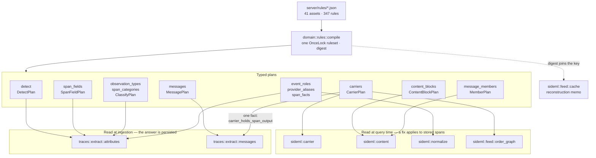
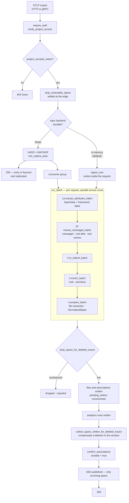
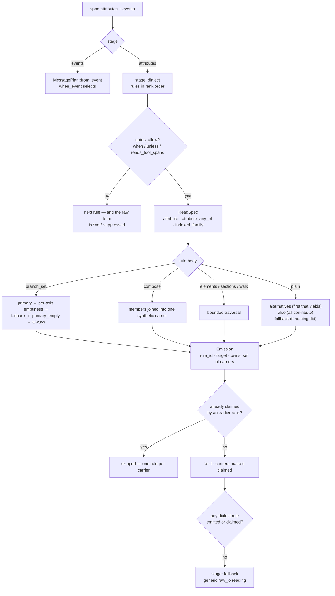
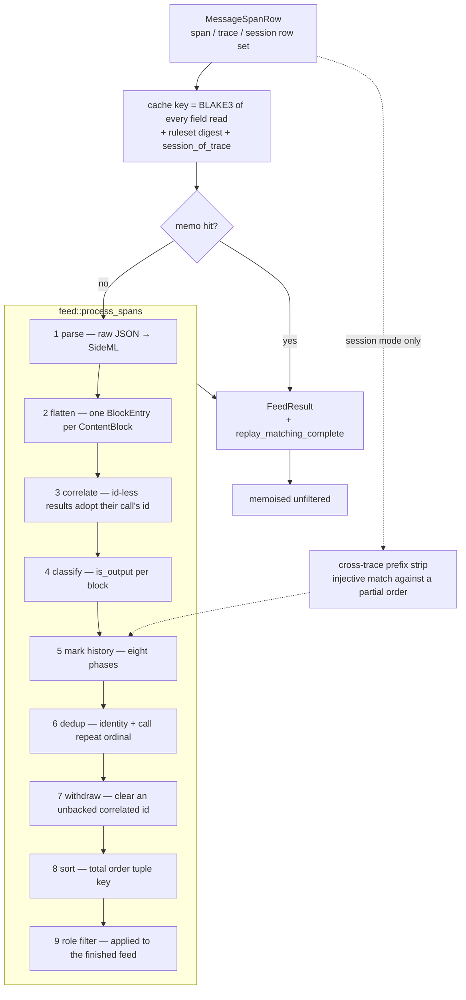

# Architecture diagrams

Five diagrams, each answering a question that is otherwise answered by reading several thousand lines. They
are checked against the code they describe by `the_diagrams_name_things_that_exist` — every node label that
names a Rust item or an asset section must resolve, so a rename breaks the build rather than the diagram.

Where a diagram and prose disagree, the code is the authority and the diagram is a defect; that is what the
test is for.

## 1. Where framework knowledge lives, and who reads it

The question: *if the Rust knows nothing about frameworks, what does, and when is it consulted?*

The answer is one compiled ruleset with two sets of readers, and the split is the reason a fix does or does
not apply to stored data. Ingestion-side readers ran once, when the span arrived; query-side readers run on
every read, so correcting them corrects history.

Two things the diagram is making explicit because they are easy to get wrong — and the first is one I drew
incorrectly first, which is why the arrow is annotated rather than plain.

`carriers` is read on **both** sides, asymmetrically. The query side reads all eight facts and the ordering
family, so a correction there reaches stored rows. Ingestion reads exactly one, `carrier_holds_span_output`,
to decide which of a span's messages are its own output — and *that* answer is persisted, so correcting it
does **not** reach spans already stored. "A fix applies to history" is therefore true of carrier semantics
generally and false of that one fact, which is the kind of distinction a diagram either records or quietly
misleads about.

And the ruleset **digest** is part of the reconstruction cache key, because that cache is a memo over a pure
function of the rows and the rules are part of the function.

## 2. Ingestion, and where a 200 becomes true

The question: *at which point has the server promised the data is stored?*

The ordering of the two writes is deliberate and is the whole reason the fences look like this: **files
before the rows that name them**, so the surviving failure is a reclaimable orphan rather than a row
promising bytes that are not there.

## 3. How a message rule claims a carrier

The question: *two dialects both describe `output.value` — which one reads it, and why is the answer not
"whichever is first"?*

`owns` is a **set of physical carriers**, not the emitted tag: a rule that composes three attributes into one
observation owns all three, or the other two stay free for another dialect to read as a conversation. A
*claim* emission owns without emitting, which is how a payload that is framework internals rather than a
message is taken off the table.

## 4. Query-time reconstruction

The question: *why can a span view hold more messages than its trace view?*

The span view loads one span and does **no** cross-trace stripping, because that is what the view means:
what this span carried, including the history it re-sent. So it can hold more messages than its trace view,
where dedup collapses the same turn re-sent by every generation span.

## 5. What keeps framework knowledge out of Rust

The question: *the claim is enforced — by what, exactly, and what does each gate not see?*

```mermaid
flowchart LR
    subgraph gates["Enforcement"]
        direction TB
        names["no_production_module_names_a_framework<br/>tokenised · markers derived from asset ids"]
        keys["no_production_module_carries_a_framework_telemetry_key<br/>every dotted string minus our own vocabulary"]
        oracles["17 equivalence oracles<br/>declared vs the code it replaced"]
        goldens["120 committed goldens<br/>4 views · count · order · content · no duplicates"]
        compile2["compile refusals<br/>dead rule · shared rank · unknown result · unreachable declaration"]
    end

    subgraph blind["What none of them sees"]
        direction TB
        b1["a key no asset declares"]
        b2["a value that is not a dotted key"]
        b3["a computed or non-adjacent name"]
        b4["a name inside an ALLCAPS run"]
        b5["prose"]
        b6["source outside server/src"]
        b7["a producer version nobody captured"]
    end

    gates -.->|"limits, stated"| blind
```

The two sweeps are enforcement of a *syntactic* invariant, not semantic proof — which is why the oracles
matter more than the sweeps, and why the blind spots are enumerated rather than implied.
