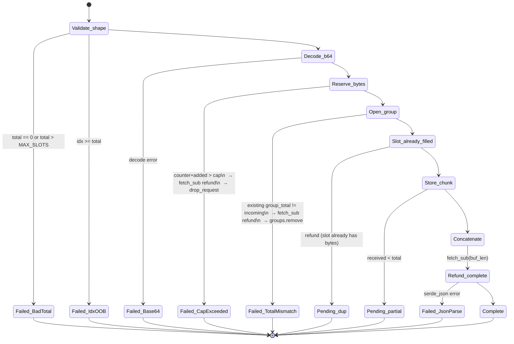
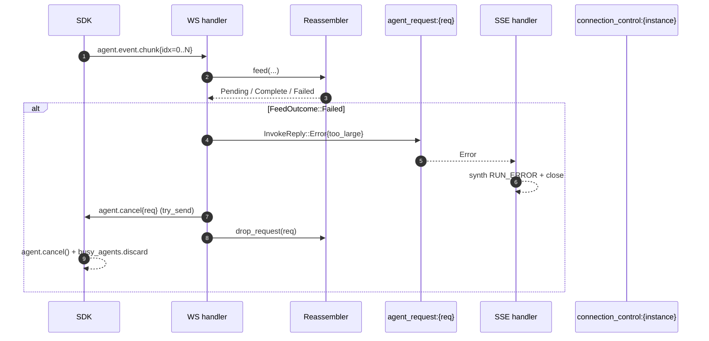

# Large `agent.event` chunking

## Why

The WS frame cap is 4 MiB (`WS_MAX_MESSAGE_BYTES`). AG-UI carries
events whose `model_dump_json()` can exceed that cap in real-world
agents:

- `TOOL_CALL_RESULT` with a PDF / RAG context / blob payload.
- `MESSAGES_SNAPSHOT` on a long conversation.
- `STATE_SNAPSHOT` over time.

Without chunking, the SDK's `send()` either fails outright or — worse
— Tungstenite kills the WebSocket with close code 1009 ("Message Too
Big") and ALL in-flight invocations on that SDK die.

## Design

Two new wire frames, additive (still `v=1`):

### `agent.event.chunk` (SDK → server)

```jsonc
{
  "v": 1,
  "type": "agent.event.chunk",
  "id": "<frame uuid>",
  "payload": {
    "request_id": "<request uuid>",
    "group_id": "<chunk-group uuid>",   // unique per chunked event
    "idx": 0,                            // 0-based chunk index
    "total": 4,                          // total chunks in the group
    "data_b64": "<this chunk's bytes>"   // base64'd slice of the event JSON
  }
}
```

The original event's serialised JSON is split into N slices of
`CHUNK_PAYLOAD_BYTES` (3 MiB) each. Each slice is base64-encoded and
becomes one `agent.event.chunk` frame. After base64 expansion (4/3),
each frame's wire size stays under the 4 MiB cap.

### Reassembly (server)

Server-side `InvokeReply::EventChunk` reassembles by `(request_id,
group_id)`. When `idx == total - 1` arrives AND all earlier indices
are present:
1. Concatenate `data_b64` slices in order.
2. Base64-decode → original event JSON bytes.
3. Parse to `serde_json::Value`.
4. Forward as a single `InvokeReply::Event(value)` to the SSE
   subscriber (same path as a normal small event). The SSE consumer
   sees one `data: <json>\n\n`, identical to non-chunked events.

### Reassembly buffer & TTL

- Per-`(request_id, group_id)` partial state: `Vec<Option<Bytes>>` of
  size `total`, plus `created_at`.
- Timeout: 60 s. Stale partials are discarded with a `tracing::warn`.
- Memory cap: per request, drop new chunks if total reassembled bytes
  for that request exceed `MAX_PER_REQUEST_BYTES` (default 64 MiB).
  Emits `agent.error{too_large}` to the SSE.
- On `agent.complete`/`agent.error` for a request_id, drop any
  pending partials for that request_id.

## Ordering guarantees

Chunks for one event preserve order via `idx`. Within one
WebSocket connection the SDK guarantees in-order delivery (TCP +
single send-mutex), so `idx` is monotonically increasing without
gaps. Reassembly stays trivial; we only need the count check.

The interleaving question: while a giant event is mid-chunk, can a
small event sneak through? The SDK serialises sends through
`_send_lock` (a single `RLock`), so chunk[0..N] go out atomically as
a sequence. Other events can't cut in between two chunks of the same
group.

**However**, two *different* in-flight invocations on the same SDK
share that mutex, so chunks of invoke A can interleave with chunks
of invoke B at the group boundary, never mid-group. The
`(request_id, group_id)` reassembly key handles that cleanly.

## Threshold

The SDK chunks **only when needed**. `_send_agui_event` measures the
serialised JSON length:

- ≤ `CHUNK_THRESHOLD_BYTES` (3 MiB) → send as a single
  `agent.event` frame, current behaviour, zero overhead.
- > `CHUNK_THRESHOLD_BYTES` → split + send `N × agent.event.chunk`.

Choosing 3 MiB instead of 4 MiB leaves headroom for the envelope
(`v`, `type`, `id`, `request_id`, `group_id`, `idx`, `total`) plus
the base64 4/3 expansion: a 3 MiB raw payload becomes ~4 MiB
base64'd, still under the cap with the envelope.

## State machine

### `Reassembler::feed()` — single chunk arrival



**Invariants checked at every transition**

- `bytes_per_request[request_id]` is a faithful upper bound on resident
  bytes for that request: every `fetch_add` is paired with a
  `fetch_sub` on either the `Complete`, `Pending_dup`, or any `Failed_*`
  path. After a successful `Complete`, the counter for that request
  drops to zero (verified by unit test
  `happy_path_in_order_zeros_counter`).
- `Failed_CapExceeded` calls `drop_request` so any earlier partials
  for the same request are also evicted; the counter is rebuilt from
  scratch on the next chunk.
- `Failed_TotalMismatch` only refunds the *just-arrived* chunk's
  bytes; pre-existing chunks of the same group remain accounted for
  until the surrounding invoke ends (`drop_request`).

### Server WS handler ↔ Reassembler ↔ SDK on chunk failure



**Why the server-to-SDK cancel matters**

Without the explicit `agent.cancel`, the SDK would keep streaming
`agent.event` frames into the void: the SSE is closed, the
per-request topic has no subscribers, but the SDK doesn't know the
event was rejected at reassembly. Worse, `busy_agents` would stay set
until the agent finished naturally, blocking subsequent invokes. The
cancel surface routes through the same primitive used for
client-disconnect cancellation, so the SDK handles both
indistinguishably.

## Rejected alternatives

- **Permessage-deflate / WebSocket compression**: would help but
  doesn't change the post-decompression hard cap. Tungstenite
  enforces `max_message_size` *after* decompression.
- **Just bumping the cap to 16 MiB**: pushes the failure mode out
  one order of magnitude but leaves the cliff. Real-world agents
  sometimes emit `MESSAGES_SNAPSHOT` over 50 MiB on long-running
  threads; chunking handles that gracefully.
- **Split AG-UI events themselves** (e.g. emit two
  `TOOL_CALL_RESULT`s with partial content): violates the AG-UI
  spec — events are atomic.
