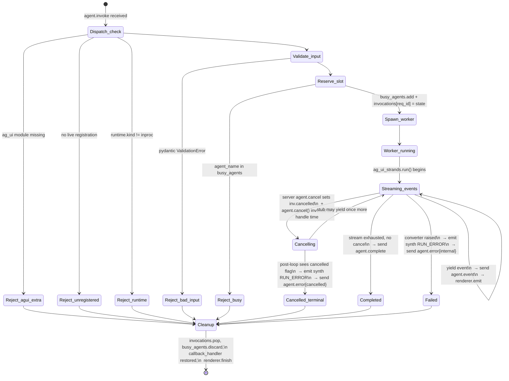
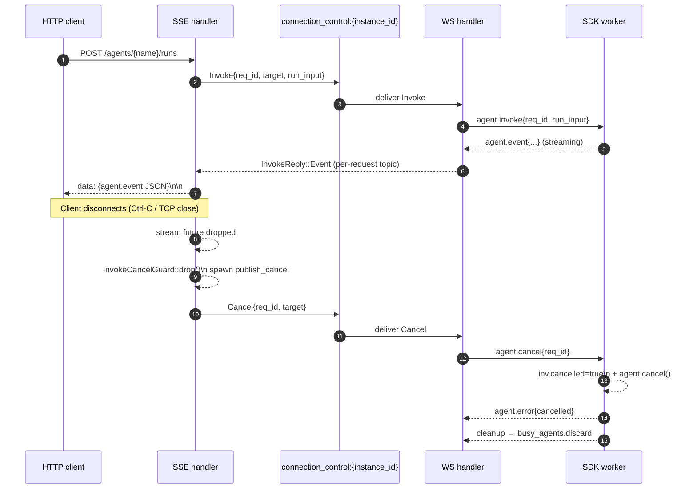

# AG-UI invoke flow — state machines

End-to-end view of one invocation, from frontend HTTP `POST` through
the server WS bridge to the SDK worker thread and back. Each diagram
maps states a single component traverses; transitions are labelled
with the event that fires them.

## 1. HTTP SSE handler (`server/src/api/routes/agui/mod.rs::run_agent`)

```mermaid
stateDiagram-v2
  [*] --> Validating
  Validating --> Failed_400: bad project_id / non-object body
  Validating --> Looking_up
  Looking_up --> Failed_404: registration missing
  Looking_up --> Failed_500: store error
  Looking_up --> Subscribing
  Subscribing --> Failed_500: subscribe error
  Subscribing --> Publishing_invoke
  Publishing_invoke --> Failed_500: publish error
  Publishing_invoke --> Streaming
  Streaming --> Streaming: InvokeReply::Event (non-terminal AG-UI)
  Streaming --> Streaming: TopicError::Lagged (warn + continue)
  Streaming --> Closed_terminal: AG-UI RUN_FINISHED / RUN_ERROR seen\n  → disarm cancel guard
  Streaming --> Closed_complete: InvokeReply::Complete\n  (synth RUN_FINISHED if no terminal)\n  → disarm cancel guard
  Streaming --> Closed_error: InvokeReply::Error\n  (synth RUN_ERROR if no terminal)\n  → disarm cancel guard
  Streaming --> Closed_timeout: invoke_timeout elapsed,\n  saw_any_event=false\n  → guard stays armed → cancel publishes
  Streaming --> Closed_shutdown: server shutdown_rx flips\n  → synth RUN_ERROR(internal)
  Streaming --> Closed_disconnect: client dropped TCP\n  → axum cancels future\n  → guard Drop publishes cancel
  Failed_400 --> [*]
  Failed_404 --> [*]
  Failed_500 --> [*]
  Closed_terminal --> [*]
  Closed_complete --> [*]
  Closed_error --> [*]
  Closed_timeout --> [*]
  Closed_shutdown --> [*]
  Closed_disconnect --> [*]
```

**Invariants enforced**
- `agent_request:{request_id}` topic subscription is established
  **before** `ConnectionControl::Invoke` is published, so an
  early-arrival `agent.event` from the SDK is never lost.
- The cancel guard is armed for the lifetime of the SSE stream and
  disarmed exactly on the four "stream produced or surfaced a
  terminal" paths. Any other dropping path (timeout, shutdown,
  client disconnect, panic) leaves the guard armed and its `Drop`
  publishes `ConnectionControl::Cancel` so the SDK never gets stuck
  in `agent_busy`.

## 2. SDK invocation worker (`sdk/python/.../client.py`)



**Invariants enforced**
- The reservation/cleanup pair (`busy_agents.add` ⇒
  `busy_agents.discard`) sits inside `_invoke_worker_entry`'s outer
  `try/finally` so any exception raised before the converter starts
  still releases the slot.
- `_send_agui_event` is the only path that emits `agent.event`
  frames; renderer.emit happens synchronously alongside the wire
  send so the SDK terminal stays exactly in sync with the SSE
  pipe.
- Cancellation is two-phased: `_handle_cancel` calls
  `agent.cancel()` immediately so Strands wakes at its next
  checkpoint, and the loop's `_is_cancelled` re-check ensures the
  worker leaves cleanly even if `cancel()` is a no-op for that
  agent.

## 3. Cancellation propagation



**Race-resistance**
- The guard's `Drop` runs *synchronously* with the SSE future drop;
  the spawned `publish_cancel` task is independent of the SSE
  subscriber. Even if the topic broker takes time to deliver, the
  SDK eventually receives it and releases the slot.
- The worker's cleanup in `_invoke_worker_entry::finally` runs
  regardless of whether `agent.cancel` was delivered — if the cancel
  topic flaps, the worker still finishes when the converter does
  and frees `busy_agents`.

## 4. Error mapping (single source of truth)

| Phase | Failure | Wire frame | HTTP outcome |
|---|---|---|---|
| HTTP validation | bad project_id / non-object body | n/a | 400 `bad_request` |
| HTTP lookup | no registration matching `(project, agent, name)` | n/a | 404 `agent_not_registered` |
| HTTP topics | broker error | n/a | 500 `internal` |
| SDK dispatch | optional `ag_ui` not installed | `agent.error{agui_extra_missing}` | synth RUN_ERROR + close |
| SDK dispatch | live agent unregistered between find() and invoke | `agent.error{agent_not_registered}` | synth RUN_ERROR + close |
| SDK dispatch | non-inproc runtime kind | `agent.error{unsupported_runtime}` | synth RUN_ERROR + close |
| SDK dispatch | RunAgentInput invalid | `agent.error{bad_run_input}` | synth RUN_ERROR + close |
| SDK dispatch | concurrent invoke of same agent | `agent.error{agent_busy}` | synth RUN_ERROR + close |
| SDK runtime | converter raised | `agent.event{RUN_ERROR}` + `agent.error{internal}` | RUN_ERROR forwarded + close |
| SDK runtime | server cancel arrived | `agent.event{RUN_ERROR}` + `agent.error{cancelled}` | RUN_ERROR forwarded + close |
| Server timeout | first event > INVOKE_TIMEOUT_MS | n/a | synth RUN_ERROR{invoke_timeout} + close |
| Server shutdown | shutdown_rx flips | n/a | synth RUN_ERROR{internal} + close |
| Client disconnect | TCP / Ctrl-C | n/a (cancel emitted to SDK) | future dropped |
